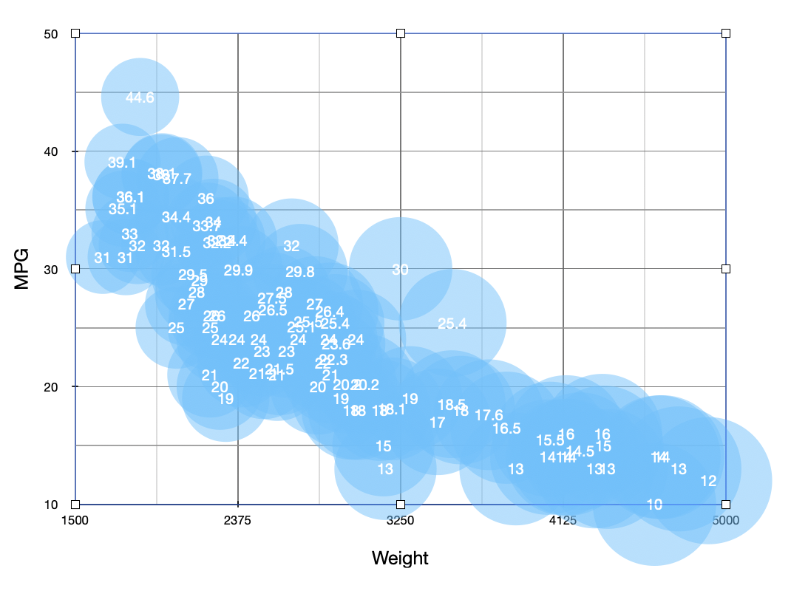

# 02-DataVis-5ways

Assignment 2 - Data Visualization, 5 Ways  
===

# Numbers App on Mac

I came upon this visualization tool by accident. When I open the cars-sample.csv file, it automatically opens with the Numbers App on my desktop. Here, you can select to add a chart and then select the data that you would like to use. It is similar to Excel, but I chose to use this tool over excel because you do not have to import the csv file, it is right there in a nice table format to use. There are many capabilities that I was surprised about using this tool: you can choose where the tick marks are, add in grid lines, choose where you would like the axes to start, and have the color opacity. I was also surprised when I was able to select the weight as the factor that determined the circle size. However, with this feature the bubbles are way too big, and there is no way to  scale them down, as they are determined by the weight column.

# d3...

(And so on...)

## Technical Achievements
- **Proved P=NP**: Using a combination of...
- **Solved AI Forever**: ...

### Design Achievements
- **Re-vamped Apple's Design Philosophy**: As demonstrated in my colorscheme...
