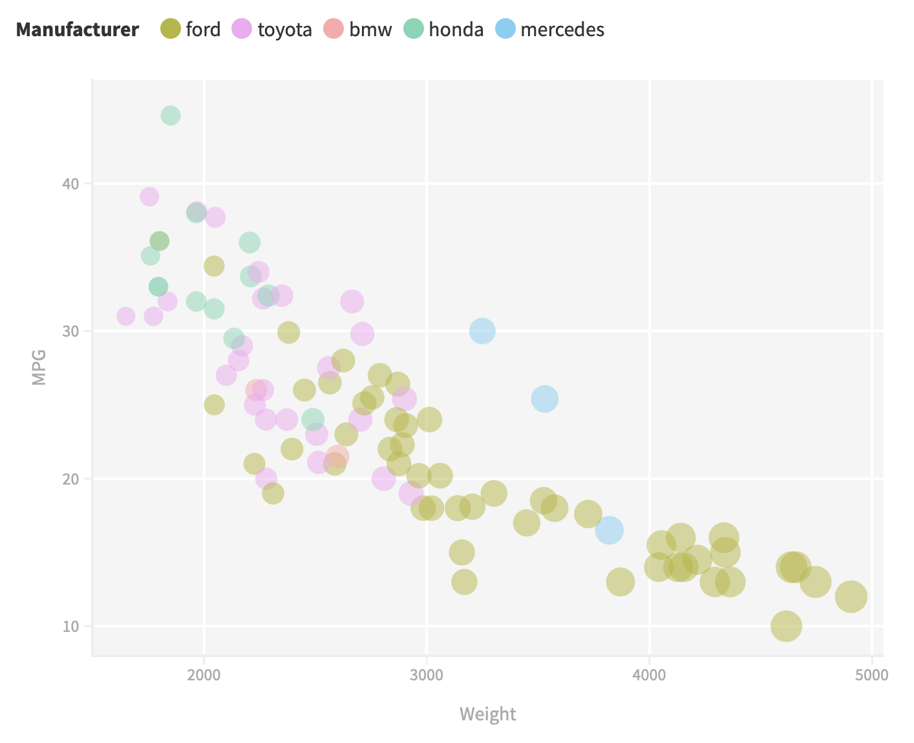
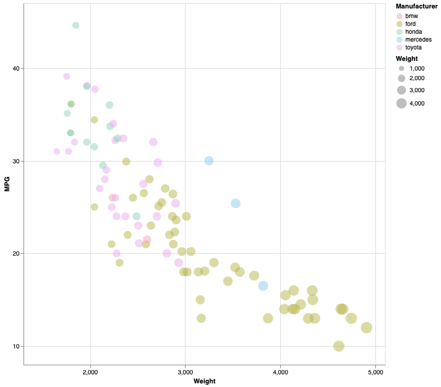
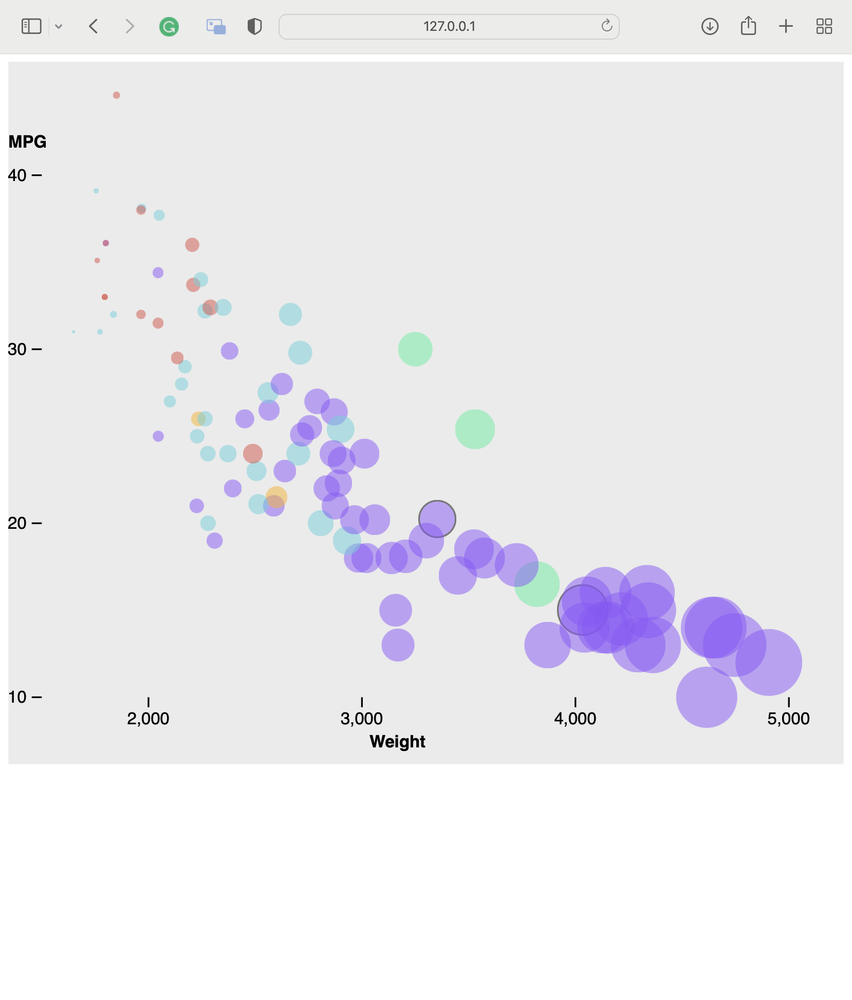
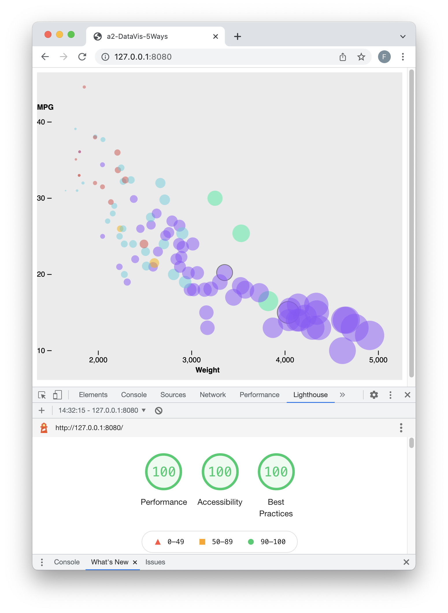
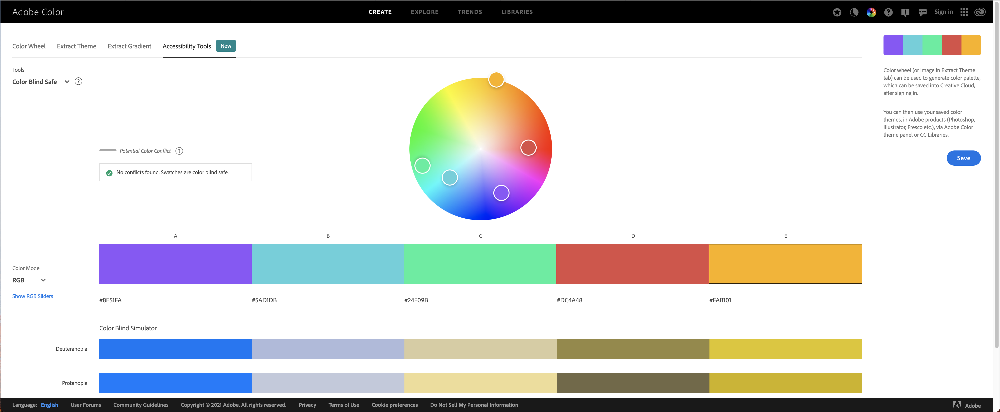

# Plotly + Python

Plotly is a Python graphing library similar to Matplotlib, but steered further towards ML/AI and interactivity. It is used by companies such as NVIDIA and Tesla to perform data visualizations. Plotly also integrates natively with Dash, an interactive web visualization platform to show and interact with plots.

With just three lines of code (+ library imports) and only reading the documentation I was able to recreate the plot. I first read the dataset using a Pandas dataframe. I then used the `px.scatter` function to make the plot and the `fig.show` function to show the plot. I simply had to pass the x, y, size, color, and opacity to the function.

Pros:
- Very easy to use
- Powerful
- Can be connected to Dash for larger visualiations and interactivity

Cons:
- (Minor) Need to install Pandas separately to read a dataset

# Flourish

I think Flourish is the best platform for complex data visualizations with no coding knowledge. The platform allows selecting a type of plot, uploading a dataset, and linking each marker property to a column of the data. Marker properties include size, color, shape, and more.

Pros:
- Easy to use for people who don't know how to code
- Minimal setup needed
- Intuitive without reading any documentation

Cons:
- Not as customizable
- Cannot handle the dataset low-level such as using Pandas

# R + ggplot2

R is a language primarily focused on statistical computing.
ggplot2 is a popular library for charting in R.
R Markdown is a document format that compiles to HTML or PDF and allows you to include the output of R code directly in the document.

To visualized the cars dataset, I made use of ggplot2's `geom_point()` layer, with aesthetics functions for the color and size.

While it takes time to find the correct documentation, these functions made the effort creating this chart minimal.

# Vega-Lite
Vega-Lite allows to create complex plots by defining a JSON-style input that is compiled into a plot. Using the online portal at [https://vega.github.io/editor/#/custom/vega-lite](https://vega.github.io/editor/#/custom/vega-lite), it's possible to code and render the JSON automatically. Compared to previous solutions, Vega-Lite did require me to read multiple pages of documentation and also read a discussion on ObservableHQ. Once understood the structure of the JSON, however, it's easy to customize a plot with minimal effort.

Pros:
- Powerful
- Plot encoded in JSON and easy to share

Cons:
- Need to have the dataset ready to be plotted
- Steeper learning curve than previous solutions

# d3.js
d3.js allows to create complex data visualizations using JavaScript. d3.js reads the csv file using a function, maps the data to object fields, and allows to visualize it using SVG components. Compared to other solutions which plot the data directly, d3.js requires to create the parts of the plot one-by-one. For example, the axis have to be added and translated to a specific position, same as the labels, ticks, and numbers. Using d3.js certainly requires to read some documentation and sample code. However, I think d3.js was the most versatile data visualization framework. Compared to the other tools, the developer has full control of the graphical components of the plot. I think this is a great option to make complex visualizations, but if trying to make something simple, other solutions allow for great time-saving.

Pros:
- Powerful
- Complete control over graphic components
- Can manipulate the data before plotting it

Cons:
- Need to read the documentation and sample code
- For simple plots it takes much longer than other data visualization platforms

# Other
All design and technical achievements were completed on Python or JavaScript because they are the most versatile.
### Technical Achievements
- Managed NA values in the dataset
     - The dataset contained some missing (NA) values. I could either filter them out, or make an interpolation to estimate the missing values. I imported the [Simple Statistics](https://simplestatistics.org) library to compute a linear regression on data points, and then used the model to predict the MPG values for the missing data.
- Implemented Plotly with Dash
    - I connected the Plotly visualization with Dash, a web framework for interactive data visualization. With just four lines of code, I was able to make an interactive plot as seen in the GIF below.

- Lighthouse tests:
    - I tested the website using the Google Lighthouse tests and scored 100 on Performance, Accessibility, and Best Practices. I did this to check that I am following best practices, that the site is accessible (tests include background/foreground color contrast check), and that the dataset it read, interpolated, and processed quickly enough (performance metric).

### Design Achievements
- Accessible color palette (screenshot below):
    - I created a custom color palette of five colors using [https://colors.adobe.com](https://colors.adobe.com). I also validated the palette for accessibility using [https://colors.adobe.com/create/color-accessibility](https://colors.adobe.com/create/color-accessibility) to make sure it works for people with color blind or accessibility issues.

- Visualize NA values in the dataset
    - To identify the points with a MPG value predicted by the linear regression model, I changed the stroke of those circles to make them darker. This allows to keep the same color palette and make the manufacturer easily recognizable, while warning the viewer that the point is predicted and not actual.

