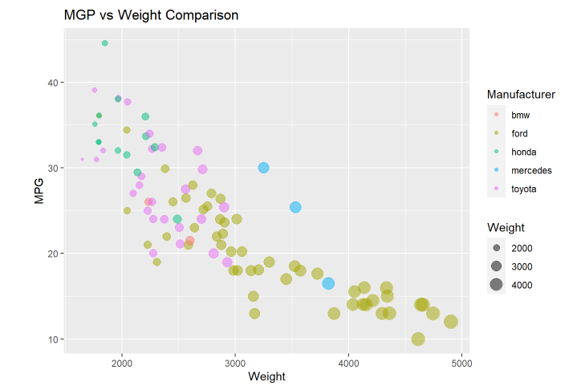
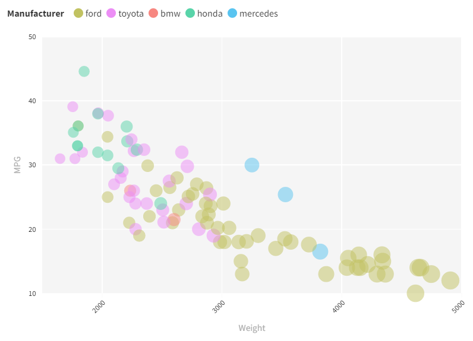

# 02-DataVis-5ways

Libraries, Tools, Languages
---
I used a variety of tools and languages to recreate the desired. In this ReadMe, I'll also give each tool I used based on
difficulty, result, and my personal frustration. Difficulty is how difficult I found using the language to be. Result is how
close I got it to the original image. And frustration is how frustrated I got while using that tool.

# R + ggplot2 + R Markdown

I've used R for a few classes now, and so I have become fairly familiar with it. When I saw that R was an option, I immediately
jumped on it to get it done quickly. Using R and ggplot2 made this very easy. It took 4 lines of code to achieve the desired
output and 2 of those lines were import statements, 1 was loading the data set and 1 was actually plotting the data.
The output can be seen in the screenshot below. I also added a title. My sources for this were googling and looking at ggplot2 documentation.

Overall ratings:
Difficulty: 1/5
    *Only took 2 lines to load data in and plot it
Result: 5/5
    *spot on accurate with the given image
Frustration: 1/5
    *Straightforward and not time-consuming

# d3...

The second tool I used was d3. Even though this one was mandatory, I was still interested in using it.
I am stil fairly new at programing with d3 and so I struggled a little with this one. The output can be seen below.

From that image, you can see that I preserved all the required components. I struggled to create a legend and trying to make a background
grid. 
Overall, this also felt fairly straight forward, but was more time consuming figuring a lot of it out. 
My sources for this were lots and lots of googling (I have a too many tabs problem :( ).
Overall rating:
Difficulty: 3/5
    *Mainly attributed to me being new with d3. 
    *still getting used to programming in d3.
Result: 4/5
    *The result was pretty close to the original image.
    *Was struggling getting the grid and legends going.
Frustration 2/5.
    *Programming was smooth with some minor issues that again relate to my inexperience
    *Lot of time googling and finding how certain things function with d3.

# python + matplotlib

The third tool I used was the matplotlib pyplot library in python. I also don't have much experience writing in python. However,
this was nothing that some googling and documentation reading couldn't fix. I used the pandas library to import my csv and used
matplotlib to plot it. The initial code to plot the data wasn't too difficult to understand. Plotting and then adding the chart details
wasn't hard either through matplot lib. It was a few function calls, and then it was ready. Pyplot also has a .show() function
that creates a window with an interactive scatter plot.
The output is below

Overall ratings:
Difficulty: 3/5
    *Again, new to writing in python.
    *Faced some issues with setting up PyCharm but that's just on my computer acting strange
Result: 4/5
    *Almost preserved all aspects of the image
    * Grid was a little dark for my liking and I was having a hard time finidng how to make it not as bold.
    *Couldn't get the legend to work properly.
Frustration: 2/5
    *Lots of time spent googling and with weird IDE errors.

# Excel

Going into this project, I planned to use Excel because I've had a lot of experience using it and was thinking it would've 
been easy. I was very wrong. I struggled a lot with this one. I thought that I would have to use pivot tables to create a scatterplot
and manipulate the data and visual as I needed it. Turns out, you can't use pivot tables with scatter plots. I found that out after 
wasting lots of time googling. After poking around a lot using Excel's scatterplot charts, I was able to make one with the required data
and with the proper axes. The issue was, I couldn't change the point's colors based on manufacturer. After more playing around and testing,
I found a way to do it. You can load data into the scatterplot in 2 ways. Then first is to highlight a big set you want to
plot and then press the scatter plot button. The second is to manually enter the data set ranges. The latter is how I ended up doing it.
Luckily, I could sort the data  table by manufacturer. After doing that, I highlighted the Weight for the X and the MPG for 
the Y and added them under one of the manufacturer labels (for example bmw). After that, I repeated that process manually for all 5 
manufacturers. It took a while and excel decided it wanted to crash 3 times, but I eventually got a scatterplot. It can be seen below.

I'm not fully happy with this scatter plot. I don't think I was able to change the size of each plot based on the weight. I 
searched for a while on google and came up with nothing. Furthermore, I was unable to find out how to decrease the opacity of each plot.
Luckly, I was able to adjsut the X and Y axes starting values. By default, Excel starts them at 0 but I shifted them as requied by the project
description.
Overall ratings:
Difficulty: 2/5
    *Doing the work in excel wasn't necessary hard just frustrating
    *It was only a matter of highliting the correct data and plotting it and playing with the graph visuals.
Result: 2/5
    * I wasn't happy with the resulting image. 
    *I couldn't reszie the plot points and so they looked very small and because of the colors, some were hard to see.
    *I tried fixing that by slighlt darkening the background and adding outlines to the circles.
    *Was able to get a legend, grid, and title 
Frustration : 5/5
    * Excel was not being stable and kept crashing
    *Lots of time wasted googling and searching for solutions
    *Data set not being cooperative and sometimes wouldn't plot some points
    *Excel would randomly just remove the scatterplot as I was working on it

# Flourish
    
The last tool I used was Flourish. I had intended to use GNUplot, but found Flourish to be more interesting since it was 
a website based tool. Creating my plot was super easy. This tool made uploading my data super easy. It was just a few clicks to upload the csv.
Then, they gave lots of options on how to customize the visual and updated it in real time as you were editing it. After uploading
the data, I selected where the X and Y values would be (Weight and MPG) and which column to base the colors on (Manufacturer).
After that, It was basically done. I added a title, and the axes lables were already done. I added a legend that automatically assigned different colors 
to each point based on manufacturer. I then also dropped the opacity of each point to 50%. This was all made super easy by their interactive interface.
it can be seen below. My only complaint was that I could only choose a color pallet and it would assign colors by default, and couldn't choose each color individually.

Overall ratings:
difficulty: 1/5
    *super easy and straight forward to use
    *nice user intervace
result: 5/5
    *not necessarily identical but keeps all the needed aspects of the original image and looks good
frustration: 1/5
    *super straight forward

## Technical Achievements

* My editor that I write my R code in generated an HTML file. This notebook file shows the graph output. This notebook
    can be seen at https://obliiviion.github.io/
* One weakpoint I had in A1 was writing functions and conditionals in d3. I tried addressing this in this project. In  the d3
  attempt, I spent time writing functions when needed and using if .then().
* The python code creates a window with a semi interactive scatter plot. You can move around the plot and zoom in and out.
* The flourish visualization was published to https://public.flourish.studio/visualisation/8573088/

### Design Achievements 

* For both python and d3, I created colors using an online hex color creator. I tried to get as close to the original colors as possible.
* For excel, I gave the plot  a slightly gray color. This was because Some of the points size mixed with their color would make them hard to see at first
* I also changed the colors and plot outlines in the excel file because some of the plots were too difficult to see. for example,
    I darkened the BMW color and gave the plots slightly pink outlines to increase visibility.
