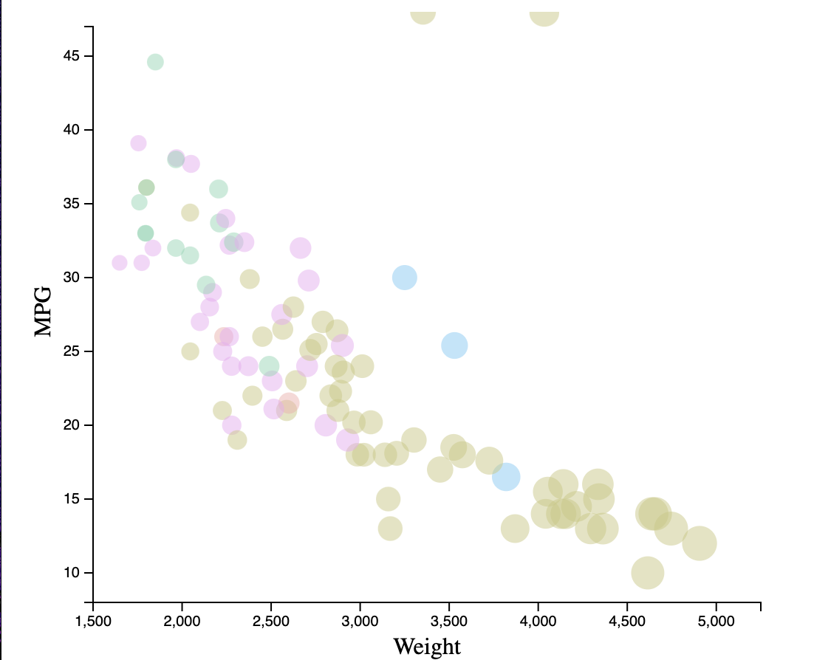
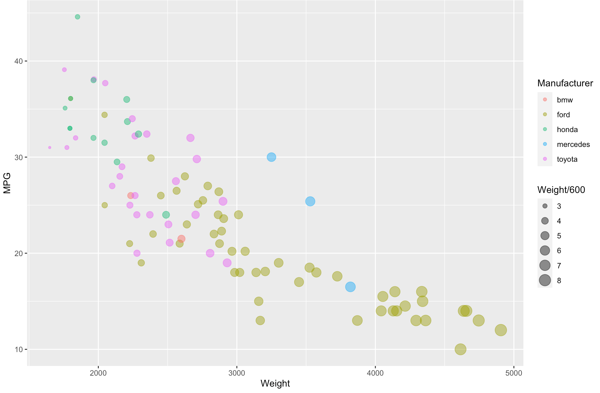
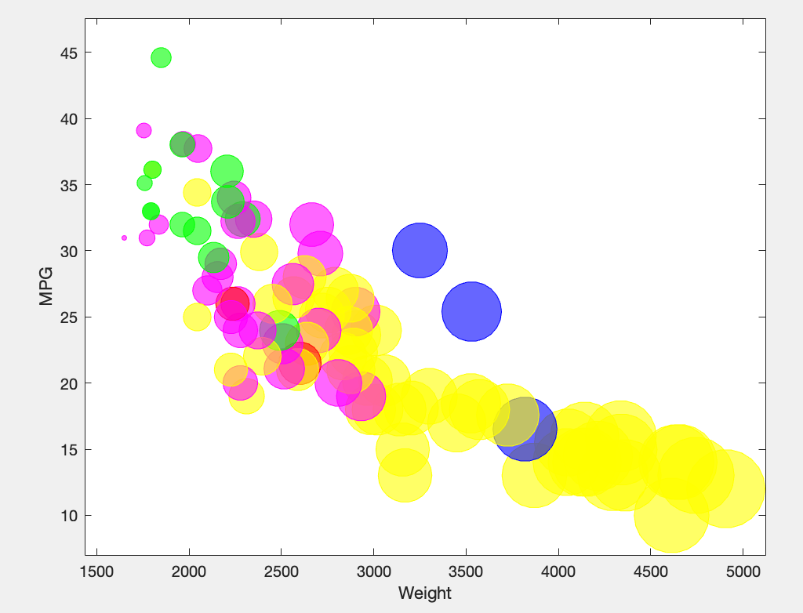
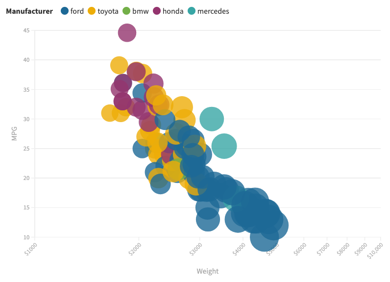

# 02-DataVis-5ways

Assignment 2 - Data Visualization, 5 Ways  
===

# d3

d3 is the data visualization language we have to use for the class, so I used it here.
This one easily took me the longest to get set up, just because it was easily the least streamlined tool I used for this assignment.
That, and it generally is the one I'm least experienced with (except flourish) so I'm still learning most of the things that would make this go faster.

# R + ggplot2

I'm just gonna keep the beginning of this explanation because it's all true lol.
R is a language primarily focused on statistical computing.
ggplot2 is a popular library for charting in R.
I have used R before for a class last term, so this was pretty easy, plus it was SUPER simple to actually write the code.

# MATLAB

MATLAB (Matrix Laboratory) is a language tool used for matrix manipulations.
I have used it a bunch for other classes, and it was easy to use here as well.
Scanning in csv files is straightforward, and so is using the bubblechart() method.

# Excel

Technically I used Google Sheets, so I guess it's a lie to say this was Excel, 
but I already titled the files with that and don't feel like going back thru and changing them. 
Oh well.
This was pretty straightforward, and about as complex of a chart as you can physically make using Sheets.
It wasn't that bad though, although Excel is in fact significantly better.
![excel][img/excelplot.png]

# Flourish

This one was incredibly easy, flourish is an online data visualization tool that lets you select your own data and
it was incredibly straightforward and streamlined to get the result I desired.
The one downside is that to get the HTML code for my visual I would have had to pay an exorbitant subscription fee and, frankly, I'm all set on that.

