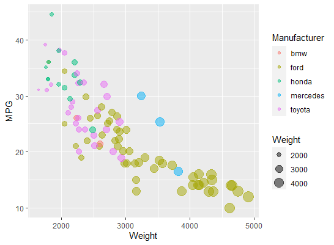
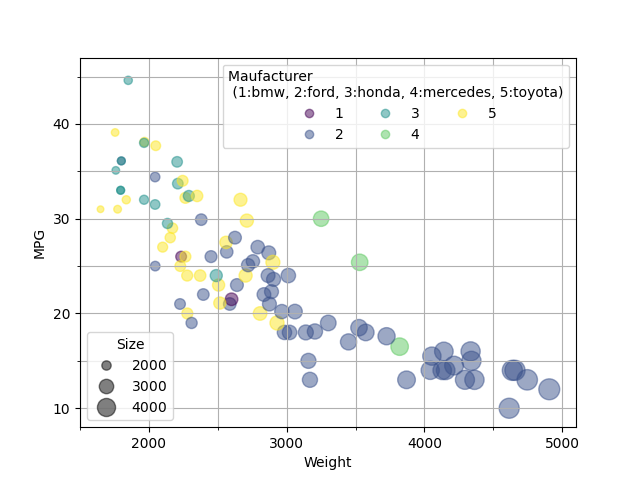
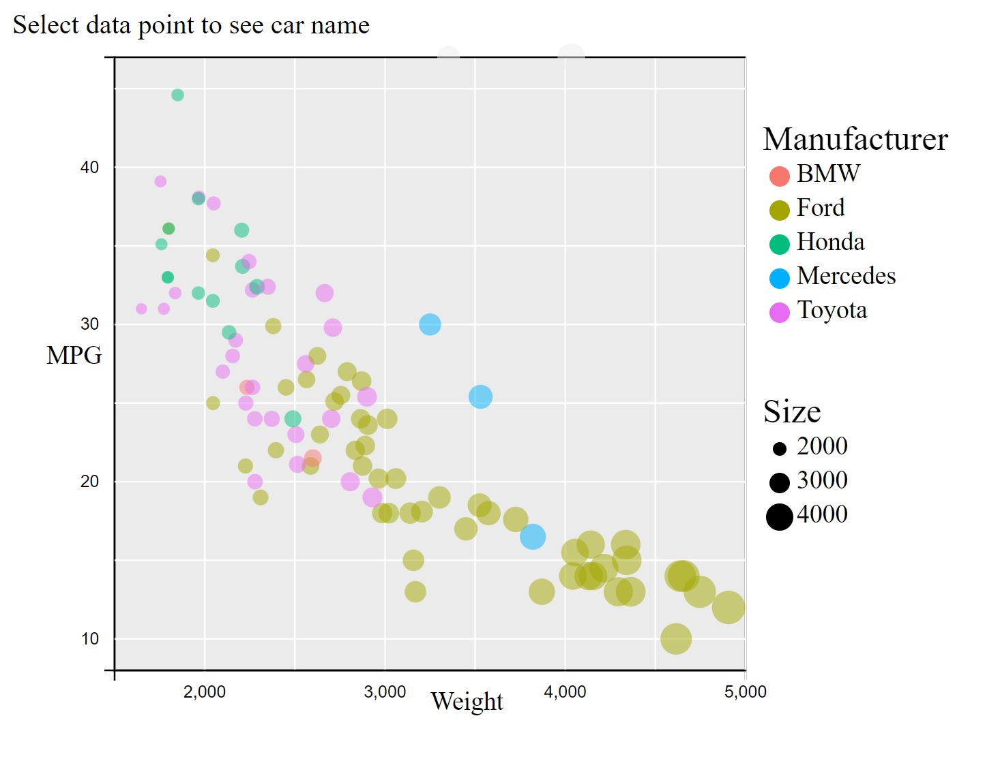
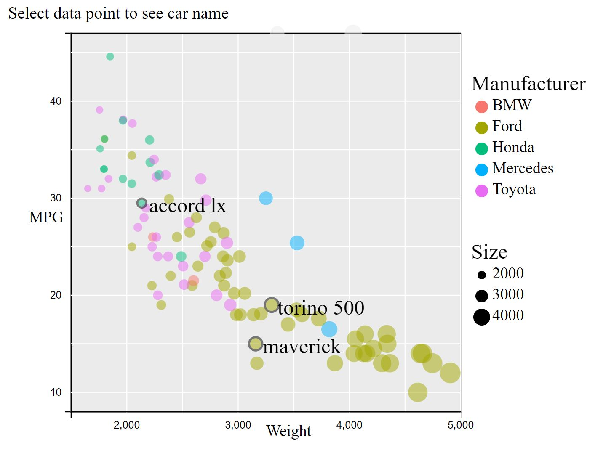
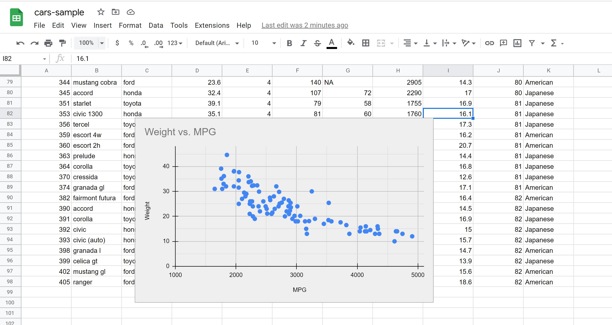
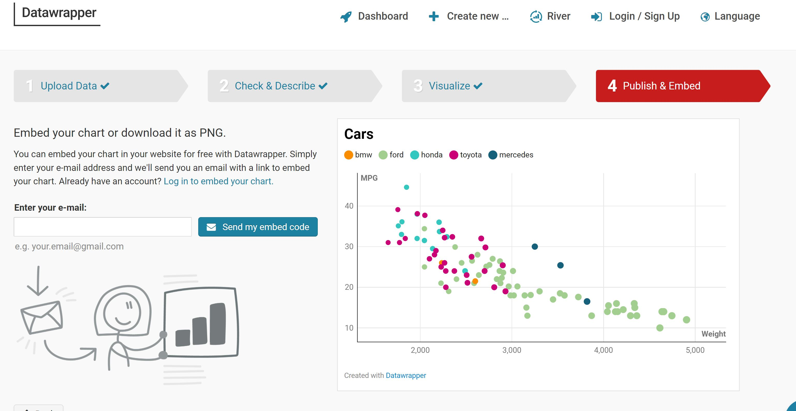
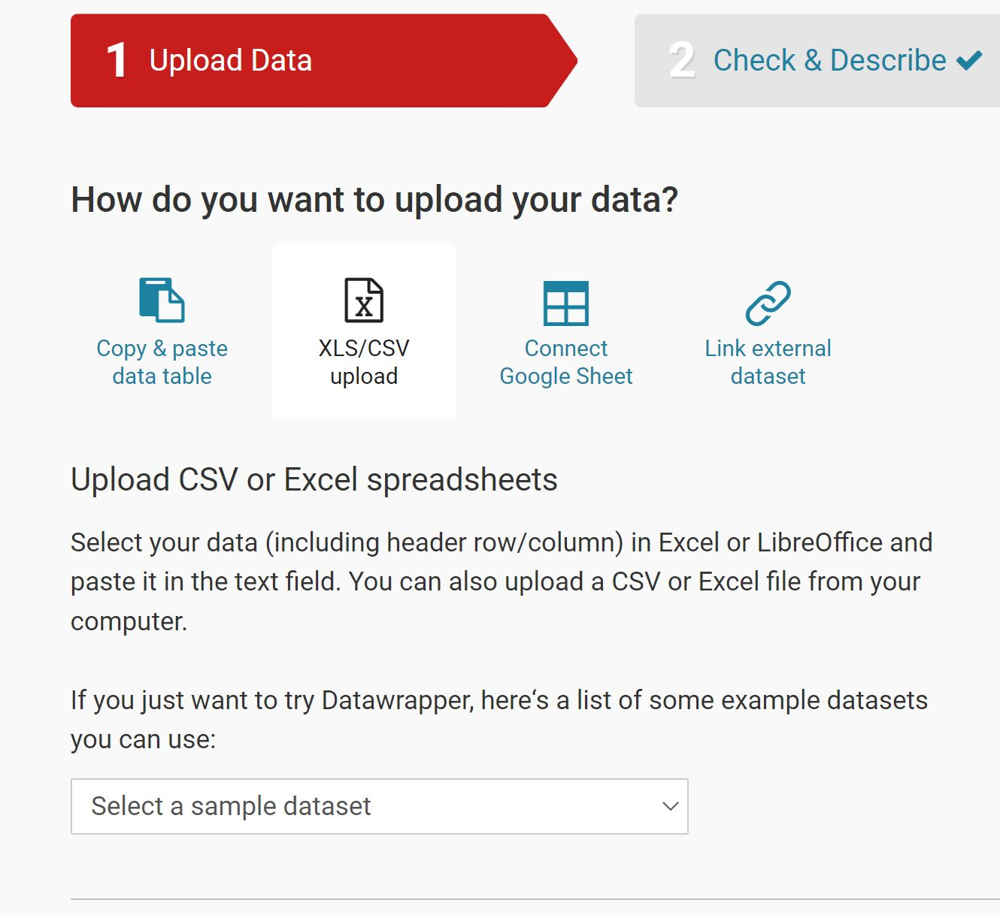
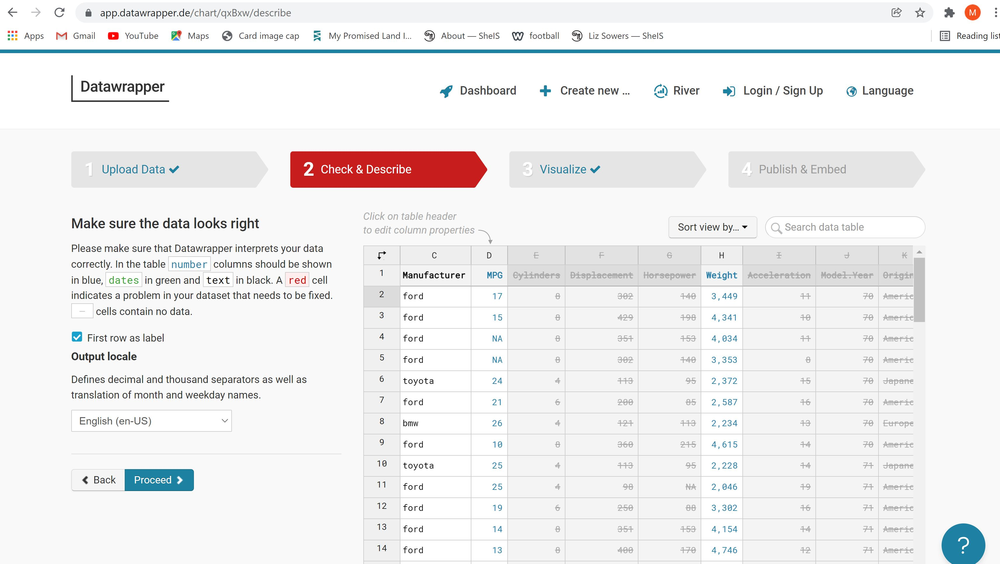
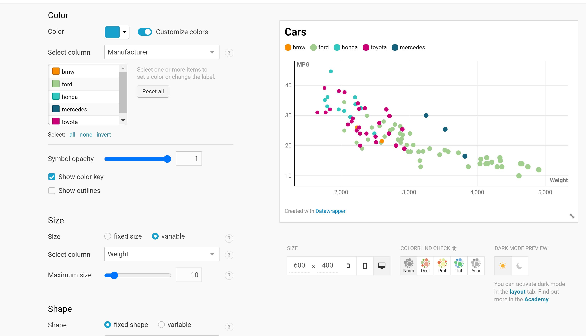

# 02-DataVis-5ways

Assignment 2 - Data Visualization, 5 Ways  
===

**Maria del Carmen Sacristan Benjet**

# R + ggplot2 

Despite the fact I started without any previous knowledge of R or ggplot, it ended up being the easiest way to create the visualization. The hardest part was figuring out how to read the data from the csv file. After that it took me only one line to get my visualization. R was good at showing what I needed through simple commands. I also suspect that the image prompt of the visualization that we were provided with was made in R, which is why R with only a few personalizations defaulted to the exact graph I needed. I now know that Ris a very useful and easy to use tool to plot conventional graphs.

# Python + matplotlib.pyplot

Using python with the matplotlib library was significantly challenging. Getting the general concept of the table was easy, however I struggled to force it to do the details. Making the legend was a nightmare, because the color map would only take in a color or number, thus losing the manufacturer label. I also had to plot the visualization as subplots so that it would allow the legend to have more than one value in it. In the end the legend for the manufacturer's color code was unsatisfactory. It really made me appreciate the auto created legend in R.

# d3

My d3 visualization can be found here: https://marsacben.github.io/index.html

D3 allowed for the most freedom to personalize the visualization as I wanted. The drawback is that I had to spend a lot of time building a lot of the basic elements that were generated for me in R and Python. For example, making the grid and axis for the d3 visualization proved the hardest part of the project. Plotting the data, the easiest, and I had the liberty to do it exactly how I wanted with no constraints. I was able to add interaction to the data points, and map to exactly the color and size I wanted. For the legend I was able to avoid the fiasco of Python since I could just type in manually the texts and reference shapes. D3 is a great language to make personalized or interactive visualizations too complicated for other languages like R or Python.

# Google sheets

My google sheets visualization can be found here: https://docs.google.com/spreadsheets/d/1nxTvyUmIwYO66rqbnx0XzS1Fqsu3WiErogr3PZ7X22I/edit?usp=sharing

I love using google sheets because it is very easy to create. The big drawback is that it is very limited. Google sheets only allow you to make simple graphs. As you can see in my visualization, I was not able to capture the color nor size mapping of the original visualization.

# Datawrapper

I found Datawrapper after searching for free online data visualization GUI tools. This tool is very easy to use, and provides a surprising amount of personalization or its simplicity. Here all I was not able to do was add a legend to the size map. I would have also liked to be able to make the size differences larger so they would be more noticeable. Nonetheless, I was happy it gave me the ability to size maps. I liked the ease, the amount of options and the fact that it doesn't force you to create an account to create visualization. Bellow are screenshots documenting my process making this visualization:

## Technical Achievements
- **Built interactive visualization**: I made my d3 visualization interactive. Clicking on any data point will display the name of that car as well as adding a thick black boarder line to the circle. 

### Design Achievements
- **Used a color matching tool to fing the exact colors used in the picture of the reference visualization**: For my d3 visualization I used this a tool to get the exact color from an image so that I could replicate my d3 visualization in the exact same color. The color matching tool I used was: https://html-color-codes.info/colors-from-image/#. I lso spent a lot of time figuring out how to make the grid line color white to match the original visualization. This was very hard as it would not allow the changing of the line clolour throught .attr() not .style() and I had to ad css to do it.
