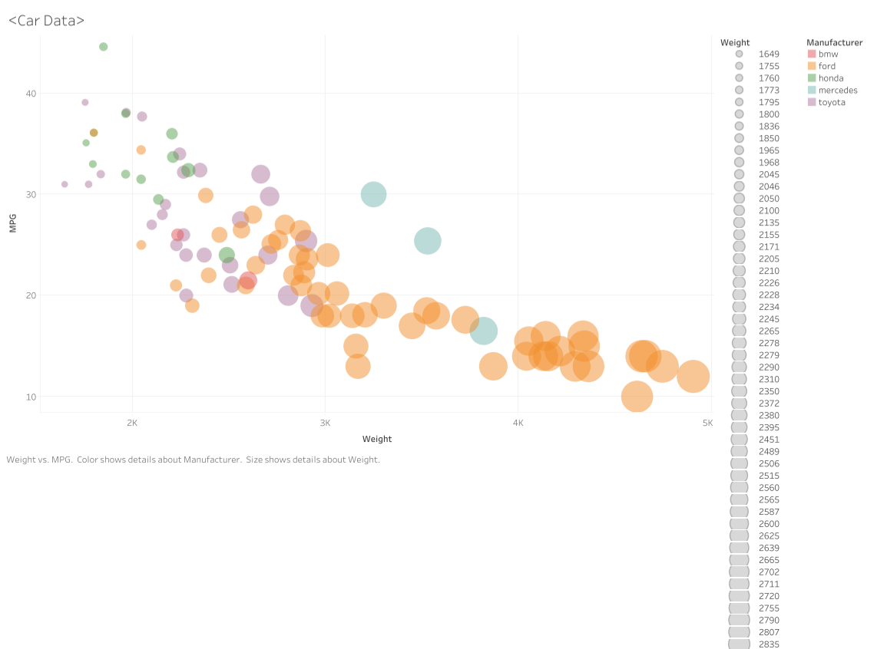

# 02-DataVis-5ways - Sophia Strano

Assignment 2 - Data Visualization, 5 Ways  
===

Your goal is to use 5 different tools to make the following chart:

My Recreations!
---

A good readme with screenshots and structured documentation is required for this project. 
It should be possible to scroll through your readme to get an overview of all the tools and visualizations you produced.
- Write a paragraph for each visualization tool you use. What was easy? Difficult? Where could you see the tool being useful in the future? Did you have to use any hacks or data manipulation to get the right chart?

# d3 : https://sophiastrano.github.io/a2-DataVis-5Ways/

The first visualization I chose to create used the d3 library in Javascript which I was more familiar with from the first assignment. I preserved my documentation for creating scales and various sized circles of different colors and opacities from the first assignment, so the only brief challenge I encountered here invovled learning how to properly load in the CSV data using d3 and then re-scaling the chart to preserve the downward trend shown in the orignal visualization. I also removed the data points that had N/A for the MPG as is reflected in the example visualization, while in some of the other tools it was easier to drop those data points from the visualization, in this case I found it easier to remove the unhelpful data.  

# Tableau

The next tool I used to recreate the visualization was Tableau, which I was completely new to using and struggled a little to set up due to software illiteracy. However, once properly installed I actually found the program itself to be relatively intuitive and enjoyed adjusting the chart using the built in features that let me label each axis and easily assign color to manufacturer in the data settings. I'd use tableau again if I didn't have an internet connection...

# Flourish
https://public.flourish.studio/visualisation/8607177/

Because if I have an internet connection I'd definitely use flourish to create any visualizations I make without any hard programming in the future! This was my first time using flourish but I found it to be the fastest way to create the desired visualization of all the tools I worked with during this assignment, and I enjoyed some of the additional features that I included in this chart recreation such as the different shapes to denote country of origin for each vehicle. I also liked the user interface of flourish most of all the tools used, and enjoyed the customization features like choosing speicifc tic marks to include. One difficulty I did encounter though was resizing the circles to more clearly display the difference in weight for all the different car data points, which is what led me to include additional features. 

# Plotly

The next tool I used to recreate the visualization would be plotly, a python library which I was also unfamiliar with. I haven't used python very much before this course, so I felt that it would be appropriate to challenge myself by practicing the use of different python libraries to create graphs. Unless explicitly necesasry I don't think I would reuse this method as it was much more cumbersome and challenging to make the aesthetic changes to the chart I had made easily with other tools. 

# MatPlotLib

The last tool I used to recreate the car data visualization was the MatPlotLib library, which was a much bigger challenge for myself than I'd originally foreseen.
Again, definitely if not explicitly necesasry I don't think I would reuse this method as this tool was by far the most difficult for me to implement due to challenges loading the data and challenges properly assigning colors to manuafacturers on the data points. I was able to preserve the fundamentals of the chart to convey the same information, but the scale proportion to the axis was also difficult to adjust and does not perfectly reflect the original visualization

## Technical Achievements
My biggest technical achievements for this project were the implementation of new python libraries I'd never interacted with to create visualizations, and the general expansion and strength in my ability to use these software tools. I was able to create functions to maintain the margains on my d3 graph, as well as on my Flourish and Tableau graphs. I also was able to include functionality in my Plotly visulization so that as each data point is moused over, information is displayed. 

### Design Achievements
I created a dynamic color scheme to track the manufacturers in each chart, and was also able to make various adjustments with the size and scale of the datapoints to best display the data within each tool. In my flourish visualization I included additional shapes to identify the manufacturing location of each vehicle to create a more informative visualization. On several visualizations I was also easily able to preserve the background grid and grey shade, and made use of functions in d3 to assign colors to my visualizations. 
