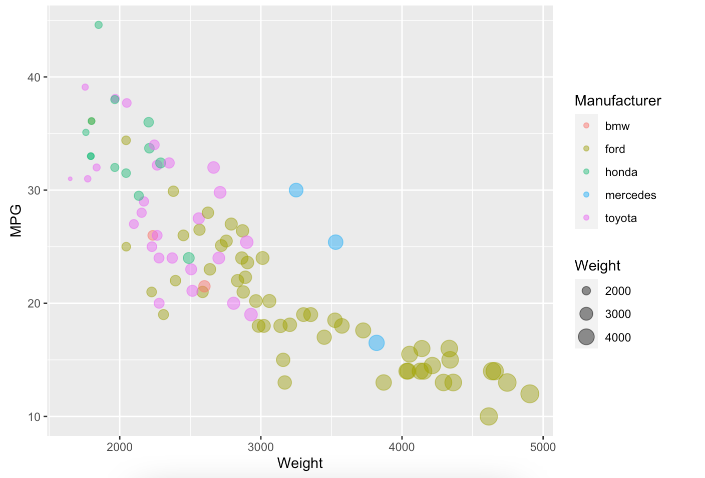
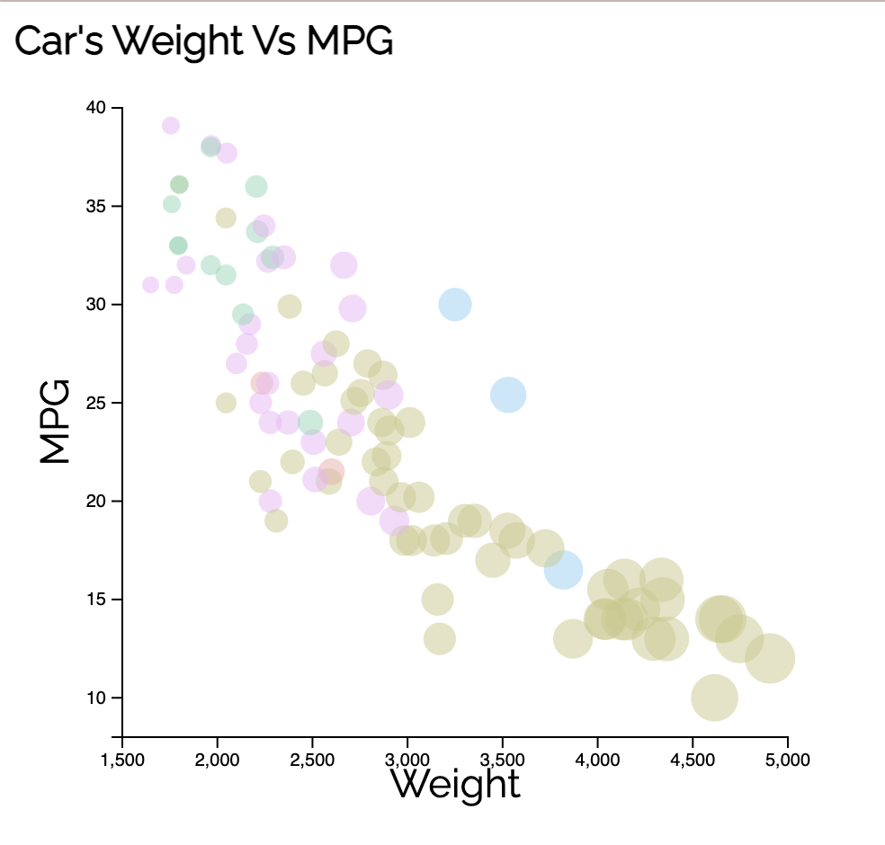
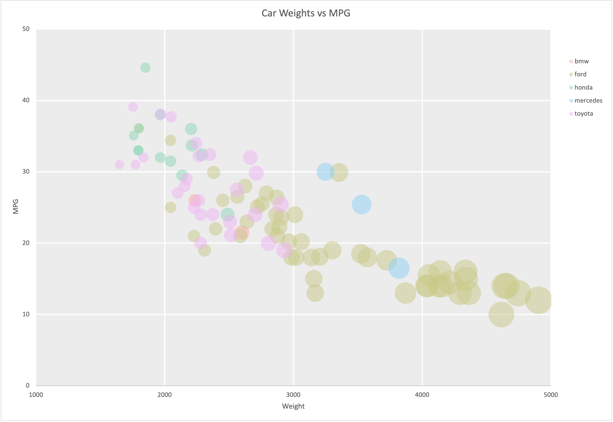
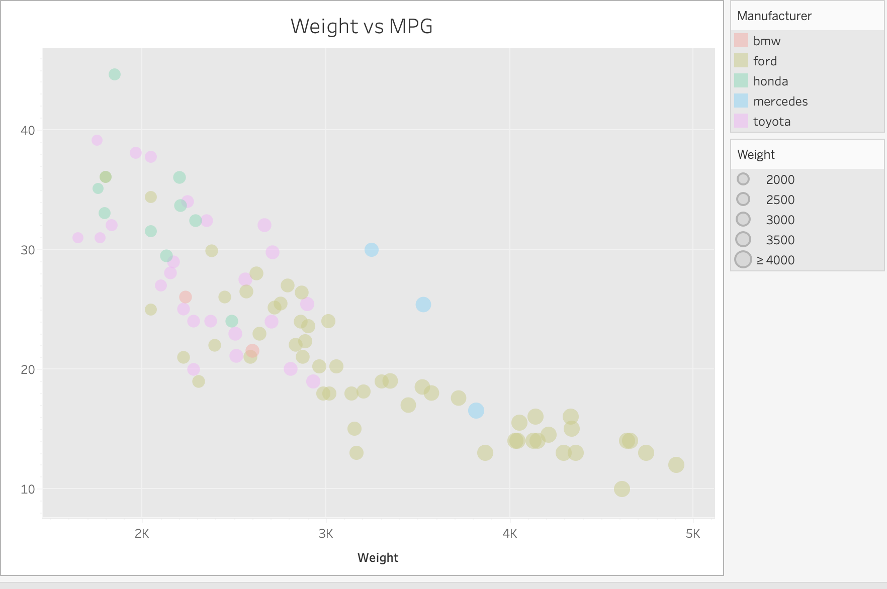

# 02-DataVis-5ways

# Assignment 2 - Data Visualization, 5 Ways

Using the dataset "cars-sample.csv", I created five visualization using various libraries and languages. I used R + ggplot2, Javascript + d3, Python + mathplotlib, Tableau, and Excel to complete this. The goal was to use this chart as reference and recreate it using each tool.

Note: For the missing MPG for the two Ford cars, I sub'd them with the MPG from the closest weight of that car type (Ford) this allowed me to complete the data set for visuals instead of a point that was not likely accurate (high weight and zero MPG, which is what is shown when you plot the missing data without changes)

# R + ggplot2 + R Markdown

I have taken stats 1-2 and prob so R is old faithful along with ggplot so this wasn't a big deal. There was no custom colors involved since the sample graph is the same, so that was less work for me to do which was fun. The background and axis was all auto after you set it, which was less fussy than other options too.

# Javascript + D3

D3 was less than helpful when it came to creating gridlines, so I had to forgo adding them. I found that simple instructions were hard to keep up with when D3 is being updated and removing features I was looking for like mouse(this) to implement the hover over. I was not able to get it to fully work, but it does call on hover and detects the mouse moves (I checked via the google chrome's inspect tool) it just does not place on screen relevative to the mouse position. It's useful, but I think there's more of a learning curve to get over before it's my first choice since it is a lot of trial and error on indivual additions to each chart as it's own SVG.

# Python + Matplotlib

Each visualization should include a screenshot. Put these in an `img` folder and link through the readme (markdown command: ``.

- Write a paragraph for each visualization tool you use. What was easy? Difficult? Where could you see the tool being useful in the future? Did you have to use any hacks or data manipulation to get the right chart?

# Excel

This tool was something popular in workplaces but far from my favroite, Microsoft Excel. Importing the data is easy enough and autoloads CSV files correctly, however there are major drawbacks that make it not my favorite. Excel does not allow you to add white space before the start of the axis bounds, which made it impossible to have the x axis start at 2000 and the y-axis start at 10, since it cuts off the data. To avoid missing points, I set the axis bounds lower than the example, so the x-axis started at 1000 and the y-axis start at 0. Knowing how to use formulas in Excel is useful when working on larger data sets and manipluation of the CSV itself, but the system starts to lag when creating charts and graphs and slows down my system. If working with smaller sets, this is a fine tool, but for larger sets of data I would not use this again by choice.

# Tableau

For this tool, I found this to be pretty easy to use. The instructions are clear on their website and the only thing I had to look up was inputting custom color palettes. I like that you can change each display based on device, and I think in the future if I wanted to use some mobile vis tools I would check this out first! It also lets you host on a server, which is good for keeping the features like on-hover available. When it's in the app on my computer, I can mouse over for values but that doesn't translate to PNG well.

## Technical Achievements

For tech achivements, I attemped to implement a mouse-over view for D3 to show data, but it did not work. The effort is there though!

### Design Achievements

I used consistent colors to the original graph by pulling the original hex colors. I also imported my own font to look closer to the original font into the D3 implementation since I ride or die by Raleway. For my Excel and Tableau implementations, I added the background grey and the white grid lines to the correct thickness to add some more visual contrast like the original graph. I was able to create the leagends and the visual icons as well for these two platforms.
