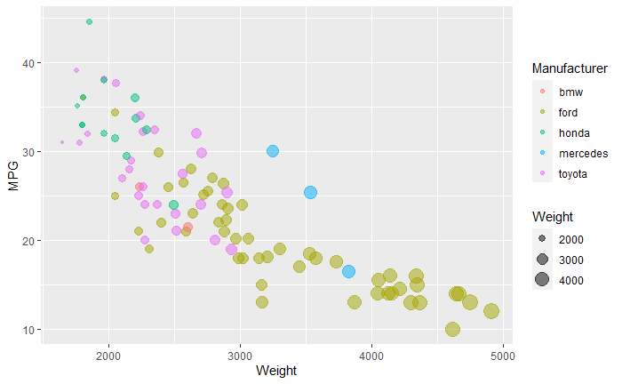
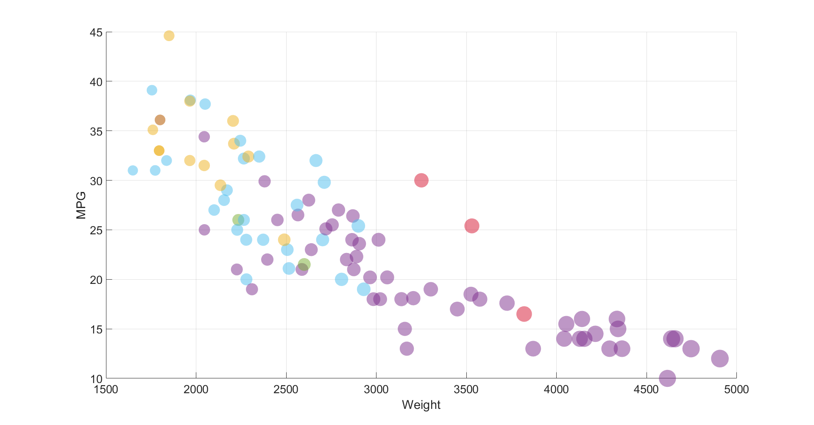
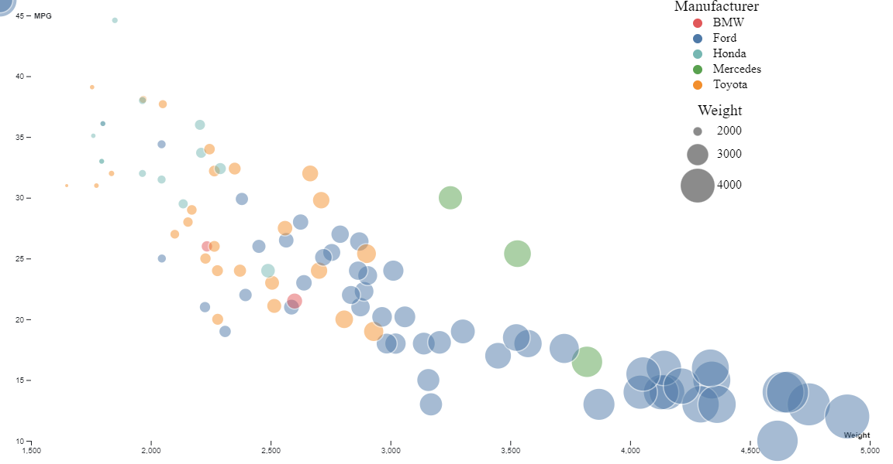

# R + ggplot2 + R Markdown

!Note! The code shown in class was used, I used the documentation of `geom_point()` shown in class(https://ggplot2.tidyverse.org/reference/geom_point.html) to complete the size and opacity of the graph.

R is a language primarily focused on statistical computing.
ggplot2 is a popular library for charting in R.
R Markdown is a document format that compiles to HTML or PDF and allows you to include the output of R code directly in the document.

To visualized the cars dataset, I made use of ggplot2's `geom_point()` layer, with aesthetics functions for the color and size.

While it takes time to find the correct documentation the prof showed us where it was =), these functions made the effort creating this chart minimal.

# Matlab
Write a paragraph for each visualization tool you use. What was easy? Difficult? Where could you see the tool being useful in the future? Did you have to use any hacks or data manipulation to get the right chart?

MATLAB is a programming and numeric computing platform used by millions of engineers and scientists to analyze data, develop algorithms, and create models(From their website). Matlab is a language I have used before in many math classes.

It was really easy to plot the dataset as there are many function in matlab that make reading a csv file easy.

Trying to get a legend to work for my data types was impossible. For some reason matlab insists on having the legend partially preset making it incredibly frustrating to work with.

The only data manipulation that was done was replacing car manufacturers with colors, so they could be passed through the scatter() function. As well as shrinking the weight sizes as the were originally to large.

# d3 + Observable Notebook

Link to Notebook: https://observablehq.com/d/9817b361aab1c8f5

(And so on...)

## Technical Achievements
- **Got all Pictures to be displayed in a webpage I made =)**: 

### Design Achievements
- **Used matlab help Center to pick nice colors **:https://www.mathworks.com/help/matlab/creating_plots/specify-plot-colors.html 
- **Installed ColorZilla**: Helped me make legends and identify colors in hexadecimal.
- **Used circle outline in d3**: I did this to better highlight cars that were similar to one another in terms of weight and MPG.
