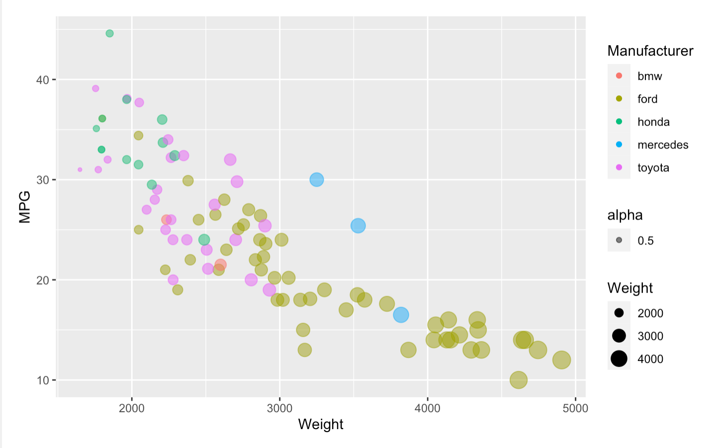
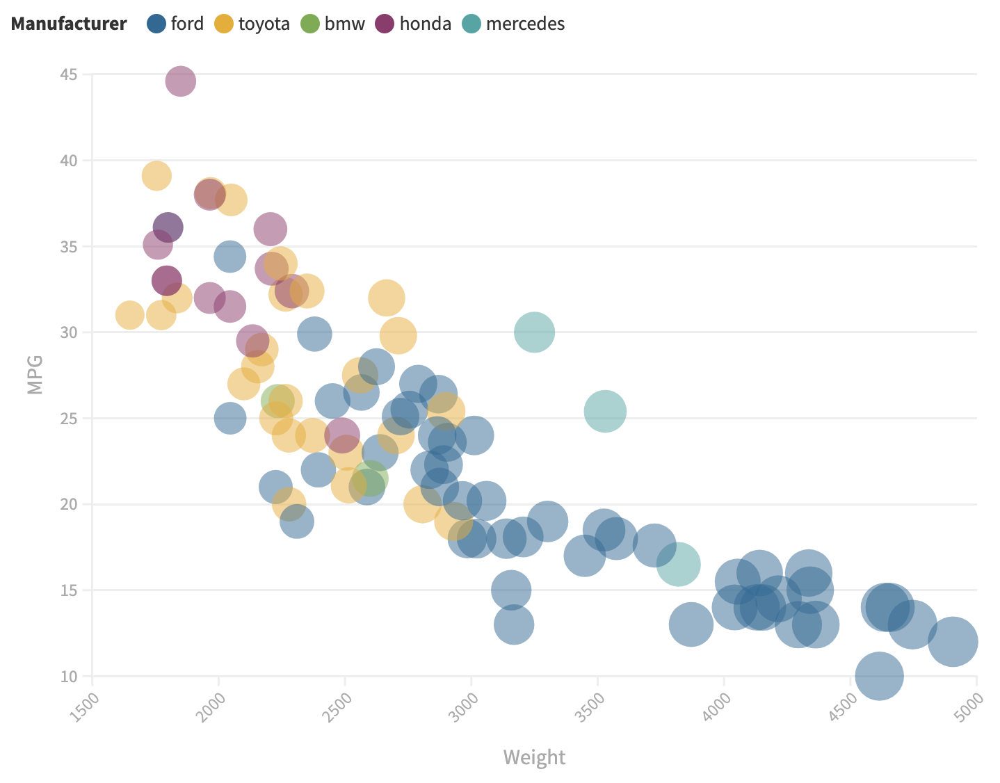
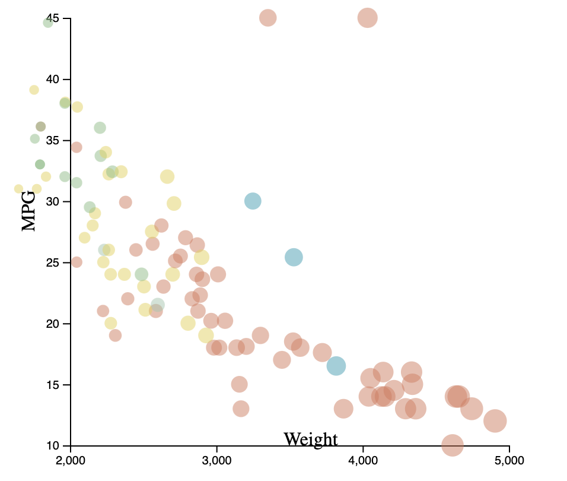
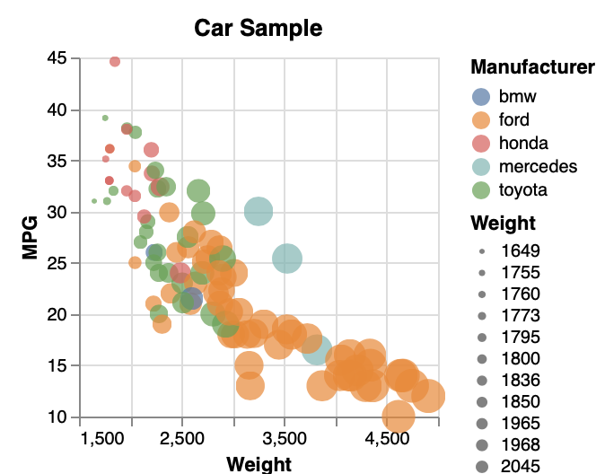

# 02-DataVis-5ways

Assignment 2 - Data Visualization, 5 Ways  Carley Gilmore
===

# R + ggplot2 + R Markdown

I thought R + ggplot2 was one of the easiest implementations to work with. I've used R before with RStudio in my Applied Statistics class and geom_point is a very useful tool to use. I simply edited the demo code from class to have an opacity of 0.5. I also personally liked the color scheme that R installed with each Manufacturer having a very distinct color.

# Flourish
The next tool I used was Flourish. I thought it was relatively simple to produce. I was mostly confused with how the legends worked because there is a section that only allowed one field to be shown at a time, or at least it didn't seem like you could add more than one legend. I also played around as a design achievement with showing the data when you click on the point.

# d3 js
I think d3 was the hardest graph to produce. I'm sure I could have maybe used an additional library, but I feel like this one took the most playing around with. I referred to many different sites to try to find information on how to produce scatterplots and got a lot of tips from there. One of my references I used was https://www.d3-graph-gallery.com/graph/scatter_basic.html. I also just played around with  different parameters especially style. I also noticed that a tricky part was getting the colors to appear different based on the manufacturer and d3.scaleOrdinal helped a lot with this: https://observablehq.com/@d3/d3-scaleordinal.

# Python + MatplotLib
This one was a fun one to figure out, I feel like it was definitely easier than d3js in  my opinion since matplotlib has some built in functions to create the scatter plot. However, figuring out the legends was a hassle to do. Finding a way to map the colors once again was a little tricky, but the solution was less involved than  I thought: https://kanoki.org/2020/08/30/matplotlib-scatter-plot-color-by-category-in-python/.

# VegaLite
This was my first time using VegaLite. I thought the syntax was a little getting used to and importing the CSV but it was still pretty clear and simple to produce legends for the map. I used VegaLite's example code and then tweaked the parameters.

## Technical Achievements
Hovering over a point to see data about it

### Design Achievements
Conscious color scheme for distinct colors- pulled off of randomized color chart based on Manufacturer
Made sure that the colors could be read with the light background
