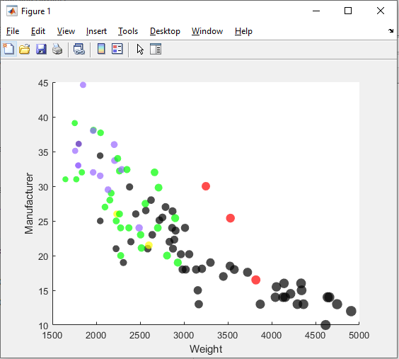

# d3js visualization
[d3js HTML Visualization](https://jacobadamsky.github.io/a2-DataVis-5Ways/code/d3vis.html)

# MATLAB visualization

# MatPlotLIB visualization
[d3js HTML Visualization](https://jacobadamsky.github.io/a2-DataVis-5Ways/html/matplotlib.html)

# ggplot2 visualization
[d3js HTML Visualization](https://jacobadamsky.github.io/a2-DataVis-5Ways/html/ggplot2.html)

# gnuplot visualization
[d3js HTML Visualization](https://jacobadamsky.github.io/a2-DataVis-5Ways/html/gnuplot.html)

Readme Requirements
---

A good readme with screenshots and structured documentation is required for this project. 
It should be possible to scroll through your readme to get an overview of all the tools and visualizations you produced.

- Each visualization should start with a top-level heading (e.g. `# d3`)
- Each visualization should include a screenshot. Put these in an `img` folder and link through the readme (markdown command: ``.
- Write a paragraph for each visualization tool you use. What was easy? Difficult? Where could you see the tool being useful in the future? Did you have to use any hacks or data manipulation to get the right chart?

Other Requirements
---

0. Your code should be forked from the GitHub repo.
1. Place all code, Excel sheets, etcetera in a named folder. For example, `r-ggplot, matlab, mathematica, excel` and so on.
2. Your writeup (readme.md in the repo) should also contain the following:

- Description of the Technical achievements you attempted with this visualization.
  - Some ideas include interaction, such as mousing over to see more detail about the point selected.
- Description of the Design achievements you attempted with this visualization.
  - Some ideas include consistent color choice, font choice, element size (e.g. the size of the circles).

GitHub Details
---

- Fork the GitHub Repository. You now have a copy associated with your username.
- Make changes to fulfill the project requirements. 
- To submit, make a [Pull Request](https://help.github.com/articles/using-pull-requests/) on the original repository.
