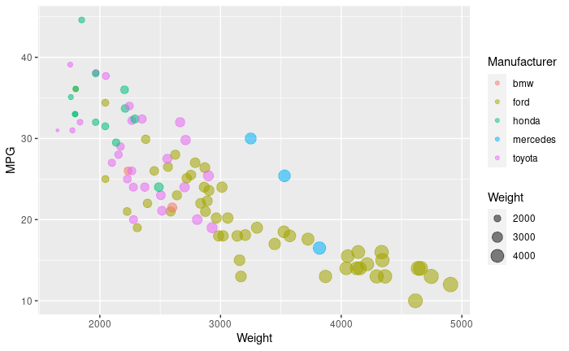
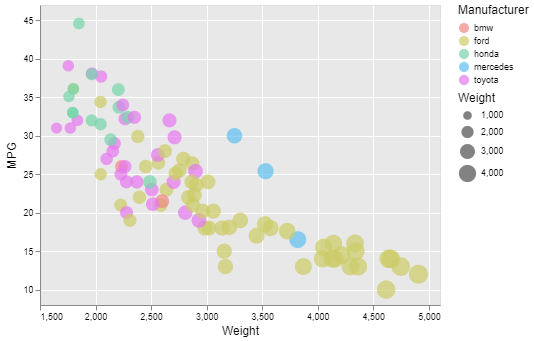

# 02-DataVis-5ways

Assignment 2 - Data Visualization, 5 Ways  
===

- Data positioning: it should be a downward-trending scatterplot as shown.  Weight should be on the x-axis and MPG on the y-axis.
- Scales: Note the scales do not start at 0.
- Axis ticks and labels: both axes are labeled and there are tick marks at 10, 20, 30, etcetera.
- Color mapping to Manufacturer.
- Size mapping to Weight.
- Opacity of circles set to 0.5 or 50%.

Other features are not required. This includes:

- The background grid.
- The legends.

Note that some software packages will make it **impossible** to perfectly preserve the above requirements. 
Be sure to note where these deviate.

Improvements are also welcome as part of Technical and Design achievements.

Libraries, Tools, Languages
---

You are required to use 5 different tools or libraries.
Of the 5 tools, you must use at least 3 libraries (libraries require code of some kind).
This could be `Python, R, Javascript`, or `Java, Javascript, Matlab` or any other combination.
Dedicated tools (i.e. Excel) do not count towards the language requirement.

Otherwise, you should seek tools and libraries to fill out your 5.

Below are a few ideas. Do not limit yourself to this list!
Some may be difficult choices, like Matlab or SPSS, which require large installations, licenses, and occasionally difficult UIs.

I have marked a few that are strongly suggested.

- R + ggplot2 `<- definitely worth trying`
- Excel
- d3 `<- since the rest of the class uses this, we're requiring it`
- Matplotlib
- three.js `<- well, it's a 3d library. not really recommended, but could be interesting and fun`
- p5js `<- good for playing around. not really a chart lib`
- Tableau
- Java 2d
- GNUplot `<- the CS department head uses this all the time :)`
- Vega-lite <- `<- very interesting formal visualization model; might be the future of the field`
- Flourish <- `<- popular in recent years`
- PowerBI
- SPSS

You may write everything from scratch, or start with demo programs from books or the web. 
If you do start with code that you found, please identify the source of the code in your README and, most importantly, make non-trivial changes to the code to make it your own so you really learn what you're doing. 

Tips
---

- If you're using d3, key to this assignment is knowing how to load data.
You will likely use the [`d3.json` or `d3.csv` functions](https://github.com/mbostock/d3/wiki/Requests) to load the data you found.
Beware that these functions are *asynchronous*, meaning it's possible to "build" an empty visualization before the data actually loads.

- *For web languages like d3* Don't forget to run a local webserver when you're debugging.
See this [ebook](http://chimera.labs.oreilly.com/books/1230000000345/ch04.html#_setting_up_a_web_server) if you're stuck.

Readme Requirements
---

A good readme with screenshots and structured documentation is required for this project. 
It should be possible to scroll through your readme to get an overview of all the tools and visualizations you produced.

- Each visualization should start with a top-level heading (e.g. `# d3`)
- Each visualization should include a screenshot. Put these in an `img` folder and link through the readme (markdown command: ``.
- Write a paragraph for each visualization tool you use. What was easy? Difficult? Where could you see the tool being useful in the future? Did you have to use any hacks or data manipulation to get the right chart?

Other Requirements
---

0. Your code should be forked from the GitHub repo.
1. Place all code, Excel sheets, etcetera in a named folder. For example, `r-ggplot, matlab, mathematica, excel` and so on.
2. Your writeup (readme.md in the repo) should also contain the following:

- Description of the Technical achievements you attempted with this visualization.
  - Some ideas include interaction, such as mousing over to see more detail about the point selected.
- Description of the Design achievements you attempted with this visualization.
  - Some ideas include consistent color choice, font choice, element size (e.g. the size of the circles).

**NOTE: THE BELOW IS A SAMPLE ENTRY TO GET YOU STARTED ON YOUR README. YOU MAY DELETE THE ABOVE.**

# R + ggplot2 + R Markdown

According to the original README.md for this assignment:
`R is a language primarily focused on statistical computing.
ggplot2 is a popular library for charting in R.
R Markdown is a document format that compiles to HTML or PDF and allows you to include the output of R code directly in the document.`

I have found trying to figure out how to do stuff in R frustrating, but since the original chart was created in ggplot2, I was able to recreate it almost identically with minimal code.

I borrowed code from the following sources:
- This class: https://wpi0-my.sharepoint.com/personal/ltharrison_wpi_edu/_layouts/15/onedrive.aspx?id=%2Fpersonal%2Fltharrison%5Fwpi%5Fedu%2FDocuments%2FSpring%202022%2Fcs480x%2D22c%2Fvid%2F2022%2D01%2D24%2013%2E03%2E11%20cs480x%2D22c%2Fggplot2demoinclass%2Ezip&parent=%2Fpersonal%2Fltharrison%5Fwpi%5Fedu%2FDocuments%2FSpring%202022%2Fcs480x%2D22c%2Fvid%2F2022%2D01%2D24%2013%2E03%2E11%20cs480x%2D22c
- https://www.datanovia.com/en/blog/how-to-remove-legend-from-a-ggplot/
- https://statisticsglobe.com/set-legend-alpha-of-ggplot2-plot-in-r
- https://www.tutorialspoint.com/how-to-import-csv-file-data-from-github-in-r

# d3...

(And so on...)

# Vega-Lite

"Vega-Lite is a high-level grammar of interactive graphics", according to Vega-Lite's website.

It allows us to easily create charts in JSON. The object structure can match data structures to various properties of the markers, and legends and axes are automatically created for each mapping.

Interestingly, according to the documentation, Vega-Lite uses d3 behind the scenes.

When recreating the chart, I used custom colors to match the original, but there are a number of color presets that can be used.

I was unable to match the circle size (mine are generally bigger), and Vega-Lite doesn't support having extra gridlines between axis labels.

## Technical Achievements
- **Probably none**

### Design Achievements
- **Probably none**
