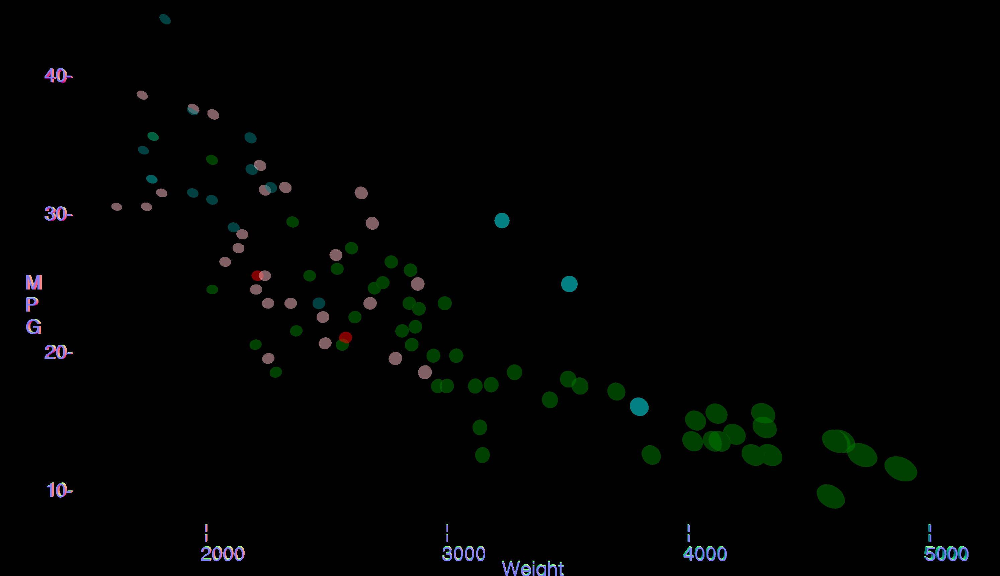

# ThreeJS

This was the worst possible way to graph this data. I loved the result and it was fun to make but there were so many problems I ran into when making this. To make my axis' I had to map the car's value to canvas dimensions(mpg/weight) to a canvas 

# Google Sheets

