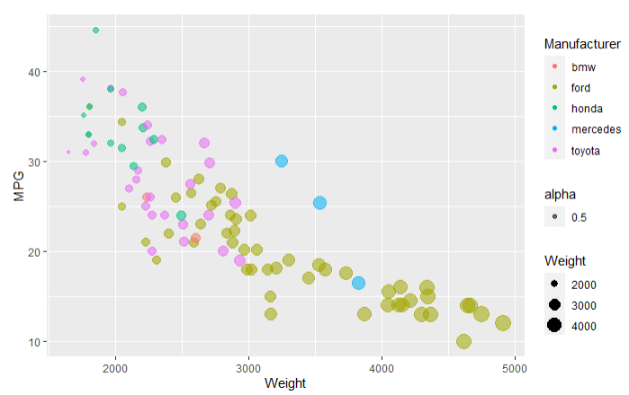
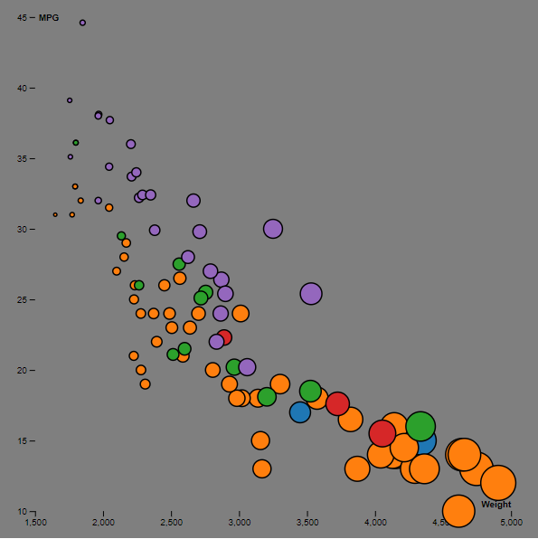
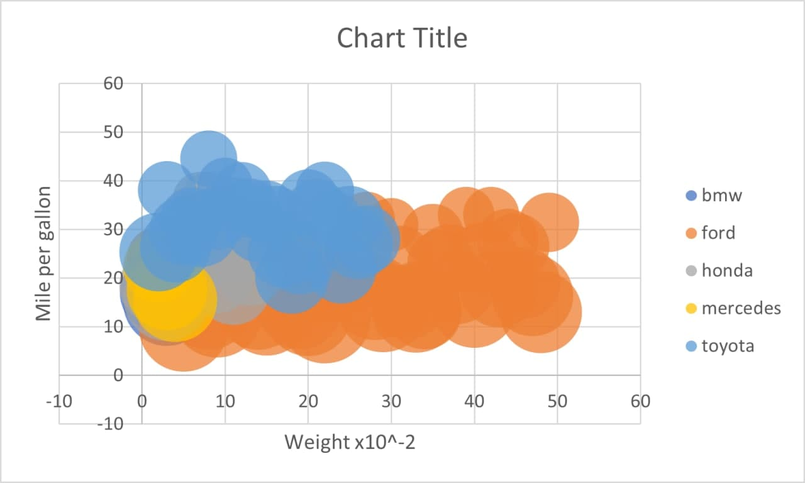
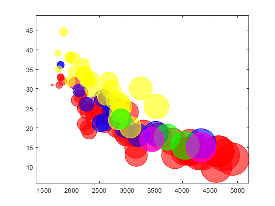
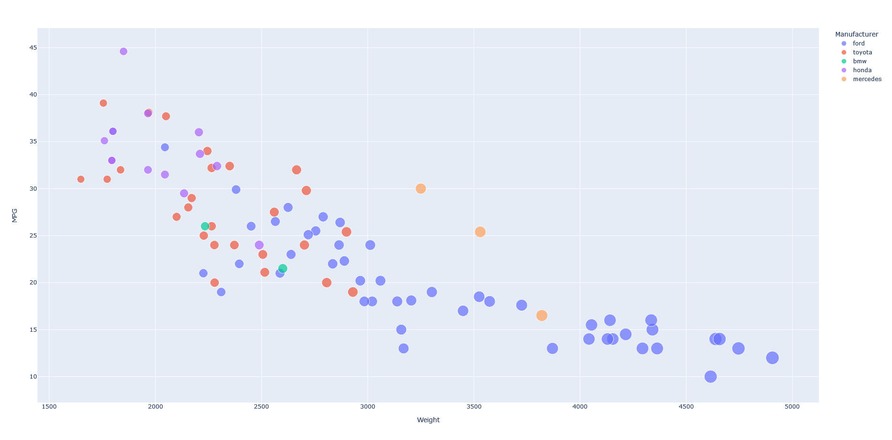
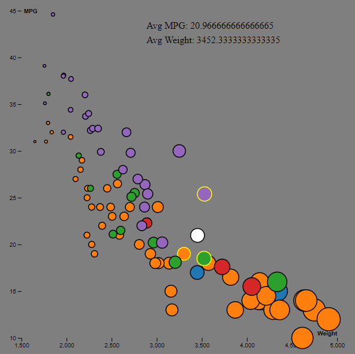

# R + ggplot2 + R Markdown

R is a language primarily focused on statistical computing.
ggplot2 is a popular library for charting in R.
R Markdown is a document format that compiles to HTML or PDF and allows you to include the output of R code directly in the document.

To visualized the cars dataset, I made use of ggplot2's `geom_point()` layer, with aesthetics functions for the color and size.

While it takes time to find the correct documentation, these functions made the effort creating this chart minimal.

Although the charts generated by this tool were easy to use, it wasn't as easy as plotly and wasnt better in apearance. 

# d3
D3 is a JavaScript library for data visualization. It was used to create a html page that visalized the car sample data. 

The process requiered signifcant coding but enabled the creation of interactive elemnts. This tradeoff is worthwile if these elements are desired.

# Excel

Excel is primarily a spreadsheet manipulation program, which also has the capibility for basic data visualization. 

Visualizing the data requiered manual manipulation of the data and selection of the different manufacturers for them to be dispalyed differnetly. The graphs was minimally interactive. However no coding was requiered.

These tools are usefull if already working in excel, but are not worth seeking out to use otherwise.

# Matlab

Matlab is a matrix based calucaltor/language that in addition to other simulation and modeling cappibnliites, as graphing ability as well.

The procedure for using this software to display differnet coloars is somewhat unintuitive. Its overall not as versitle and easy to weild other options. it is also difficult to customize the appearance and make the visualization more readable and apealing. 

Like excel thse tools are useful if alredy working in matlab, but are not vercitle or easy enought to seek out otherwise.

# Python plotly 
Plotly is a plotting library for python.

Plotly was able to generate the visualization with no data manipulation and only 3 lines of code.
The visual clarity of the default graph was also good, consiterably better than matlab and excel. 

This ease of use would make this my choice for a tool to visualize data quickly.

## Technical Achievements
- **Average of Selected Datapoints**: In my d3 visualization the user has the ablity to select several datapoints, which will then have their average weight and MPG displayed on the visualization as a white dot.

### Design Achievements\
- **Average Selection Visual Calrity** The selected dtapoints are outlines in a bright yellow to make clear which ones are being averaged.
- **Used d3.schemecategory10**: In my d3 visualization I used colors form this color scheme thougout my visualization
