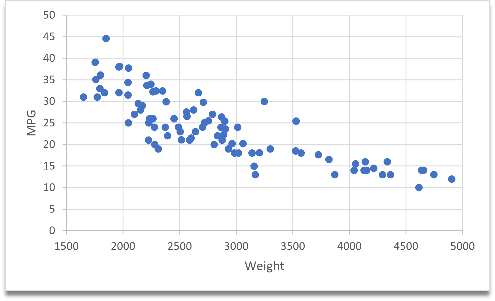
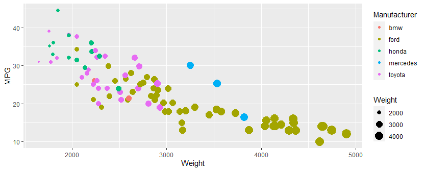

# 02-DataVis-5ways

Assignment 2 - Data Visualization, 5 Ways  
===

# Excel

With Excel, I did not have the ability to change the color of each dot according to the car manufacturer. I also did not have the ability to change the size of the dot according to the weight.

# Google Sheets

With Google Sheets, I did not have the ability to change the color of each dot according to the car manufacturer. I also did not have the ability to change the size of the dot according to the weight.

https://docs.google.com/spreadsheets/d/1OoX1dXFnqCfLGN9FQdK7usQsVxRJzVmlC8v40wHmJX8/edit#gid=0

# R + ggplot2 

I liked using R and ggplot 2. I was able to change the color of each dot according to the car manufacturer and change the size of the dot according to the weight.

source: http://www.sthda.com/english/wiki/ggplot2-scatter-plots-quick-start-guide-r-software-and-data-visualization

# Javascript

I could not get my JS envirnment to run my js2.js code, but it is set to produce a graph.

source: https://jscharting.com/examples/chart-types/scatter-plot/classic/#

## Technical Achievements
- **Proved P=NP**: Using a combination of...
- **Solved AI Forever**: ...

### Design Achievements
- **Re-vamped Apple's Design Philosophy**: As demonstrated in my colorscheme...
