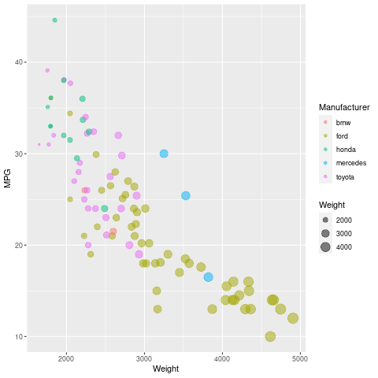
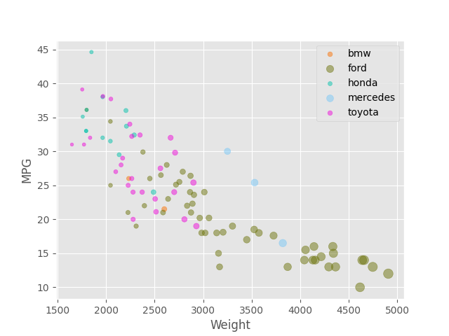
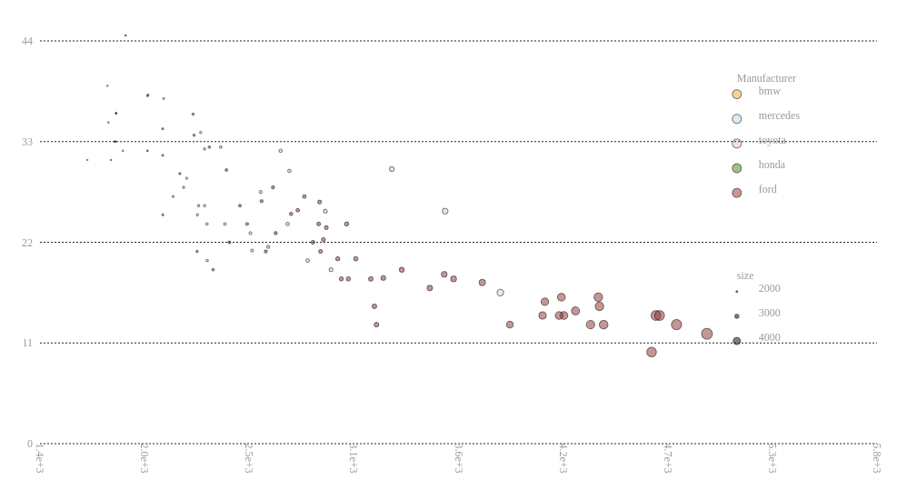
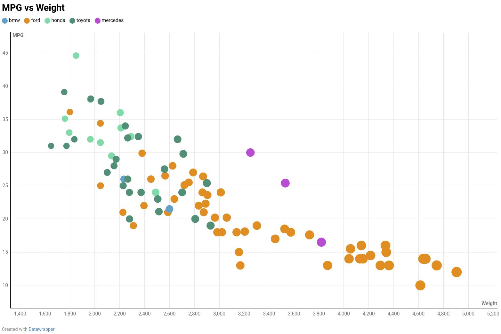

# R

Using the popular ggplot2 library for Rlang, plotting the chart can be done in a
single line after loading the data. The simple and descriptive syntax gets 
supercharged via layering. It fully recreates the example chart, as the original
was done with thix combination of tools.

# Matplotlib Python

Pyplot from matplotlib is my go to plotting library in any language. It's syntax
is very similar to that of Matlab, and in relatively few lines of code, I was 
able to recreate the original chart. However, I was unable to find documentation
or examples of a secondary legend for the car weight, as was available in other 
visualization tools.

# d3

The d3 plot was also relatively simple, though much more verbose than the R
implementation. Mostly, referring to examples of other scatterplots created with
d3 were helpful in understanding what code to write, while with the more 
statistically oriented programming languages, the documentation was the most 
helpful resource.

# Svelte + SVG from scratch

While this code is even more verbose than the d3, it does most of the same 
things. Instead of manipulating the DOM in D3's functional chaining style,
svelte's reactivity and integration into the markup allows for a more straight-
forward syntax for describing the layouts.

Due to the general focus of svelte, many helper functions one might expect from 
software like d3 are missing. In real world use, d3 can be imported for use with
d3-scale or other helers, despite not using them to manipulate the DOM. The 
build process will shake unneeded code from the bundle, so you don't have to 
worry about bloat for your user when importing extras from something like d3.

# Datawrapper

Datawrapper is a quick online visualization tool. Despite its limited interface,
I was able to recreate almost all aspects of the original chart except for the 
second weight legend. While the size does vary by the weight, the difference is
very hard to tell in Datawrapper, and the constrained settings to generate the 
plot left more control to be desired in this regard.

## Technical Achievements

- **Implemented scatterplot from scratch in SVG**: While d3 relies on modifying 
attributes of a circle or other shape that it has generated, the svelte 
implementation I made brings the user much closer to the original SVG markup
that makes the page, and allows design patterns to extend beyond visualization 
into the rest of the DOM.

### Design Achievements

- **Matched colorscheme as best as possible**: In the python and d3 
implementations, where nice colorspaces were available, I attempted to get the 
closest pallete to the R pallete.
- **Shaded Background**: I copied the shaded background style of the original in
the R plot and the python/matplotlib plot.