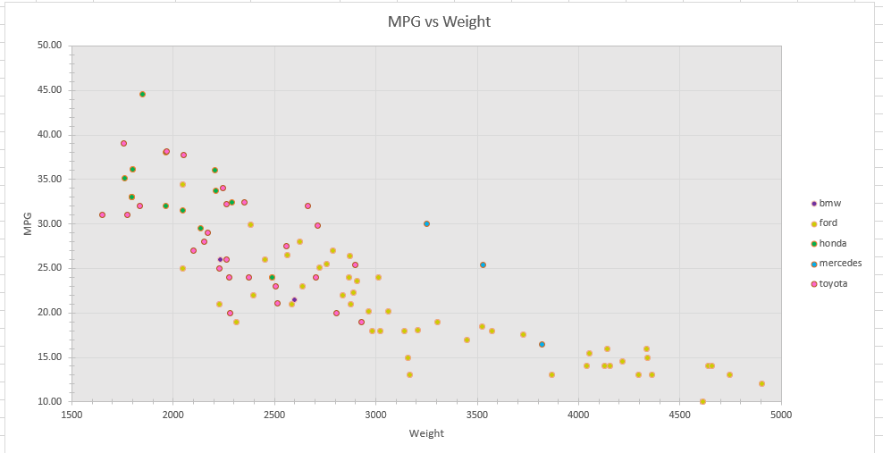

# R + ggplot2
 
R is a language commonly used in the fields of statistics and probability. ggplot2 is an open-sourced visualization library for R, and it includes a variety of features that pair the mathematical power of R with data visualization.
 
I was surprised by how remarkably easy it was to use R and ggplot to replicate the visualization. It took an extremely minimal amount of code to create a fairly intricate chart. I used Professor Harrison's code in class that he used as a demo as a starting point.
 
I could see R and ggplot being useful in the future when wanting to combine statistics and data visualization in one language. I did not have to manipulate the data to get the right graph, and the data with 'NA' for its MPG field was automatically filtered out.
 

 
# d3
 
d3 is an extremely powerful and customizable library for creating data visualizations in Javascript.
 
With this immense level of freedom also comes much more work to achieve the same results as other languages. I am a little more comfortable using d3 after having spent some time with it, but I find that it is a comparatively difficult tool to use for trying to create a simple visualization.
 
d3 would definitely be useful for making more intricate and interactive visualizations. It offers much more depth than the other tools I used. I filtered out the null data points by simply setting their y-coordinate to be outside the SVG. All code I based my program on is shown in the comments of the file.
 

 
# Excel
 
Excel is a spreadsheet tool created by Microsoft. It is perhaps the most common data analysis application in the world.
 
I ran into some problems importing the CSV data to Excel, which led to some tedious debugging. Other than that, Excel was one of the more intuitive tools I used and was fairly easy to use once I got past my initial difficulties.
 
Excel is great for light data analysis and visualization, where complex functionality is not needed. I had to create a separate series for each manufacturer's cars in order to map the manufacturer to node color.
 

 
# Python + pyplot
 
Python is an extremely versatile language used in a wide variety of high-level programming fields. Specifically, pyplot is a library that gives matplotlib MATLAB-like functionality.
 
I have very minimal experience in Python and found the syntax a bit perplexing at first. Although I did not have to write too many lines of code to create what I wanted, the lines I did write took a long time to get right.
 
Python and pyplot could be useful for making data visualization on program performance. It would be simple to analyze an algorithm's performance and visualize it using pyplot. I noticed that the bubble size of the data points was much too big initially, so I had to divide the manufacturer size by 10 to make it work. All code I based my program on is shown in the comments of the file
 

 
# Google Sheets
 
Google Sheets is the Google equivalent of Excel. It is free for anyone with access to Google Drive and has a lot of the same functionality as Excel.
 
Sheets was almost too easy to use. It sacrificed depth in features for being incredibly straightforward. It took much less time to create the chart than the other tools I used.
 
Sheets could be used to offer an introduction to data analysis and visualization and as a free alternative to Excel. It could also be used to work on the same spreadsheet remotely with others. Unfortunately, Sheets does not allow you to edit the bubble size of the data points, which made the data a lot harder to read.
 
Note: the chart did not seem to export correctly when I tried downloading the Sheets file as a .xlsx, so I included a .pdf file as well.
 

 
## Technical Achievements
- **Gained experience with CSV files**: I had never worked with CSV files before this assignment. I figured out how a CSV file is formatted and how to utilize its different fields in a variety of languages.
- **Learned how to bind data in d3**: I learned how to bind data from the CSV file to individual circles in d3. To do this, I had to learn how to import the CSV and use the d3.data() function, both of which I had never done before.
- **Learned how to use Python**: Having little experience with Python before this, I was able to pick up what I needed to know on the fly as I was doing the assignment.
- **Resolved Excel datatype issue**: For some reason, the MPG field in the CSV file was imported as text to Excel and not as numbers (I am guessing because of the 'NA's). This caused the MPG to not display correctly on the chart. I had to change the datatype in order to create the scatterplot correctly.
- **Incorporated Margins in d3 program**: Margins were something Professor Harrison mentioned in class as being commonly used in the d3 community. I tried to understand how they work and used them in the design of my chart.
 
### Design Achievements
- **Used interactive tooltip in Python chart**: My Python/pyplot chart uses a tooltip that displays the exact Weight and MPG values of the datapoint the mouse is hovering over.
- **Used consistent color style**: Across all the tools and libraries, I used the same general coloring for every manufacturer.
- **Filtered out null data values**: I dealt with the cars that had 'NA' as their MPG value by not displaying them in my charts, making the chart easier to read and more intuitive.
- **Added legends**: Multiple of my charts have legends showing the manufacturer associated with the color of each data point, and one also displays the datapoint size and weight relationship as well as the opacity being used.