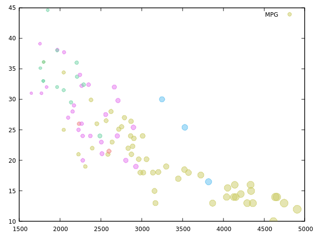
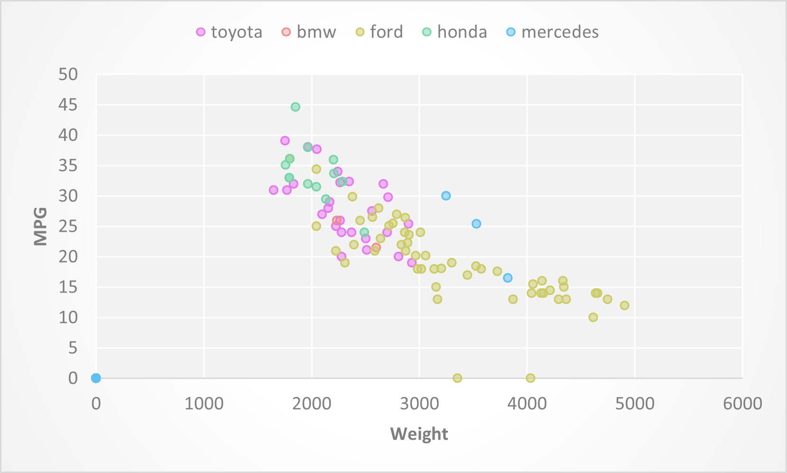
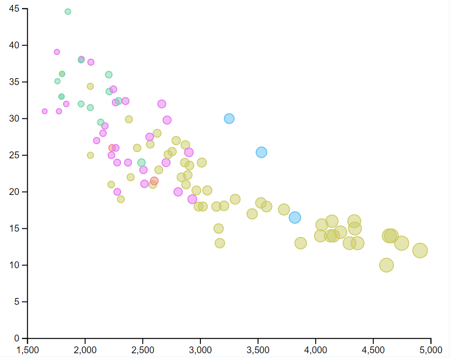

Assignment 2 - Data Visualization, 5 Ways  
===

Tips
---

- If you're using d3, key to this assignment is knowing how to load data.
You will likely use the [`d3.json` or `d3.csv` functions](https://github.com/mbostock/d3/wiki/Requests) to load the data you found.
Beware that these functions are *asynchronous*, meaning it's possible to "build" an empty visualization before the data actually loads.

- *For web languages like d3* Don't forget to run a local webserver when you're debugging.
See this [ebook](http://chimera.labs.oreilly.com/books/1230000000345/ch04.html#_setting_up_a_web_server) if you're stuck.

# Vega-Lite

"Vega-Lite is a high-level grammar of interactive graphics", according to Vega-Lite's website.

It allows us to easily create charts in JSON. The object structure can match data structures to various properties of the markers, and legends and axes are automatically created for each mapping.

Interestingly, according to the documentation, Vega-Lite uses d3 behind the scenes.

When recreating the chart, I used custom colors to match the original, but there are a number of color presets that can be used.

I was unable to match the circle size (mine are generally bigger), and Vega-Lite doesn't support having extra gridlines between axis labels.

# R + ggplot2 + R Markdown

According to the original README.md for this assignment:
`R is a language primarily focused on statistical computing.
ggplot2 is a popular library for charting in R.
R Markdown is a document format that compiles to HTML or PDF and allows you to include the output of R code directly in the document.`

I have found trying to figure out how to do stuff in R frustrating, but since the original chart was created in ggplot2, I was able to recreate it almost identically with minimal code.

I borrowed code from the following sources:
- This class: https://wpi0-my.sharepoint.com/personal/ltharrison_wpi_edu/_layouts/15/onedrive.aspx?id=%2Fpersonal%2Fltharrison%5Fwpi%5Fedu%2FDocuments%2FSpring%202022%2Fcs480x%2D22c%2Fvid%2F2022%2D01%2D24%2013%2E03%2E11%20cs480x%2D22c%2Fggplot2demoinclass%2Ezip&parent=%2Fpersonal%2Fltharrison%5Fwpi%5Fedu%2FDocuments%2FSpring%202022%2Fcs480x%2D22c%2Fvid%2F2022%2D01%2D24%2013%2E03%2E11%20cs480x%2D22c
- https://www.datanovia.com/en/blog/how-to-remove-legend-from-a-ggplot/
- https://statisticsglobe.com/set-legend-alpha-of-ggplot2-plot-in-r
- https://www.tutorialspoint.com/how-to-import-csv-file-data-from-github-in-r

# gnuplot

"Gnuplot is a portable command-line driven graphing utility for ... many ... platforms."
 
Gnuplot is at least as beginner unfriendly as R, and Google was much less helpful for finding answers as it was for R. As a result, I gave up before attempting to add the grid or legends.

In addition to the official documentation (http://gnuplot.info/docs_5.4/Gnuplot_5_4.pdf), I consulted these sources:
- https://stackoverflow.com/questions/29071421/gnuplot-plotting-points-with-color-based-iris-data
- https://stackoverflow.com/questions/14871272/plotting-using-a-csv-file
- https://tipsfordev.com/in-gnuplot-how-can-i-plot-the-sum-of-two-columns-when-i-m-plotting-by-header-name
- https://courses.physics.illinois.edu/phys466/sp2013/comp_info/gnuplot.html (for how to load scripts)

There are ways to use gnuplot online; however, with the way I installed it, it doesn't support using online files. You will need to put gnuplot.script and cars-sample.csv in the same folder to get the code to run.

# Excel

Excel is a part of Microsoft Office, and deals with spreadsheets.

Among its features is the ability to create charts and graphs.

I have already learned a large number of Excel's features due to having previously taken a course in Office, and so it didn't take that long to create the chart.

Excel doesn't support mapping a data series to color; however, because the data series that was mapped to color was categorical, I was able to use it to filter the data into 5 groups, each of which I graphed using a different color.

Excel also doesn't support mapping a data series to size, nor changing the spacing of axis ticks or gridlines.
Furthermore, it added about 400 FALSE/FALSE datapoints (which were artifacts of my filtering method) to the graph at (0,0), forcing the graph to include the origin.
Other settings, like changing the background color and adding transparency, are rather hidden.

Like Vega-Lite and ggplot, Excel uses builtin color palletes, but I used a custom pallete to match the original graph.

# d3

"D3.js is a JavaScript library for manipulating documents based on data."

d3 operates at a lower level than the other visualization tools, and so the code is generally much bigger. It gives us more freedom than the other libraries, but using convenience methods like .extent() and .nice() reduces this freedom.

Because I was short on time, I did not attempt to re-create the background grid, nor the legend.

I handled NA values by setting them to 0, and so my y-axis goes all the way down to 0, unlike the sample chart. My x-axis does not go to 0, however.

I borrowed code from the following sources:
- This class: https://wpi0-my.sharepoint.com/personal/ltharrison_wpi_edu/_layouts/15/onedrive.aspx?id=%2Fpersonal%2Fltharrison%5Fwpi%5Fedu%2FDocuments%2FSpring%202022%2Fcs480x%2D22c%2Fvid%2F2022%2D01%2D12%2013%2E00%2E20%20cs480x%2D22c%2Fd3start%2Ezip&parent=%2Fpersonal%2Fltharrison%5Fwpi%5Fedu%2FDocuments%2FSpring%202022%2Fcs480x%2D22c%2Fvid%2F2022%2D01%2D12%2013%2E00%2E20%20cs480x%2D22c&p=14
- https://www.geeksforgeeks.org/d3-js-axisbottom-function/
- https://www.d3indepth.com/scales/
- https://observablehq.com/@d3/d3-extent

## Technical Achievements
- **Probably none**

### Design Achievements
- **Probably none**
