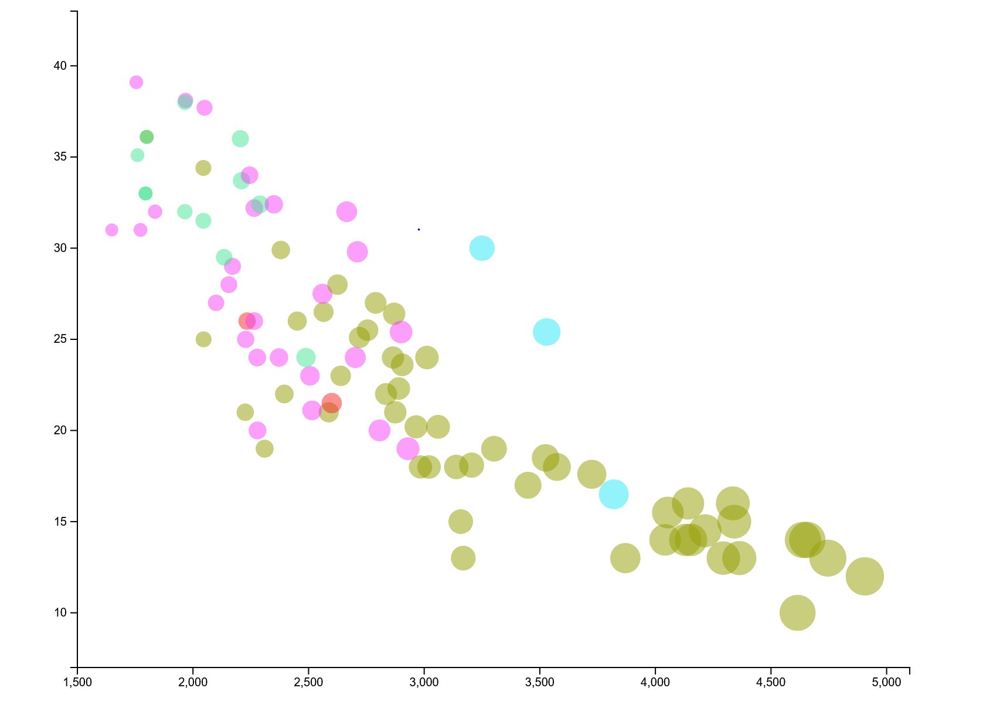
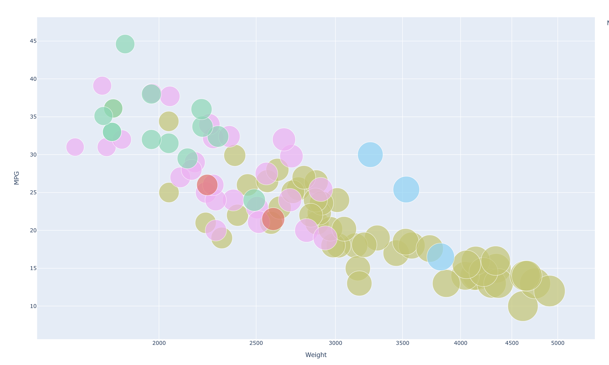
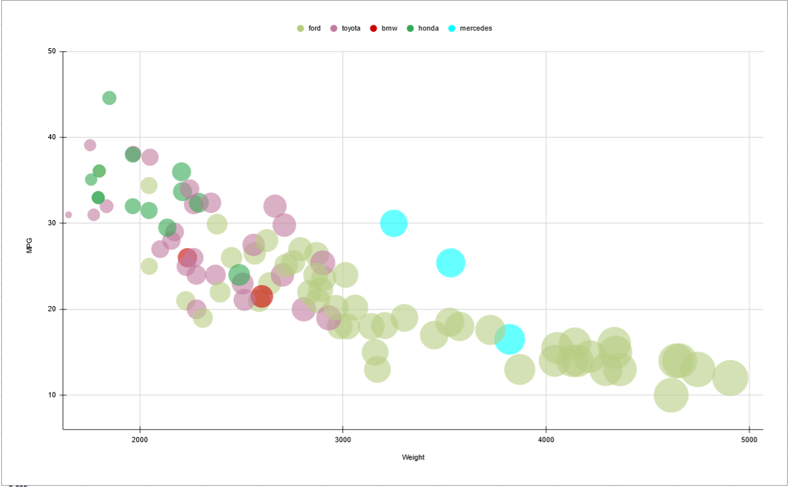

# Project Overview
For my project I used the following tools to create my graphs
1. ThreeJS
2. D3
3. Python(plotly.express)
4. Google Sheets
5. Flourish

## Technical Achivements
My technical achivement was using ThreeJS to create my graph. This is a library I'm trying to relearn. Using this library was a lot of work since there is no built in graph functionallity so I had to create my axis' including labels.

Additionally I added the feature to spin around the graph in the ThreeJS one which isn't very useful but is fun.

## Design Achivements
My design achivement was keeping consistant point colors(expect google sheets that program just sucks).

Another achivement was have the threejs graph take up the enite window when launched.

# ThreeJS

Website: https://travisthomp.github.io/a2-DataVis-5Ways/graphs/threejs/dist/index.html

This was the worst possible way to graph this data but... I loved the result and it was fun to make. There were so many problems I ran into when making this. To make my axis' I had to map the car's value to canvas dimensions(mpg/weight) to the canvas cordinates. I would not reccoment this for creating a quick graph but it makes an cool visual. I felt like I had way too much control over what I wanted to for this visualization(Was a lot like reinventing the wheel).

# D3

Website: https://travisthomp.github.io/a2-DataVis-5Ways/graphs/d3/dist/index.html

I had a good experience with this. I used starter code from
https://www.d3-graph-gallery.com/graph/scatter_grouped.html

I had a pretty smooth experience with this. I felt that I had a lot of control comparted to googlesheets and python. The only issue I ran into was creating the axis labels which I figured out.

# Python using plotly.express

This code was really fast to write but didn't give me the most control. I wish it was easier to control the sizes of bubbles I felt like no matter what I did they were always a little to big.

# Google Sheets

This was probably the worst expierience I had which I was supprised about. Everything felt difficult to do and hard to find. It could of been just my skill with the program but it just wasn't fun to make.

# Flourish

Code on flourish: https://public.flourish.studio/visualisation/8550400/

This was the best experience I had making this graph. The enitire system was EXTREMELY user friendly. Being a new user I was able to create the exact graph I wanted within 5 minutes which is just insane and I felt like I had all the control I wanted.
