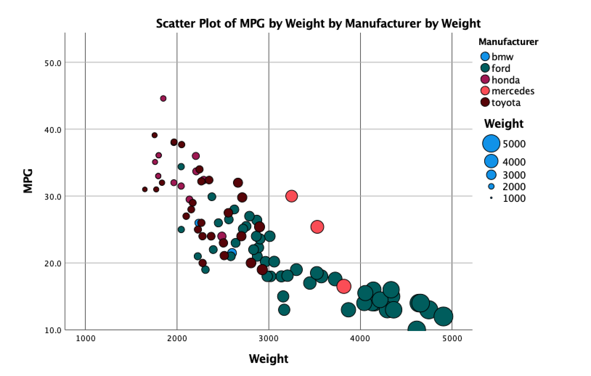

# R + ggplot2 + R Markdown

R is a language primarily focused on statistical computing.
ggplot2 is a popular library for charting in R.
R Markdown is a document format that compiles to HTML or PDF and allows you to include the output of R code directly in the document.

To visualized the cars dataset, I made use of ggplot2's `geom_point()` layer, with aesthetics functions for the color and size.

While it takes time to find the correct documentation, these functions made the effort creating this chart minimal.

# Javscript + D3

D3.js is a JavaScript library for producing dynamic, interactive data visualizations in web browsers. It makes use of Scalable Vector Graphics, HTML5, and Cascading Style Sheets standards. JavaScript, often abbreviated JS, is a programming language that is one of the core technologies of the World Wide Web, alongside HTML and CSS. 

In order to categorize the scatterplot according to the manufacturer, I used the d3 built in function, scaleOrdinal() to map colors to a category. This allowed me to easily categorize the datapoints and color them according to manufacturer.

# Python + MatplotLib + Pandas

Python is an interpreted high-level general-purpose programming language. Its design philosophy emphasizes code readability with its use of significant indentation. Matplotlib is a plotting library for the Python programming language and its numerical mathematics extension NumPy. Pandas is a software library written for the Python programming language for data manipulation and analysis

In order to read in the data from the csv and transform it into a usable and neat data structure, I used the read_csv method available in pandas. In order to make sure the axes were correctly spaced, I made use of matplotlib locator params variable that allowed me to set the number of tick marks on the x and y axes.

# IBM SPSS

SPSS Statistics is a statistical software suite developed by IBM for data management, advanced analytics, multivariate analysis, business intelligence, criminal investigation.

In order to make the required portions of the graph such as assigning size to weight and colors to manufacturer I used the drag and drop functionality that is available in the SPSS chart builder where you simply drag the measurements such as weight or mpg that you want controlling aspects of the graph, such as color or size of the dots.

# Tableau

Tableau Software is an American interactive data visualization software company focused on business intelligence. Tableau was by far my favorite tool to use in this assignment because of its seamless user interface.

In order to make the bubble chart, all I had to was import the csv file into tableau and the software took care of seperating the data. In addition to this, In order to assign size of the bubble to weight and assign color of the bubble according to category, it was very simalar to IBM SPSS where I simply had to drag the measurements onto the style preferences. Though this was simalar to SPSS I liked tableau better simply because it was easier to understand what to do.

## Technical Achievements
- **Proved P=NP**: Using a combination of...
- **Solved AI Forever**: ...

### Design Achievements
- **Re-vamped Apple's Design Philosophy**: As demonstrated in my colorscheme...

# Technical Achievements

Some technical achievements I had during this was understanding how both SPSS and Tableau function. I thoroughly enjoyed the way both visualization software allows for the drag and drop visualizations to make the process as seamless and simple as possible. In addition to this, I got to know more about matplotlib and after reading some documentation, I was able to use the locator_params that are avilable in matplotlib to customize the axes to how I wanted them.

# Design Achievements

One of the biggest design achievements I had for this project was understanding the color schemes and understanding the different available color maps such as hsv that were available in python's matplotlib library.

