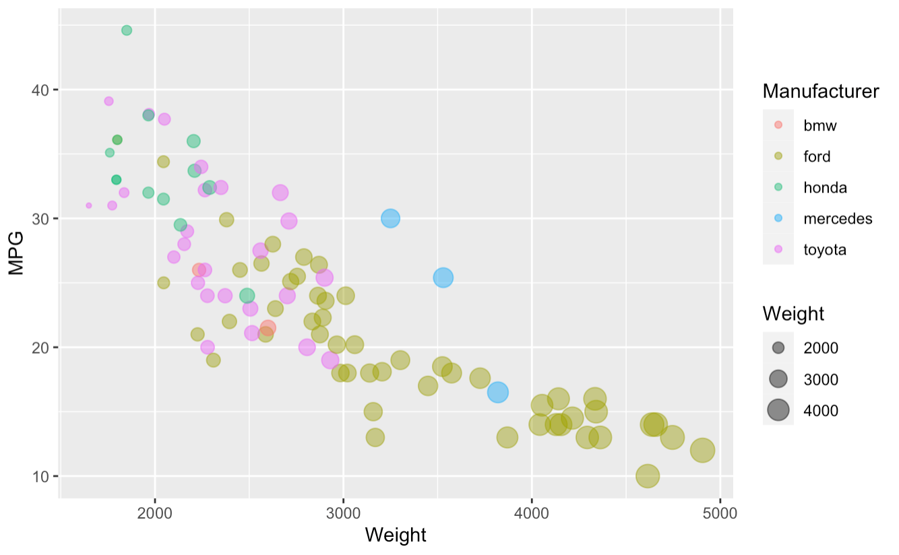
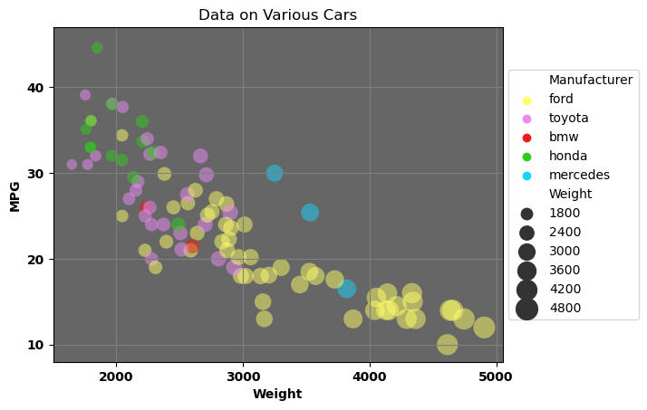
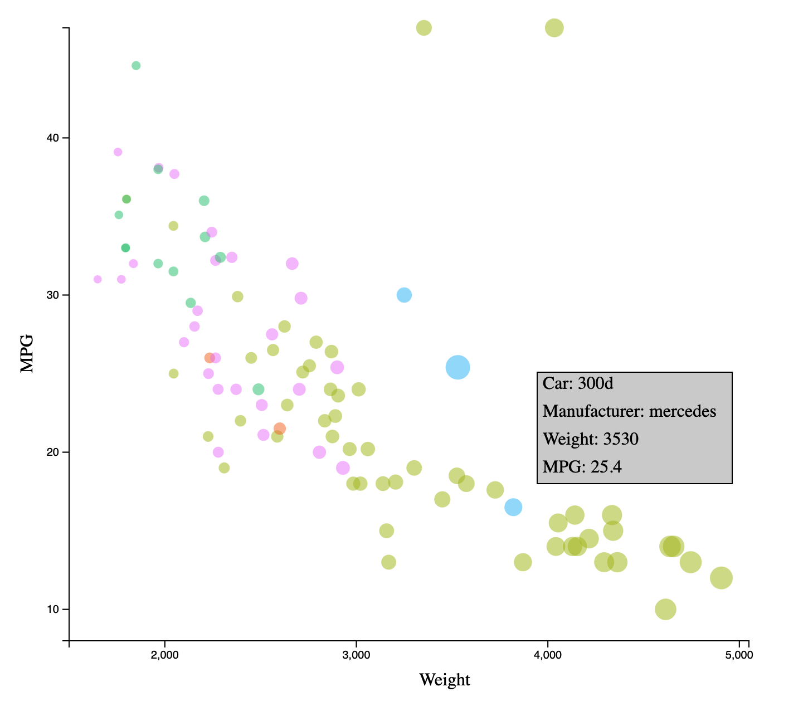
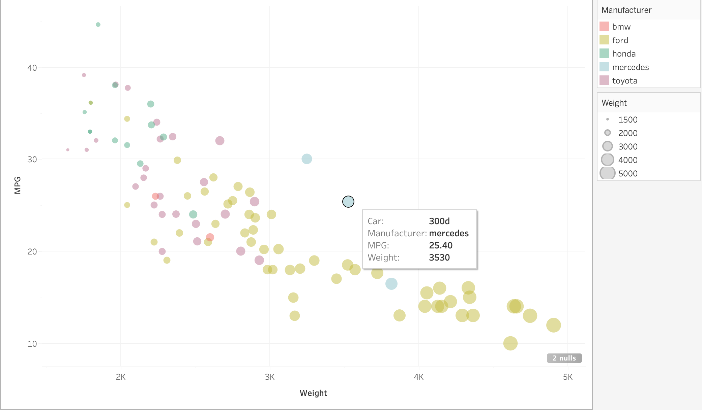
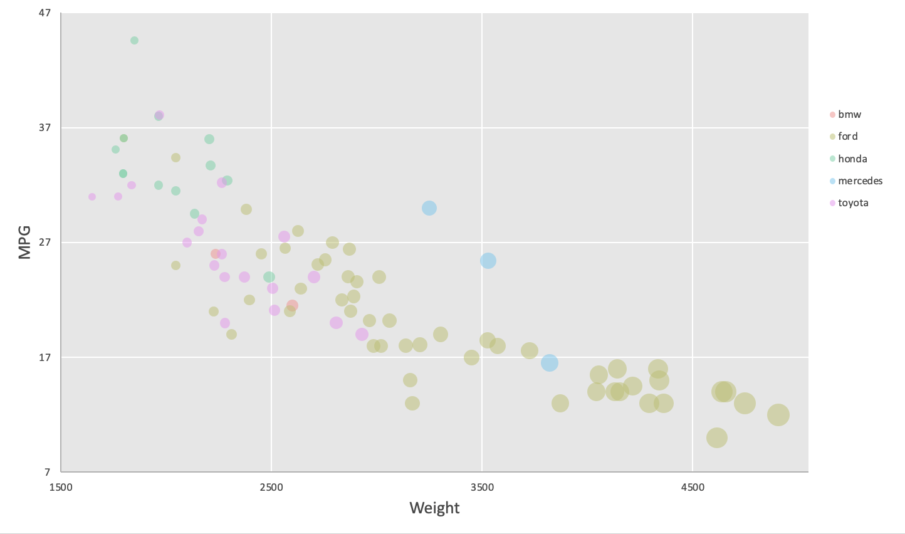

# 02-DataVis-5ways

- Ignore .ipynb_checkpoints folder

# R + ggplot2 + R Markdown

R is a language primarily focused on statistical computing. Ggplot2 is a popular library for charting in R. R Markdown is a document format that compiles to HTML or PDF and allows you to include the output of R code directly in the document.

I created the data visualization by using ggplot2's `geom_point()` layer. I was able to add all the necessary chart elements just in this layer. I did color and size mapping and set the opacity just by setting the parameters. I loaded the data by using `read.csv()`. One interesting thing I found was that I was able to set the parameters in either the `ggplot()` or `geom_point()` functions and both would work. I also found that using `aes()` would automatically create a legend that corresponds to any parameter you set in it.

With the demo in class, ggplot2 and the functions were very easy to use. I think r + ggplot2 would be very useful in the future to create statistical graphs very quickly and easily. It doesn't require many lines of code to make a nice looking graph.

# Python + Seaborn + Matplotlib

I created the cars data visualization by using seaborn's `sns.scatterplot()` function. This function has many parameters to be able to change features of the graph. I was able to color map, size map, change the opacity, and create a legend just with this function. I used matplotlib to add features to the graph such as axis labels and grid lines. I used this to set the min and max values on the axis and set the tick mark intervals. I set the location of the legend to the right of the graph and I was able to save the figure with matplotlib.

All of the functions were very straight forward once finding the correct documentation. Some difficulties I had was color and size mapping. At first, was trying to create the graph using only matplotlib. However, I switched to using seaborn to create the graph and it made it much easier to do the color and size mapping.

Seaborn and matplotlib are very useful for creating many different types of graphs in the future. Both libraries have so many different functions to create different graphs and modify its different elements.

# JavaScript + d3

I created the cars visualization by loading the data using `d3.csv()` and then I used various d3 elements to add the different elements of the chart, such as the axes, dots, etc. I manually added every element of the chart axis intervals to its labels. I also had to create an svg for the graph and set the size of it. I had to set the size of the margins for the location of the svg and graph. I also created a tooltip that gave the car, manufacturer, weight, and MPG of each dot.

D3 was somewhat easy to use once you find the correct documentation. Although it is not nearly as easy to use as seaborn and matplotlib. With d3, you have to create elements a lot more manually versus just changing a parameter. For example, when I created the axis labels I had to position them on the screen in order for them to be in the middle of the axis and outside the graph. With other libraries, this was done automatically. The same difficulty goes for setting the dimensions and margins for the graph that is not needed in python. I had to set those manually by changing the pixel count where that is not needed for all of the other tools. Lastly, even with the tooltip I had to create the rectangle and position everything manually.

I think d3 is very useful in the future when you want to create very intricate charts. Once you are familiar with all the capabilities of it, you can create almost anything with it. You have to do a lot more things manually, but that allows so many more opportunities when creating a graph. It also does take much longer to create a graph because it does require a lot more code.

# Tableau

I created the cars visualization in Tableau by connecting the dataset and dragging the Weight attribute to the columns and the MPG attribute to the rows. Tableau has a box labelled "Marks" where you can edit various elements on the graphs. From this I was able to color and size map, create legends, set the opacity. I was also able to add in to tooltip that gives the Car, Manufacturer, Weight, and MPG when you hover over a dot. To set the color to Manufacturer and set the size to Weight I dragged the attributed to the Marks box and was able to edit from there. I was able to edit the axises by clicking on them.

Tableau is very intuitive to use and it very useful for people who do not code. I found it very easy to use Tableau and it did a lot of things automatically. However, I did have to do some searching on how to create the graph at first because I have only used Tableau once before and I have never used it to create a graph.

I think Tableau would be very useful in the future to create more simple graphs because you can do it very easily and quickly. I think it is a great choice when you want to create a graph without having to code, especially for people who aren't proficient with coding.

# Excel

I created the cars graph by inserting a bubble chart in the Excel worksheet. I had to create different series in the plot in order to do color mapping. I was able to edit the colors, axis, and opacity by clicking on the various elements of the chart.

Excel was by far the most difficult tool to use to make the graph. You had to add everything manually, such as the axis labels. Navigating through Excel is somewhat difficult because there are so many things you can do in it. Changing the colors, opacity, and axis labels was not very hard. However, the color mapping was very difficult. I had to search the internet for a while to find how to do it. Ultimately, I had to manipulate the data by creating a column that listed each color for a manufacturer. Then I had to create a separate column for each color/manufacturer and I had to use an if statement to either get the MPG (y value) or #N/A if the color matched or not. Once I got the correct values in the separate columns I had to create a separate series for each column and layered each one on the graph with the appropriate color.

Link for color mapping: https://stackoverflow.com/questions/17194105/how-can-i-color-dots-in-a-xy-scatterplot-according-to-column-value

For the size mapping, I was trying to do something similar, but that wouldn't have worked. I ended up using a bubble chart and changing the sizes of the dots from there. I had to do a lot of searching to learn how to make a bubble chart and map the sizes.

I also had trouble setting the axis correctly. For example, the first interval for the x-axis is 2000, but the graph starts at around 1500. There is no way to set the min of the axis to 1500 without setting the first tick mark label to 1500. If I set the min to be 2000 then the graph would start at 2000 and some data would be cut off. Therefore, I have tick mark labels start at 7 for the y-axis and for the x-axis they start at 1500. I started the axises at these values because this is where they are started on the original graph, but the first labels for the x and y axises are at 1500 and 7, respectively. Also, with this none of the data would be cut off like if I started at 10 and 2000 and the axis still do not start at 0 which was a requirement. I searched for a very long time to try and find a solution to this, but there was nothing on setting the min of the graph and the first tick mark label to different values. There were only ways to set the min or the tick mark intervals together.

I could see Excel being used in the future if you have less complex elements for your graph, such as not having color or size mapping. This would also be useful if you are very proficient in Excel and can navigate it easily. I think Excel has many features so you can customize you graph any way you want, but you have to know how to change to features.

## Technical Achievements
- I added a tooltip in the Tableau and d3 graphs where it gives you the car, manufacturer, weight, and MPG information for each marker
- For the Tableau graph, I had to add the tooltip from the Marks box and I also had to drag the elements I wanted in the tooltip into the box (car and manufacturer). Weight and MPG were already included in the tooltip because they were in the columns and rows field for the x and y values.
- For the d3 graph I had to create a group where I put a rectangle and the text I wanted. I had to create a rectangle to put all the text in and then used a function to get the values for each attribute. I positioned everything to the right of the mouse and it moves with the mouse. I also had to position and adjust the size of the rectangle and text so that all the text was in the rectangle and had enough spacing between each other. This took a lot of time and searching to figure out how to do this. Originally, I tried to use the Tooltip library and add html text to get the text that I wanted. However, this didn't work because the tooltip was behind the div and you couldn't see it. Then I decided to try a group with a rectangle and text which worked.

Link Tooltip Library (did not work) - https://www.d3-graph-gallery.com/graph/interactivity_tooltip.html#template

### Design Achievements
- I made all of the graphs, except for the seaborn graph, look as close to the original graph in the instructions as I could although all the elements weren't required. I added a white grid, a light grey background, a legend, and kept the colors of the markers the same.
- For the seaborn graph I redesigned it by following the delta design philosophy, specifically attention & engagement and retention & recall goals.
- For attention and engagement, one of the ways to get users to look at your graph is through involuntary attention, a.k.a eye catching. To do this I made the colors of the dots more intense and saturated. I made the background a darker grey to add more contrast. I would have increased the opacity to make the colors stand out more, but 0.5 was the requirement. I also bolded the axis labels and tick mark labels.
- For retention and recall, I increased the size of the dots while keeping the size mapping to increase the visual density. I added a title to the chart because in the article it said that the title of the chart is what people remembered the most. The 5 different colors for the manufacturers were good because the more colors the more memorable to chart is.
- For the tableau and d3 graphs, the interactive tooltip followed the usability goal of the delta design philosophy. As in the article, the interactions were sensible and limited to what was essential.

- Link - Delta Design Philosophy: https://www.tableau.com/about/blog/2019/6/creating-not-designing-four-goals-every-information-experience
- Link - Attention and Engagement: https://www.tableau.com/about/blog/2019/6/building-information-experiences-attention-and-engagement
- Link - Retention and Recall: https://www.tableau.com/about/blog/2019/8/how-get-people-remember-your-visualization
- Link - Usability: https://www.tableau.com/about/blog/2019/7/usability-most-satisfying-design-puzzle-solve
