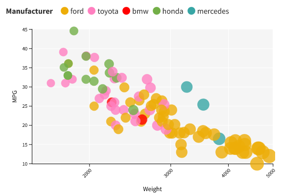

# R + ggplot2 + R Markdown

!Note! The code shown in class was used, I used the documentation of `geom_point()` shown in class(https://ggplot2.tidyverse.org/reference/geom_point.html) to complete the size and opacity of the graph.

R is a language primarily focused on statistical computing.
ggplot2 is a popular library for charting in R.
R Markdown is a document format that compiles to HTML or PDF and allows you to include the output of R code directly in the document.

To visualized the cars dataset, I made use of ggplot2's `geom_point()` layer, with aesthetics functions for the color and size.

While it takes time to find the correct documentation the prof showed us where it was =), these functions made the effort creating this chart minimal.

This could be usefull for generating simple plots that are easy to implement very quickly.(i.e. plotting 100's of plots it would be very usefull).

# Matlab

MATLAB is a programming and numeric computing platform used by millions of engineers and scientists to analyze data, develop algorithms, and create models(From their website). Matlab is a language I have used before in many math classes.

It was really easy to plot the dataset as there are many function in matlab that make reading a csv file easy.

Trying to get a legend to work for my data types was impossible. For some reason matlab insists on having the legend partially preset making it incredibly frustrating to work with.

I would only use this for comparing functions as it lacks the functionality of most of the programs and tools I used.

The only data manipulation that was done was replacing car manufacturers with colors, so they could be passed through the scatter() function. As well as shrinking the points as the were originally to large.

# d3 + Observable Notebook

Link to Notebook: https://observablehq.com/d/9817b361aab1c8f5

D3.js is a JavaScript library for manipulating documents based on data. D3 helps you bring data to life. Observable Notebook allows you to interact with other pepes code in a front-end heavy environment.

It was really easy to run code and get immediate feedback. I liked how code could be orginized and moved. I thought d3 and R (with their respective tools) were much easier to debug code in than matlab.

I though trying to write code in the notebook was more time consuming than an IDE, as it lacked many features that deacrease development time.

Overall I would use this again if I were trying to develop code so people could learn from it(i.e. teaching). I would not use it for personal projects again.

FYI: I made the design decision to not include grid lines since they made it less obvious when points were overlapping.

# Flourish

## Technical Achievements
- **Got all Pictures to be displayed in a webpage I made =)**: 

### Design Achievements
- **Used matlab help Center to pick nice colors **:https://www.mathworks.com/help/matlab/creating_plots/specify-plot-colors.html 
- **Installed ColorZilla**: Helped me make legends and identify colors in hexadecimal.
- **Used circle outline in d3**: I did this to better highlight cars that were similar to one another in terms of weight and MPG.
