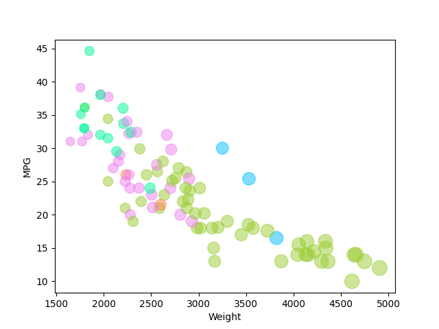
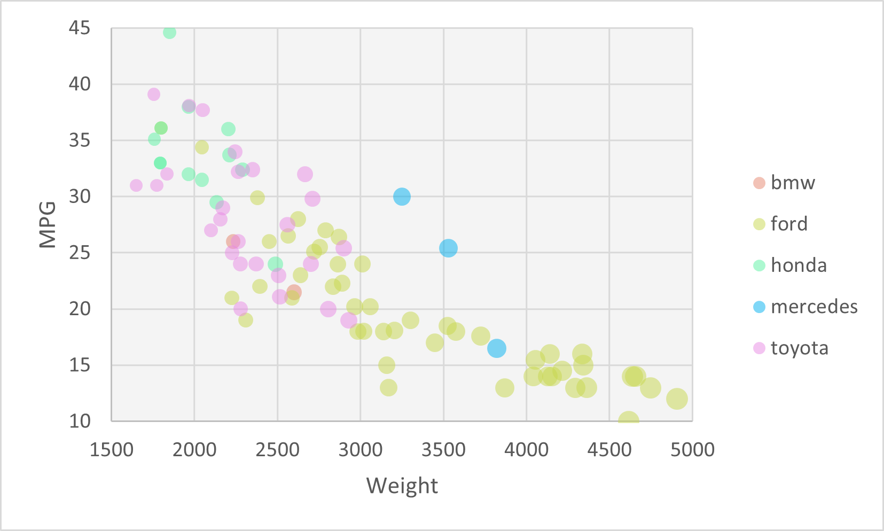
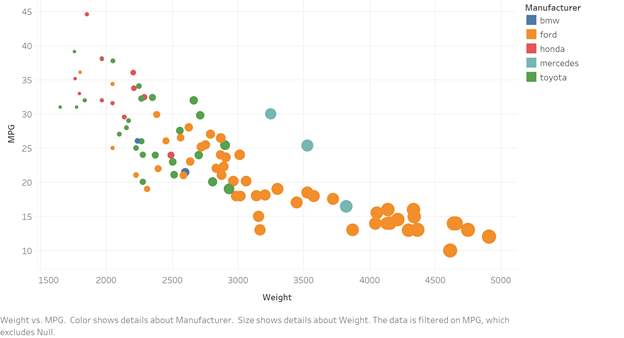
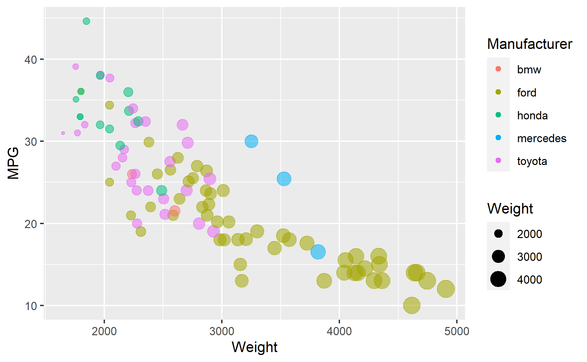
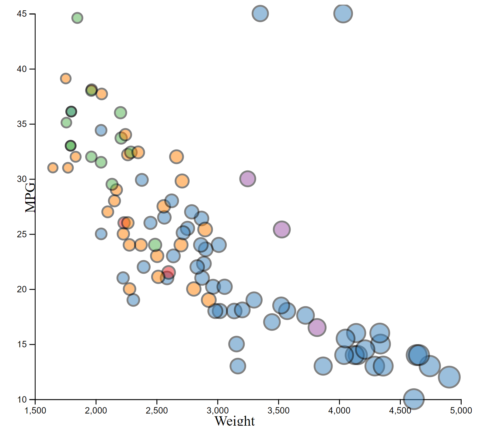

# 02-DataVis-5ways

Assignment 2 - Data Visualization, 5 Ways  
Jacob Bissonette

# Python + Matplotlib
I've used Python in several courses and am using it right now for MQP as well. It is my favorite language to program in and I feel most comfortable with it. Matplotlib is a plottling library for Python, and I believe this is the first time I've truly used it, I can't recall using it in a prior class honestly. But, I know enough Python I wasn't too worried and it was a little tricky trying to figure out the legends and most of all the colors for the bubble chart. I used the Matplotlib API to better understand what data needed to be input, and used a kanoki article to put the colors into a dictionary with the manufacturers so they would plot correctly.

References: https://kanoki.org/2020/08/30/matplotlib-scatter-plot-color-by-category-in-python/, https://matplotlib.org/stable/api/_as_gen/matplotlib.pyplot.scatter.html

# Excel 
I've used Excel in a few courses here, and it primarily dealt with data analysis and basic visualization of the data we used in assignments. I never had to make a bubble chart like this before, but was able to find a Youtube video that definitely helped give the right idea. It's been awhile since I used Excel for visualizations, and I sometimes forget how neat the visualizations can look, but I struggled to find a proper way to get the size legend in. 

References: https://www.youtube.com/watch?v=IbLN2DL3TGQ

# Tableau
I've never used Tableau before but I have heard of it as a popular data vis software so I wanted to try it out. It was definitely a little bit overwhelming when you first open a workbook as it's something I've never used before, but was able to figure it out a little bit. My one major issue with it was at first, I couldn't edit the axes and the chart was so zoomed in, when I first saved the image it was near impossible to read. But I was able to find a help link, and it turns out I just had to change them from discrete fields to continuous fields, since discrete fields create headers and not axes. So with that change it looked much more like the original visualization. Also, I read that you can't dynamically change color, but I feel the color differences make it relatively easy to distinguish manufacturers apart.

References: https://help.tableau.com/current/pro/desktop/en-us/formatting_editaxes.htm

# R + ggplot
I used R in the stats classes and DS2010 but did not use ggplot. ggplot is a data vis package for R, and after using it, I feel like this one was the more feasible and neatly oriented data vis tool/library that I used. It used colors that don't clash too much, had a nice background to make it easier to read, and the legends were nead and easy to interpret. Along with that, the code is pretty simple. I also feel like the colors it chose would still be easy to distinguish from each other if the viewer was colorblind. My dad is very color blind, where any shade of red/green/pink/purple and the likes is different shades of grey, and it seems like R chose colors that aren't similar enough where that would be to big of an issue. The one thing I did have to look up was how to remove a specific legend from the image, because the legend for the alpha value came up and that wasn't really an important aspect that needed a legend.

References: https://www.datanovia.com/en/blog/how-to-remove-legend-from-a-ggplot/

# d3
This class is the first time I've used d3. I think making the visualization on this was probably my least favorite, both because of experience and what it takes to make a solid bubble chart. I was struggling to make the legends and in the end left them omitted for this visualization because I couldn't find a proper way to do so. I was also unsure how to make the colors match as in the other plots. The background was another difficulty so I changed each circle to have a black outline. I found an article online to help make a bubble chart since I wouldn't really know where to begin from scratch and modified it from there so it made much more sense that way.

References: https://www.d3-graph-gallery.com/graph/bubble_color.html

## Technical Achievements
- **Matplotlib + Pandas**: I'm not sure if this would count per se, but I never really liked other methods of loading/reading csv's to python, so I created a python file within the folder with the csv and used pandas to read it. 
- **Tableau**: This probably wasn't the most difficult thing to do with tableau, but I've never used this before and thought this assignment gave me a great opportunity and reason to try it out, and was happy with the resulting graph.

### Design Achievements
- **Matplotlib Fun**: I know it probably wasn't the most feasible way, and definitely wouldn't be with more categories, but I felt that using a dictionary to associate manufactureres with a color for the plot was a neat way to handle it. Also, when determining size of the circles in matplotlib, I started with dividing the weights by 10 and then played around with it until I felt it was a reasonable visualization, so that is why the Weight category is divided by 20 for size.
