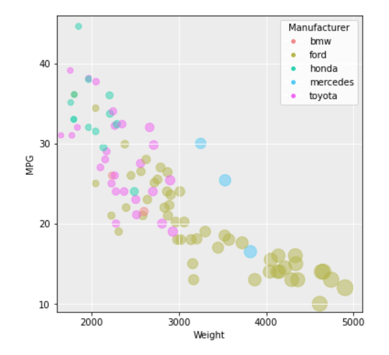
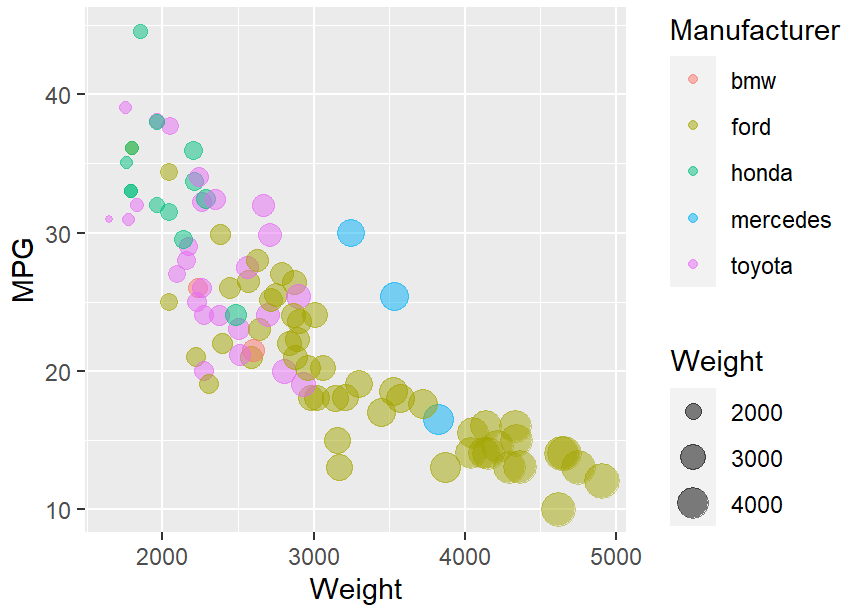
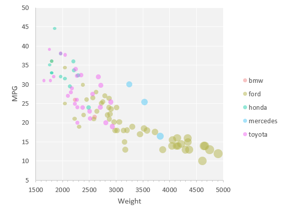
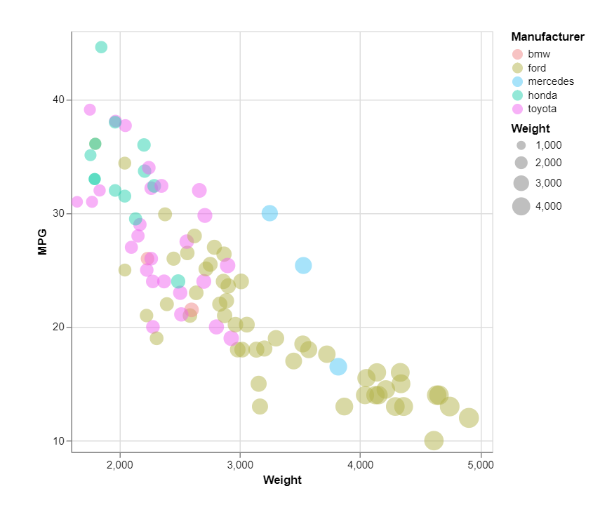

# 02-DataVis-5ways

# Python + matplotlib

Matplotlib is a visualization library for Python. I've used this library in other classes so it was very easy to generate the scatterplot. I was able to find everything I needed in the documentation. The only challenge was adding the legend, but I found a post on StackOverflow that I was able to adapt to my use case. Matplotlib is very easy to get started with if you look at the documentation, especially if you are already familiar with Python. It is flexible enough that you can customize your plots.

References:

https://stackoverflow.com/questions/11423369/matplotlib-legend-circle-markers

# d3

d3 is a JavaScript library that assists with document manipulation. The d3 plot took me the longest because it is a lot more low-level than the other tools. I referred to the documentation and examples from class. I struggled with drawing the axes but I found a tutorial that I followed to get started. d3 is more challenging to use for visualization because you have to do a lot of things manually but it gives you the most flexibility. For example, you can control the exact position and color of every element in the plot. In addition, using JavaScript allows you to add interactivity that can improve the user experience of the visualization.

References:

https://www.tutorialspoint.com/d3js/d3js_axis_api.htm

# R + ggplot2

ggplot2 is a charting library for the statistical langauge R. I used the geom_points() layer with aesthetic functions for the color and size mappings. Using an example in the documentation, I was able to create a baseline scatterplot. After that it was very easy to add the color and size mappings. This library is easy to use once you familiarize yourself with the documentation. 

# Excel

Excel was the only non language-based tool that I used. It was easy to create a basic scatterplot but difficult to add my own customizations beyond that. For example, to map color to manufacturer, I had to create pairs of dummy columns for each value of the manufacturer column, then go into the settings and specify which columns to plot against which. I was able to create a bubble chart instead of a standard scatterplot in order to get the size mappings. Using Excel I was not able to set the values of the tick marks. I found documentation on Microsoft's website on how to do this but when I followed the instructions the interval settings were missing from my version. Overall, I think that Excel is a good tool if you want to create some basic plots, but if you want to add more customization it may be better to use something more flexible.

References:

https://nikkimarinsek.com/blog/how-to-format-different-conditions-in-excel

https://support.microsoft.com/en-us/topic/change-the-scale-of-the-horizontal-category-axis-in-a-chart-637897f6-0d51-4ec5-bef9-25d2c83a8450

# Vega-Lite

Vega-Lite is a high-level visualization grammar that uses JSON syntax to customize fields related to the graph, such as position and color. I had a hard time with the installation and getting my code to run at the start. Once I familiarized myself with the syntax and referred to an example in the documentation I was able to get a basic scatterplot. After this I added more customization to the plot by changing the colors, tick marks, and size mappings. I found that everything I wanted to do was possible, but it was a little difficult to find exactly how to do it in the documentation at times. Overall, I think that Vega-Lite is a good tool that affords a lot of flexibility, but it takes time to figure out how to use it. 

## Technical Achievements
I added interactivity to the d3 plot. Data tips with model, manufacturer, and year are displayed when the user hovers over a point on the scatterplot. I also added a search bar so users can filter the points based on the fields in the data tips. I used the mouseover and mouseout events for the datatips and the keyup event and array filtering for the search bar. For the filtering, I did not redraw the plot every time but just set the display of non-matches to "None". GitHub Pages link: https://vrmelican.github.io/a2-DataVis-5Ways/d3/index.html

## Design Achievements
I tried to use a consistent color scheme between all the plots by matching them all to the original. In addition, I added legends to all the plots because I think they are necessary to understand the manufacturer color mappings.
