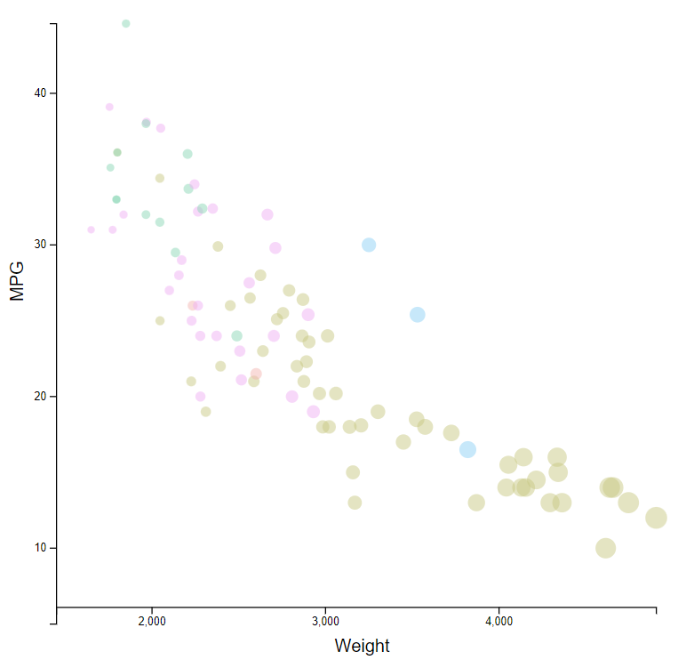
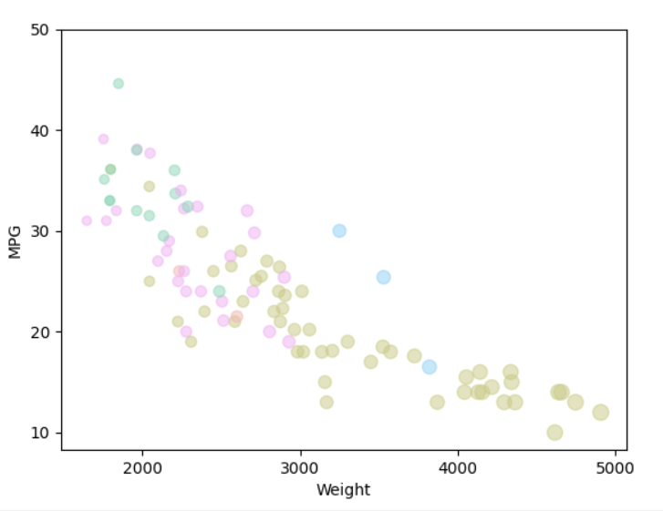
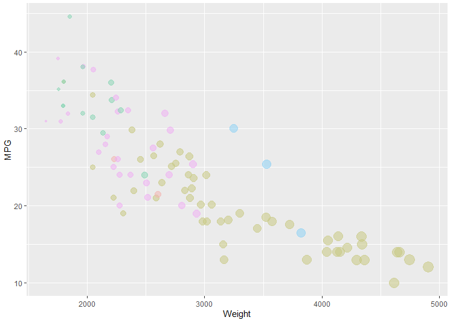
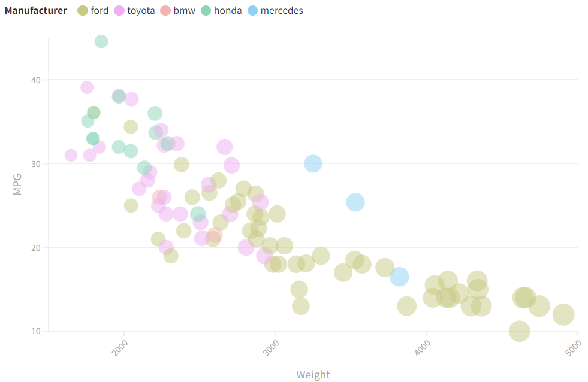
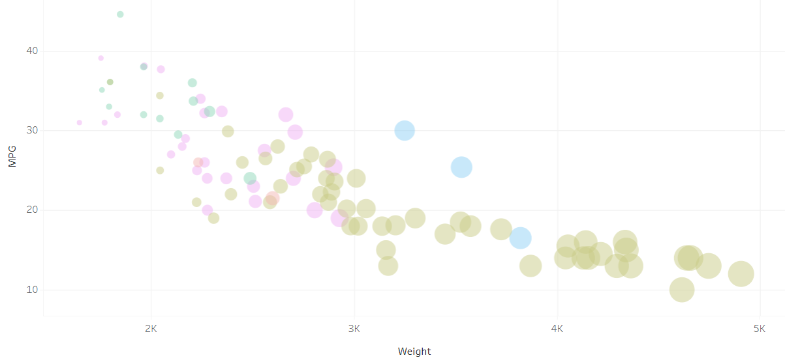

# D3

The first tool I used to perform data visualization on the "cars-sample.csv" dataset was D3. D3 was a little harder than expected because
it's not as structured as Matplotlib or ggplot2. In a way this will be better in the future as we make more sophisticated, even animated charts.
It's certainly highly customizable! Overall I thought the D3 graph portrays the trends of the data well. The size differential for weight seems to
be noticeable enough for the average consumer. And the color scheme is accurate.

Reference code for building graph in D3:
https://www.youtube.com/watch?v=SMcD3q3E5lI

# Python + Matplotlib

The next tool I used was Python's Matplotlib. Matplotlib is a library for producing graphs. However, unlike D3, it is much more structured.
In turn, it was easier to use but I can see where the number of visualizations you could make is restricted somewhat. I tried my best to scale
the data points similarly to D3 but the Matplotlib graph is a little less obvious as to how the weight of the vehicles affects MPG. You can see it
but it's not as obvious.

Reference code for building graph in Matplotlib:
https://pythonprogramming.net/legends-titles-labels-matplotlib-tutorial/
https://www.geeksforgeeks.org/reading-csv-files-in-python/

# R + ggplot2

The last programming language I used was R with the ggplot2 library. I found the code for this to be slightly tougher than Matplotlib but still
a little easier than D3. This plot did produce much better sizing of the data points.

Reference code for building graph in R:
https://t-redactyl.io/blog/2016/02/creating-plots-in-r-using-ggplot2-part-6-weighted-scatterplots.html
https://www.youtube.com/watch?v=HPJn1CMvtmI

# Flourish

This one was really cool and I thought was the easiest to use of all the tools. I was able to plot all the data in about 5 - 10 minutes.
I wanted to get the y axis to extend a little further down but it wouldn't let me. Also, the weighted sizes isn't quite as good on this graph as it was in
D3 or R.

My Flourish visualization: https://public.flourish.studio/visualisation/8574119/ (Yes. It says "By: John" because I signed up with a fake name. I promise it's
mine.)

# Tableau

Finally, Tableau wasn't nearly as easy or nice to use as Flourish but I eventually figured it out. It kept wanting me graph data sets as sum or average
instead of individual data points. Even though it was a very difficult tool to learn, I actually think this plot came out the nicest.

https://prod-useast-b.online.tableau.com/#/site/assignment2/workbooks/381961?:origin=card_share_link (May need login)

## Technical Achievements
These are all tools that I haven't used before so my goal was simply to gain a deep understanding of the tools themselves. Nothing fancy
with interaction. I'll have more opportunities to add animation in later assignments. In the end, although a little tedious, I think it
was worth learning about these five tools. It'll allow me to choose from a number of different tools in the future!

### Design Achievements
1. I kept the same color scheme for all of the graphs. I found this really help evaluate which graphs were better than others.
2. Instead of hard cutoffs for sizes, I made the size a percent of the largest weight. So, for example: 10 * (current_weight/max_weight).
   So the max radius of any circle is 10 and depending on the weight of the current data point it will get smaller as the weights of
   the cars decrease.
