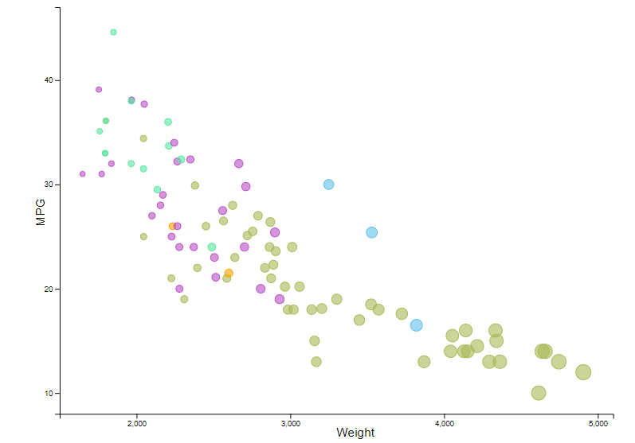

# 02-DataVis-5ways

Assignment 2 - Data Visualization, 5 Ways  
===

Now that you have successfully made a "visualization" of shapes and lines using d3, your next assignment is to successfully make a *actual visualization*... 5 times. 

The goal of this project is to gain experience with as many data visualization libraries, languages, and tools as possible.

I have provided a small dataset about cars, `cars-sample.csv`.
Each row contains a car and several variables about it, including miles-per-gallon, manufacturer, and more.

Your goal is to use 5 different tools to make the following chart:

These features should be preserved as much as possible in your replication:

- Data positioning: it should be a downward-trending scatterplot as shown.  Weight should be on the x-axis and MPG on the y-axis.
- Scales: Note the scales do not start at 0.
- Axis ticks and labels: both axes are labeled and there are tick marks at 10, 20, 30, etcetera.
- Color mapping to Manufacturer.
- Size mapping to Weight.
- Opacity of circles set to 0.5 or 50%.

Other features are not required. This includes:

- The background grid.
- The legends.

Note that some software packages will make it **impossible** to perfectly preserve the above requirements. 
Be sure to note where these deviate.

Improvements are also welcome as part of Technical and Design achievements.

Libraries, Tools, Languages
---

You are required to use 5 different tools or libraries.
Of the 5 tools, you must use at least 3 libraries (libraries require code of some kind).
This could be `Python, R, Javascript`, or `Java, Javascript, Matlab` or any other combination.
Dedicated tools (i.e. Excel) do not count towards the language requirement.

Otherwise, you should seek tools and libraries to fill out your 5.

Below are a few ideas. Do not limit yourself to this list!
Some may be difficult choices, like Matlab or SPSS, which require large installations, licenses, and occasionally difficult UIs.

I have marked a few that are strongly suggested.

- R + ggplot2 `<- definitely worth trying`
- Excel
- d3 `<- since the rest of the class uses this, we're requiring it`
- Matplotlib
- three.js `<- well, it's a 3d library. not really recommended, but could be interesting and fun`
- p5js `<- good for playing around. not really a chart lib`
- Tableau
- Java 2d
- GNUplot `<- the CS department head uses this all the time :)`
- Vega-lite <- `<- very interesting formal visualization model; might be the future of the field`
- Flourish <- `<- popular in recent years`
- PowerBI
- SPSS

You may write everything from scratch, or start with demo programs from books or the web. 
If you do start with code that you found, please identify the source of the code in your README and, most importantly, make non-trivial changes to the code to make it your own so you really learn what you're doing. 

Tips
---

- If you're using d3, key to this assignment is knowing how to load data.
You will likely use the [`d3.json` or `d3.csv` functions](https://github.com/mbostock/d3/wiki/Requests) to load the data you found.
Beware that these functions are *asynchronous*, meaning it's possible to "build" an empty visualization before the data actually loads.

- *For web languages like d3* Don't forget to run a local webserver when you're debugging.
See this [ebook](http://chimera.labs.oreilly.com/books/1230000000345/ch04.html#_setting_up_a_web_server) if you're stuck.

Readme Requirements
---

A good readme with screenshots and structured documentation is required for this project. 
It should be possible to scroll through your readme to get an overview of all the tools and visualizations you produced.

- Each visualization should start with a top-level heading (e.g. `# d3`)
- Each visualization should include a screenshot. Put these in an `img` folder and link through the readme (markdown command: ``.
- Write a paragraph for each visualization tool you use. What was easy? Difficult? Where could you see the tool being useful in the future? Did you have to use any hacks or data manipulation to get the right chart?

Other Requirements
---

0. Your code should be forked from the GitHub repo.
1. Place all code, Excel sheets, etcetera in a named folder. For example, `r-ggplot, matlab, mathematica, excel` and so on.
2. Your writeup (readme.md in the repo) should also contain the following:

- Description of the Technical achievements you attempted with this visualization.
  - Some ideas include interaction, such as mousing over to see more detail about the point selected.
- Description of the Design achievements you attempted with this visualization.
  - Some ideas include consistent color choice, font choice, element size (e.g. the size of the circles).

GitHub Details
---

- Fork the GitHub Repository. You now have a copy associated with your username.
- Make changes to fulfill the project requirements. 
- To submit, make a [Pull Request](https://help.github.com/articles/using-pull-requests/) on the original repository.

Grading
---

Grades on a 120 point scale. 
24 points will be based on your Technical and Design achievements, as explained in your readme. 

Make sure you include the files necessary to reproduce your plots.
You should structure these in folders if helpful.
We will choose some at random to run and test.

**NOTE: THE BELOW IS A SAMPLE ENTRY TO GET YOU STARTED ON YOUR README. YOU MAY DELETE THE ABOVE.**

# R + ggplot2 + R Markdown

R is a language primarily focused on statistical computing. ggplot2 is a popular library for charting in R. R Markdown is a document format that compiles to HTML or PDF and allows you to include the output of R code directly in the document.

To visualized the cars dataset, I made use of ggplot2's `geom_point()` layer, with aesthetics functions for the color and size. 

I also used the plotly library to add an interactive feature to the plot. This R library used to make interactive, publication-quality graphs. The 'ggploty()' function allowed me to create a tooltip that appears when you hover your mouse over the different points on the graph. I had the tooltip include car features, such as the car's name, weight, mpg, manufacturer, and model year. 

While it takes time to find the correct documentation, these functions made the effort creating this chart minimal. It is also incredibly easy to create high quality and interactive graphs with very few lines of code.

### Sources 
https://www.statology.org/import-csv-into-r/ (reading csv)  
https://github.com/rstudio/cheatsheets/blob/main/data-visualization-2.1.pdf (ggplot2 cheat sheet)  
https://www.musgraveanalytics.com/blog/2018/8/24/how-to-make-ggplot2-charts-interactive-with-plotly (plotly library)  
https://stackoverflow.com/questions/38733403/edit-labels-in-tooltip-for-plotly-maps-using-ggplot2-in-r (plotly legend)  

# d3

D3.js is a JavaScript library for producing dynamic, interactive data visualizations in web browsers. It makes use of Scalable Vector Graphics, HTML5, and Cascading Style Sheets standards. To visualize the cars data set, I used html and d3.js to create a similar graph to that above (MPG vs. weight with color representing the manufacturer and point size representing the weight). 

I also added a color and size legend to the graph so the user knows what the different manufacturer colors and sizes represent. I took the hex color codes from the R graph above to use in this graph to make them as similar as possible. I also used transitions to create an interactive tooltip that appears when a user hovers over different points on the graph. The tooltip displays the name of the car, the mpg, and the weight. 

I enjoyed making the features of this graph custom to what I wanted to put on it, but it took a lot more code compared to other tools such as R. Overall, I found using d3.js to be more difficult in terms of having to create the legends from scratch and manually having to calculate the point size based on the weight value. Also having to manually assign the colors to the manufacturer.

### Sources
https://www.d3-graph-gallery.com/graph/scatter_basic.html (scatterplot in d3.js)  
https://stackoverflow.com/questions/11189284/d3-axis-labeling (scatterplot axis labels)  
https://medium.com/@kj_schmidt/hover-effects-for-your-scatter-plot-447df80ea116 (tooltip)  
https://medium.com/@mila_frerichs/how-to-create-a-simple-tooltip-in-d3-js-45040afada07 (tooltip)  
https://www.d3-graph-gallery.com/graph/custom_legend.html (legend)  

# Tableau

Tableau Software is a tool that helps make Big Data small, and small data insightful and actionable. The main use of tableau software is to help people see and understand their data. I used Tableau to create a similar graph to that in R (depicted above). The software is very straightforward and easy to use which can be helpful for people who aren't as experienced with programming. To get the graph as similar as possible to the sample, I created a custom color palette with the hex codes I found when making the graph using d3. This was pretty simple to do with a google search. It is also very easy to customize the tooltip and the background colors and gridlines. Tableau also has sever hosting which is helpful for viewing interactive components such as the tooltip and animations. The only downside with this is that the pricing for the license is pretty expensive. 

### Sources
https://www.thedataschool.co.uk/emily-chen/tableau-tip-importing-custom-colour-palettes (custom color palette)  

# Excel

# Python

## Technical Achievements
- **Proved P=NP**: Using a combination of...
- **Solved AI Forever**: ...

### Design Achievements
- **Re-vamped Apple's Design Philosophy**: As demonstrated in my colorscheme...
