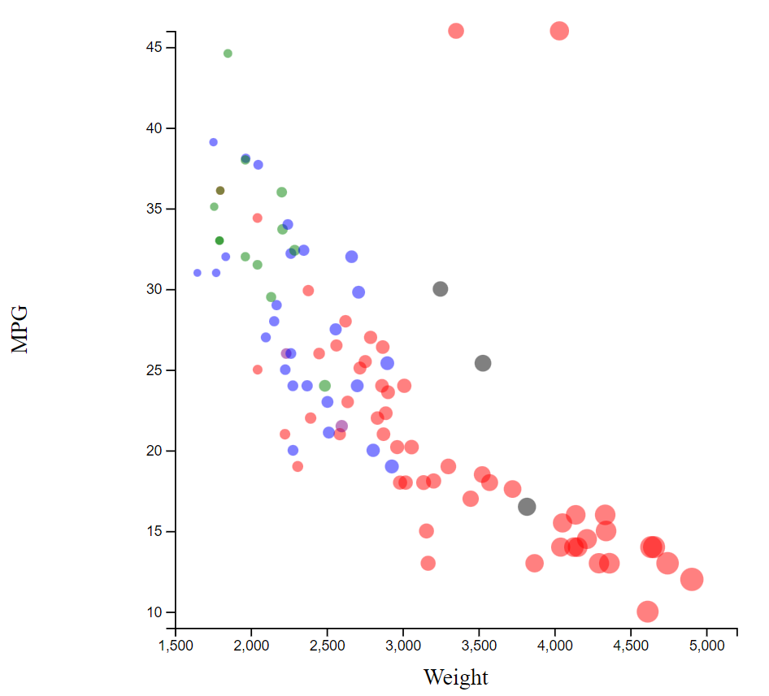
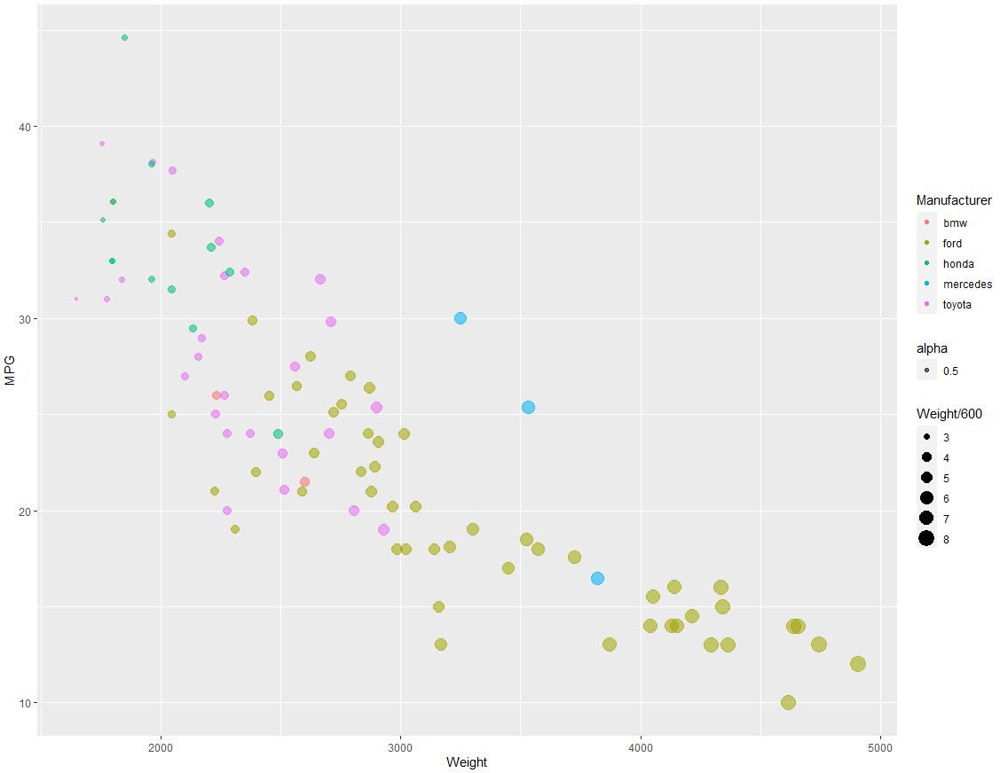
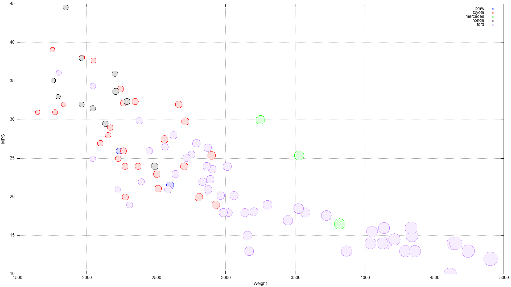

# d3js visualization
[link to d3vis.html page](https://jacobadamsky.github.io/a2-DataVis-5Ways/code/d3vis.html)
 

 
The straight-forward syntax made d3 easy to implement, but it wasn't the most code-efficient option.
Conditional plotting was a lot simpler here as well, but that may have just been me overcomplicating 
it in other languages. As for uses of this tool, it has a vast number of applications. Almost any CSV
file (or other file) can be easily plotted in d3 in a relatively short amount of time, and the amount
of control you have over the visualization is very helpful. No modification to the CSV file was necessary,
though I did at first modify the CSV file before I got a better understanding of the syntax.

# MATLAB visualization

 
Just like in d3, the syntax for plotting with MATLAB was very straight forward, only taking about 3 lines
of code to just get a basic scatter plot set up. As for the color mapping, I'm sure I chose a very unsophisticated
way of doing it, but I for-looped through the cells in the manufacturer column and added entries to a colormap which
I then used in the scatter() function. Something like in d3 where I essentially made a dictionary would have been a
much more efffective method of coloring the plot, but this was the first thing that came to mind without doing much
research. I tried using the ternary operator inside of the for loop to simplify down some of the code, but wasn't able
to get it working (something I definitely want to look at again). Just like d3, no hacks to the CSV file were necessary
to plot the data. With more learning, I could see MATLAB being useful in a lot of the same scenarios as d3, though I 
think I would choose d3 over all of the other options.

# MatPlotLIB visualization

 
Using matplotlib in python wasn't as straight-forward for getting things to look how I wanted at first. A basic scatterplot
with the data was fairly easy, but I was having trouble getting the conditional coloring and size to work. When I realized
that I could plot individual points on the scatterplot, that made things a lot easier as I was able to access individual
data entries and modify them as needed. Color-mapping was a lot easier here compared to the other languages as numpy and
Python have an effective way of mapping an array of strings to colors. While it was relatively easy to set up, I'm not a big
fan of Python, so I don't think I'd see myself using this over any of the other options. No hacks to the CSV file were necessary
to plot the data. As for use cases, I think that matplotlib (pyplot) is almost as versatile as d3, but I prefer the syntax and 
methodology of d3 more.

# ggplot2 visualization

 
I forewent the data-piping method that was displayed in class, though ggplot2 was still very simple to use. What was nicest about
color-mapping here was that you could just straight up input a string for a color and the language would do its own conversion to 
an actual color value. Another nice aspect was that there are ifelse statements in R that let you have conditional results directly
inside of the plotting, which wasn't possible (at least from what I found) in all the other languages. This was probably the easiest
language to set up, but with that ease, you likely lose the ability to customize certain things. No hacks to the CSV file were necessary
to plot the data. This language is a close second to d3 for me, so it definitely has a wide variety of applications based on its ease 
of use and customizability.

# gnuplot visualization

 
I had no clue what language to pick for my last one, so I had a friend randomly pick one for me. At first, I thought gnuplot was going
to be a hassle to set up, but it wasn't as bad as I expected. After understanding the syntax for column selection and getting a better
understanding of ternary operators, plotting the data pretty much came down to 5 lines of code. No hacks to the CSV file were necessary
to plot the data. I'd definitely say gnuplot could have a wide variety of applications, but I think a lot of the newer implementations
of plotting overshadow it in terms of versatility.

# Java AWT visualization

 
While I had much more experience wiht Java than any of the other environments, this one was definitely the hardest to set up. Instead of
being a dedicated graphing library, Java AWT is more of a general visualization library used to generate graphics of various types. This
made it much harder for me to get the proper dimensions for the graph, though it did give me the most control of how everything looked.
Being able to customize individual elements such as the hatch marks on the axes was very helpful, but also complicated the process a lot.
Again, no modifications to the CSV file as Java was able to read it directly into an array, skipping the first row of headers. Java AWT is
up there in versatility, but I think the process of actually getting it set up to display things how I wanted made this less of a contender
as a graphic visualizer for future use.

# Technical Achievements
The only language I got mousing over to work in was d3 as the other languages were a lot less straight forward with their
syntax in terms of modifying interactions with the plot. Another technical achievement was with gnuplot which used a very
interesting method for conditional plotting (lots of nested ternary operators and an interesting method for conditions).

# Design Achievements
Color mapping was easier in some languages than in others, so I forewent consistency and  used different methods that I found
to map the strings to colors (python was the easiest, gnuplot was the hardest). As for circle size, I had trouble finding how
to do conditional variable results in certain languages, so I used basic a basic formula in some cases (floor(weight / 1000) * n),
with n being some arbitrary number depending on how large the language plotted the data.
