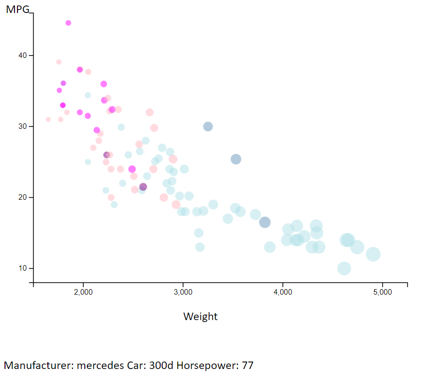
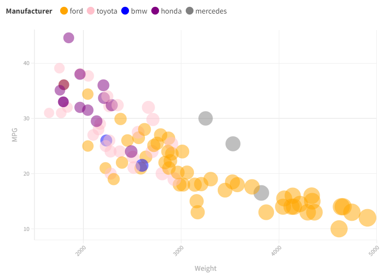
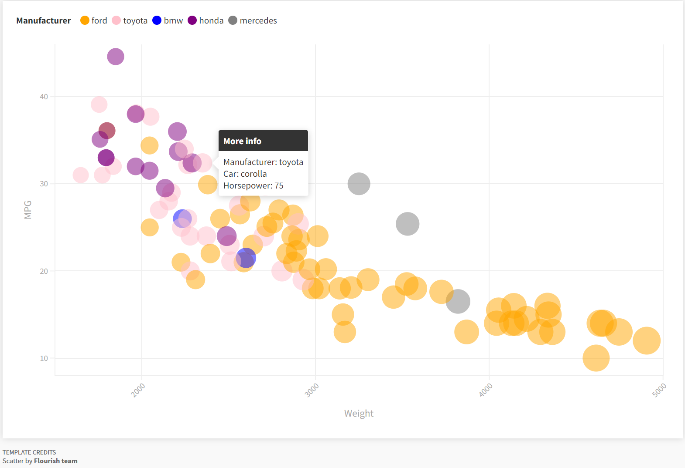
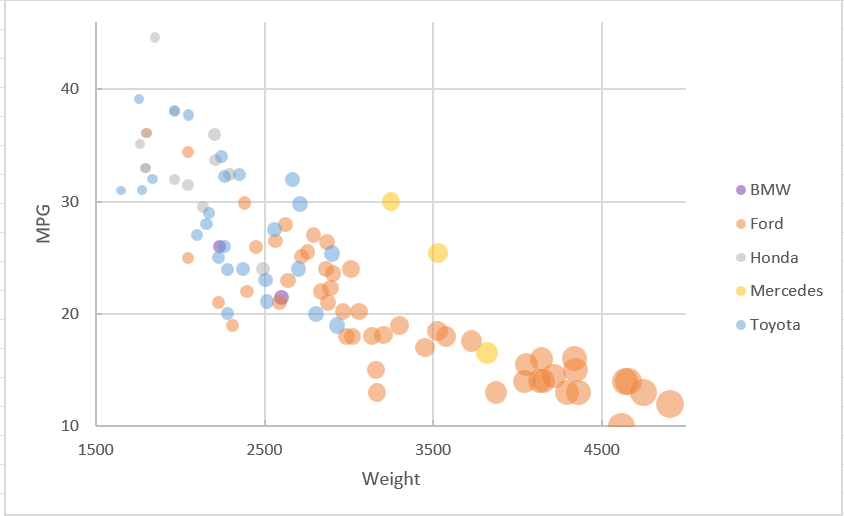
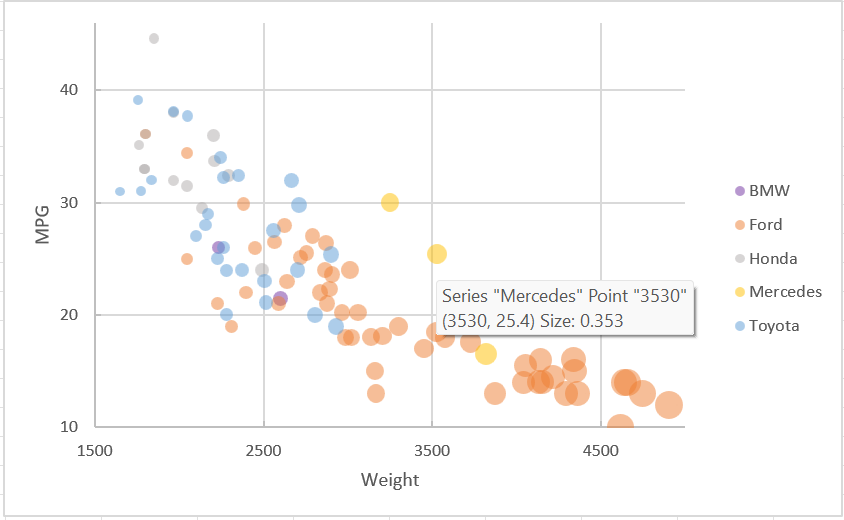

# 02-DataVis-5ways

Assignment 2 - Data Visualization, 5 Ways  
===

# R + ggplot2 + R Markdown + plotly

Source: I started with the code from class

R is a language primarily focused on statistical computing.
ggplot2 is a popular library for charting in R.
R Markdown is a document format that compiles to HTML or PDF and allows you to include the output of R code directly in the document.
Plotly is a library for making interactive plots in python.

To create the visualization, I used geom_point to create the circles in the scatter plot.
I then used the aesthetic function (aes) to add the x-axis, y-axis, color of the circles, size of the circles, alpha(opacity) of the circles, and text.
I also used the windowsFonts() function to add the Calibri font. Then using the theme function, I was able to change the font family to Calibri.
Next, I changed the default color scheme to "RdYlBu" so that red and green aren't used in the same plot, keeping colorblindness in mind.
Lastly, I added in the plotly library in order to add tooltips when the mouse hovers over each bubble.

Overall, the graph was easy to create in R. Everything was very simple and R handles data sets very well. The only issue I came across was when implementing the tooltip.
You can add text to the tooltip, but it automatically states what data is at that point already. To keep consistency with my other graphs, I decided to add horsepower and 
the car name, and I accepted the fact that this tooltip would just have more information. I can see myself using R if I have a dataset and want a quick, simple graph.

# d3

Source: I referenced https://www.d3-graph-gallery.com/graph/custom_theme.html to learn how to make a scatterplot using d3.

d3 is a JavaScript library used for making custom data visualizations.

To create the visualization, i needed to load in the data using the csv function. Then, I created the scales for the x-axis and the y-axis by adding a linear scale 
through the scaleLinear function and added custom domains and ranges for the each of them. Next, I added the labels by appending text and changed their fonts to Calibri using the style function. I then translated the x and y axis to align with eachother properly. Next, I used an ordinal scale and assigned each manufacturer to a color. Then, I created a tooltip and put everything together by appending circles, using a mouse event, and updating the tooltip. In order to handle the NA values in MPG, I didn't include those values in the data set.

Overall, the graph was the most difficult to create in d3. You had to specify everything you wanted to do explicitly, which can be annoying, but I can also see how it gives you more control over the visualization. The tooltip was also more difficult to create in d3. I can see myself using d3 to create visualizations when I want to create something that is more unique.

# d3 + Observable Plot

d3 is a JavaScript library used for making custom data visualizations.
Observable Plot is a JavaScript library built off of d3 that enables you to make charts in minutes.

To create the graph using plot, I loaded in the data using the csv function. Then, I created the plot by appending Plot.plot() to the body tag. Than I put a range of values in the r attribute for the radius of the circles. Then, I added a domain, ticks, and label for the x and y attributes. I used the style attribute to change the font of the text and the color attribute to import a colorscheme and change the type to ordinal for the Manufacturer. Next, I used the Plot.dot() function to create the bubble chart and the title attribute to assign each bubble a tooltip. Observable plot handled the NA values for MPG automatically.

Since this was the first graph I made for this assignment, it was kind of difficult because I didn't know how Plot formatted their attributes in the beginning and I haven't done much graphing through programming before. If I had to do it again, I think it would be much easier, having completed the other graphs. Other than having to get familiar with the library, the graph is easier to make than if you were using d3. I think that you can have a lot of flexibility with this library to do what you want, but I think d3 allows for more creativity. I can see myself using Plot if I want to make a decent custom plot but I don't have a lot of time.

# Flourish

Flourish is an online tool used for data visulaization and storytelling.

Since Flourish doesn't involve coding, I created the graph through uploading the csv file and it was seamlessly put into a table for me. The app assigns variables to each column so it is easier to choose which ones you want to display. It is very user-friendly. The only things that irritated me about Flourish is that you have to click on all of the dropdowns in order to find what you want to change and they only had Google fonts. However, they do have an easy way to add tooltips to graphs, which I appreciated. Flourish also handled the NA values for MPG automatically.

Overall, I enjoyed using Flourish, and it made creating graphs easier than in excel in my opinion. The only actual issue I came across was that they didn't offer Calibri as a font because they only used Google fonts, so instead of using Calibri, I made the font something very close to it. I think that charting using programming offers more flexibility, but this is a great tool for someone without programming experience to use. I can see myself using this if I want to make a chart quickly.

# Excel

Excel is the classic spreadsheet tool that you can use analyze and visualize data.

Since Excel isn't a programming language, I imported the data by opening up the csv file in Excel. In order to make the maufacturers color coded, I filtered the data by each manufacturer and added the data for each manufacturer as a series in the graph. I had to create another column for the bubble sizes in order to map bubble size to weight in Excel. To my knowledge, Excel doesn't have another way to do that more efficiently. I also ran into an issue with putting the tick marks exactly where I wanted them in Excel. It just doesn't let you choose where they go, so I still have four tick marks per axis, but the x-axis doesn't have them at the correct values. I also had issues with the tooltip in Excel. It has an automatic tooltip, but it doesn't let you add any other information to them. I also dealt with the NA MPG values by changing the size of those bubbles to 0.

Overall, I would say that Excel makes it difficult to create a chart like this. I had to go through extra steps to meet the basic requirements, which made it harder than Flourish to complete. I've learned that Excel is very limited in its' capabilities. I would only use Excel graphing if I needed to make a simple graph.

## Technical Achievements
- **Tooltips, mouseover event in d3**: I have tooltips that show up on all of the graphs I made so that if you hover your mouse over the bubble, text will appear that displays information about it. I was able to customize all of them except for the Excel tooltip, which already listed the (x,y) position of the bubble and the manufacturer. On all of the other graphs, I made sure to list at least the Car, the Manufacturer, and the Horsepower. The tooltip that took the most effort to implement was the tooltip in d3, which required me to use a mouseover event. However, with d3, you are able to control the tooltip more.

## Design Achievements
- **Avoided red and green together**: In an effort to make my graphs as accessible as possible, I decided to avoid putting red and green on the same graph. Since color is the only thing that is used to distinguish which cars are from certain manufacturers without hovering over the bubbles, I decided not to include both red and green on the same graph. I believe that most people should be able to experience a graph in the same way.
- **Font Change to Calibri**: I kept my fonts for the graphs consistent by changing the font for each of them to Calibri, except for Flourish which I had to use Source Sans Pro instead. I used Calibri because it is a simple font that is easy to read. This task was easier to do in some tools/libraries than others. It was very easy to do in Excel, but impossible to to in Flourish, which only uses Google fonts.
- **Size of the Circles**: Although the sizes of my circles vary slightly from plot to plot, I decided to keep them generally small so that it would be easy to read, without having a lot of overlap.
