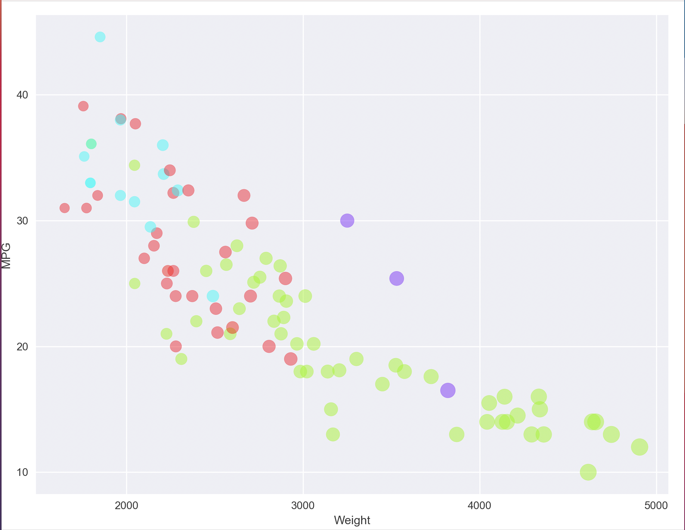
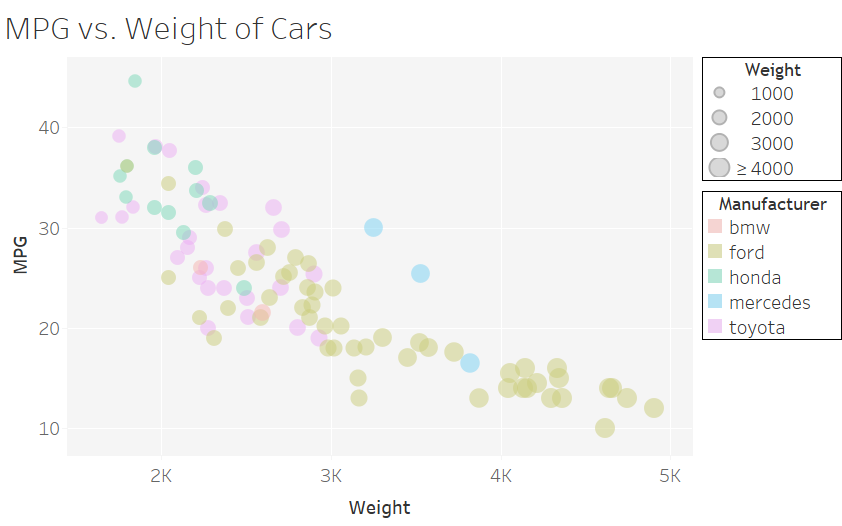

# 02-DataVis-5ways

# R + ggplot2 + R Markdown

R is a language primarily focused on statistical computing.
ggplot2 is a popular library for charting in R.
R Markdown is a document format that compiles to HTML or PDF and allows you to include the output of R code directly in the document.

To visualized the cars dataset, I made use of ggplot2's `geom_point()` layer, with aesthetics functions for the color and size.

While it takes time to find the correct documentation, these functions made the effort creating this chart minimal.

I was amazed with how easy it was to work with R because it only took two lines of code.

# d3
While doing this assignment, d3 reminded me of C. It is so powerful but so manual at the same time. I was able to find some sample code, from the d3 Gallery, to work off of for this visualization. 

From a high level view, the code goes through the following process:
- Create dimensions for the visualizatoin 
- Create dimensions of SVG element
- Create the x and y axes using d3.linearsacale()
- Add the labels to the axes 
- Add colors based on the manufacturer 
- Add functions to hover and highlight groups of data points based on manufacturer
- Append the circle data points 

The options in d3 are endless, but unfortunately I found using d3 difficult. After using R, I was expecting to be able to sort colors by manufacturers with a simple function. However, after extensive research I was unable to do that. Instead I had to manually write each manufacturer name and a color to match with it. 

I also added a feature that would highlight a color group when the user hovers over it on the graph. 

# Python
I love python, but maybe that is just a bit bias. I was able to use significantly less lines of code than in d3. Using Python's Matplotlib library, I was able to simply plot a scatter plot and input all the characteristics I wanted: including x values, y values, colors, alpha, and marker size. 

Unfortunately, Python was not very cooperative with creating grid lines across minor tick marks. I believe the reason why is because I manually decided the major tick marks and ths intervals at which they occur, not really allowing for minor tick marks in the command. I would have to dive deeper to customize this graph more. 

I did come across a challange when trying to color points based on manufacturer. In plt.scatter(), one of the arguments passed through is 'c'. Which is basically saying what colors do you want or how would you like to group the colors. Had the manufacturers been numbers rather than characters it would have been fine. But 'c' does not pass through strings. To bypass this, I had to create a for loop that went through the list of manufacturers and assign a value to each of them. Each value was then added to the array manu_color[]. I was able to pass the array through 'c' to color the points how I wanted. 

Whats also cool is that I got to use Python's cmaps - a collection of color paletts. I was originally going to match the colors to R but I got too excited when I was the 'spring' palette :)

# Tableau
I imagine that Tableau is used more for analytics in business, especially for those who don't code. The software allows for a very friendly user experience and produces crisp and clean graphics, an important part of presenting data. 

I loved using Tableau! The software was so easy to use. It allowed to me load in my data and drag and drop. Very similar to the idea of a pivot chart in excel, except more user friendly. It allowed me to do everything I did in R with no code. 

Tableau did something that none of the other programs did. In the data set given, there were two data points with NA as the MPG. Tableau found these values and gave me an option to either omit the data points or graph them with a value of 0. I omitted them because I did not see the points as valuable to this graph. 

Also, in Tableau the user can hover over the individual points and get more information on the data. Including information that wasn't graphed such as the model of the car. 

# Sisense 
Sisense is very similar to Tableau in terms of purpose and usage. I was able to repeat my process for Tableau in Sisense easily. It took me a while to kinda understand all their random lingo they made specific to their website. I was not a super fan of the special lingo and given a choice I would use Tableau over Sisense. 

The other thing is that Tableau is a software that must be downloaded and Sisense can be done in a browser which is a cool feature! 

The same data point hover in Tableau is available in Sisense. 

The only thing I was unable to do in Sisense compared to Tableau is add the weighted points to the legend. 

## Technical Achievements
In d3, I was able to implement a function that would allow to the user to interact with the graph. If the usre hovered over a point, say a red one, all the other red points on the graph would stay highlights and the other non red points would go gray. This allows the user to isolare the data based on manufacturer. 

### Design Achievements
-I experimented with Python's cmaps! I tried a few different palettes but the Spring one gave me the most joy. Almost groundhog day :) 
