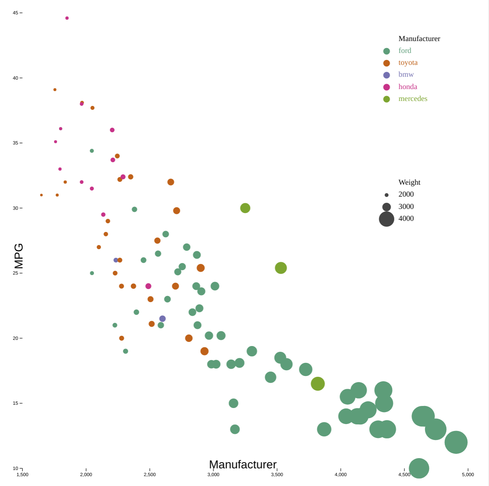

# 02-DataVis-5ways

Assignment 2 - Data Visualization, 5 Ways
===

Now that you have successfully made a "visualization" of shapes and lines using d3, your next assignment is to successfully make a *actual visualization*... 5 times. 

The goal of this project is to gain experience with as many data visualization libraries, languages, and tools as possible.

I have provided a small dataset about cars, `cars-sample.csv`.
Each row contains a car and several variables about it, including miles-per-gallon, manufacturer, and more.

Your goal is to use 5 different tools to make the following chart:

These features should be preserved as much as possible in your replication:

- Data positioning: it should be a downward-trending scatterplot as shown.  Weight should be on the x-axis and MPG on the y-axis.
- Scales: Note the scales do not start at 0.
- Axis ticks and labels: both axes are labeled and there are tick marks at 10, 20, 30, etcetera.
- Color mapping to Manufacturer.
- Size mapping to Weight.
- Opacity of circles set to 0.5 or 50%.

Other features are not required. This includes:

- The background grid.
- The legends.

Readme Requirements
---

A good readme with screenshots and structured documentation is required for this project. 
It should be possible to scroll through your readme to get an overview of all the tools and visualizations you produced.

- Each visualization should start with a top-level heading (e.g. `# d3`)
- Each visualization should include a screenshot. Put these in an `img` folder and link through the readme (markdown command: ``.
- Write a paragraph for each visualization tool you use. What was easy? Difficult? Where could you see the tool being useful in the future? Did you have to use any hacks or data manipulation to get the right chart?

Other Requirements
---

0. Your code should be forked from the GitHub repo.
1. Place all code, Excel sheets, etcetera in a named folder. For example, `r-ggplot, matlab, mathematica, excel` and so on.
2. Your writeup (readme.md in the repo) should also contain the following:
- Description of the Technical achievements you attempted with this visualization.
  - Some ideas include interaction, such as mousing over to see more detail about the point selected.
- Description of the Design achievements you attempted with this visualization.
  - Some ideas include consistent color choice, font choice, element size (e.g. the size of the circles).

**NOTE: THE BELOW IS A SAMPLE ENTRY TO GET YOU STARTED ON YOUR README. YOU MAY DELETE THE ABOVE.**

# R + ggplot2 + R Markdown

R is a language primarily focused on statistical computing.
ggplot2 is a popular library for charting in R.
R Markdown is a document format that compiles to HTML or PDF and allows you to include the output of R code directly in the document.

To visualized the cars dataset, I made use of ggplot2's `geom_point()` layer, with aesthetics functions for the color and size.

While it takes time to find the correct documentation, these functions made the effort creating this chart minimal.

# d3

### R

### Datawrapper

### Svelte + SVG from scratch

### Matplotlib Python

## Technical Achievements

- **Proved P=NP**: Using a combination of...
- **Solved AI Forever**: ...

### Design Achievements

- **Re-vamped Apple's Design Philosophy**: As demonstrated in my colorscheme...
