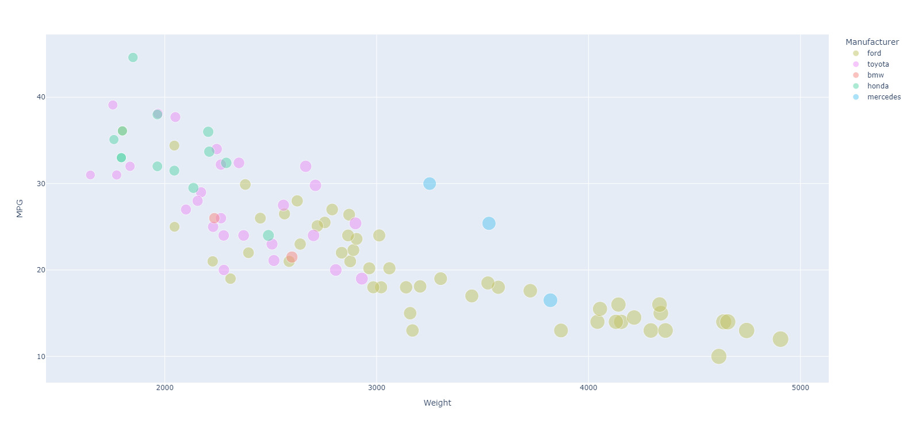
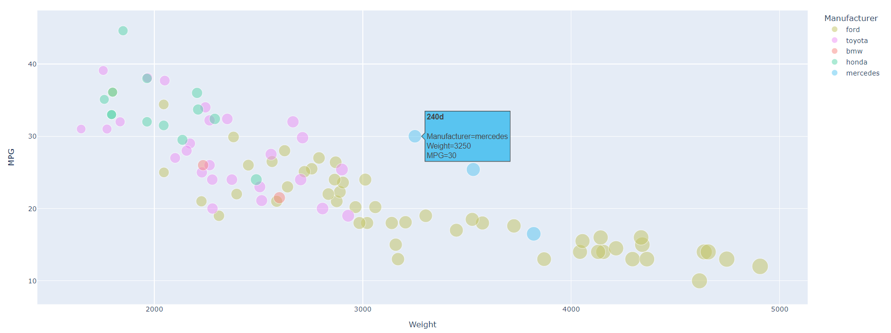

# 02-DataVis-5ways

Assignment 2 - Data Visualization, 5 Ways  
===

# R + ggplot2 + R Markdown

R is a language primarily focused on statistical computing. ggplot2 is a popular library for charting in R. R Markdown is a document format that compiles to HTML or PDF and allows you to include the output of R code directly in the document.

To visualized the cars dataset, I made use of ggplot2's `geom_point()` layer, with aesthetics functions for the color and size. 

I also used the plotly library to add an interactive feature to the plot. This R library used to make interactive, publication-quality graphs. The 'ggploty()' function allowed me to create a tooltip that appears when you hover your mouse over the different points on the graph. I had the tooltip include car features, such as the car's name, weight, mpg, manufacturer, and model year. 

While it takes time to find the correct documentation, these functions made the effort creating this chart minimal. It is also incredibly easy to create high quality and interactive graphs with very few lines of code.

### Sources 
https://www.statology.org/import-csv-into-r/ (reading csv)  
https://github.com/rstudio/cheatsheets/blob/main/data-visualization-2.1.pdf (ggplot2 cheat sheet)  
https://www.musgraveanalytics.com/blog/2018/8/24/how-to-make-ggplot2-charts-interactive-with-plotly (plotly library)  
https://stackoverflow.com/questions/38733403/edit-labels-in-tooltip-for-plotly-maps-using-ggplot2-in-r (plotly legend)  

# d3

D3.js is a JavaScript library for producing dynamic, interactive data visualizations in web browsers. It makes use of Scalable Vector Graphics, HTML5, and Cascading Style Sheets standards. To visualize the cars data set, I used html and d3.js to create a similar graph to that above (MPG vs. weight with color representing the manufacturer and point size representing the weight). 

I also added a color and size legend to the graph so the user knows what the different manufacturer colors and sizes represent. I took the hex color codes from the R graph above to use in this graph to make them as similar as possible. I also used transitions to create an interactive tooltip that appears when a user hovers over different points on the graph. The tooltip displays the name of the car, the mpg, and the weight. 

I enjoyed making the features of this graph custom to what I wanted to put on it, but it took a lot more code compared to other tools such as R. Overall, I found using d3.js to be more difficult in terms of having to create the legends from scratch and manually having to calculate the point size based on the weight value. Also having to manually assign the colors to the manufacturer.

### Sources
https://www.d3-graph-gallery.com/graph/scatter_basic.html (scatterplot in d3.js)  
https://stackoverflow.com/questions/11189284/d3-axis-labeling (scatterplot axis labels)  
https://medium.com/@kj_schmidt/hover-effects-for-your-scatter-plot-447df80ea116 (tooltip)  
https://medium.com/@mila_frerichs/how-to-create-a-simple-tooltip-in-d3-js-45040afada07 (tooltip)  
https://www.d3-graph-gallery.com/graph/custom_legend.html (legend)  

# Tableau

Tableau Software is a tool that helps make Big Data small, and small data insightful and actionable. The main use of tableau software is to help people see and understand their data. I used Tableau to create a similar graph to that in R (depicted above). The software is very straightforward and easy to use which can be helpful for people who aren't as experienced with programming. To get the graph as similar as possible to the sample, I created a custom color palette with the hex codes I found when making the graph using d3. This was pretty simple to do with a google search. It is also very easy to customize the tooltip and the background colors and gridlines. Tableau also has sever hosting which is helpful for viewing interactive components such as the tooltip and animations. The only downside with this is that the pricing for the license is pretty expensive. 

Here is my custom tooltip: 

### Sources
https://www.thedataschool.co.uk/emily-chen/tableau-tip-importing-custom-colour-palettes (custom color palette)  

# Python + Plotly

Python is a computer programming language often used to build websites and software, automate tasks, and conduct data analysis. Python is a general purpose language, meaning it can be used to create a variety of different programs and isn't specialized for any specific problems. Since I already have a good amount of experience with the matplotlib library (comprehensive library for creating static, animated, and interactive visualizations in Python), I wanted to try to use a different one to learn something new and see if I could find something easier to use. Because of this, I chose plotly express. The plotly.express module (usually imported as px) contains functions that can create entire figures at once, and is referred to as Plotly Express or PX. Plotly Express is a built-in part of the plotly library, and is the recommended starting point for creating most common figures. I found the library much easier and more straightforward to use than matplotlib. It was very easy to add a custom color palette and customize the tooltip. I made the color palette resemble that in the original plot. I also modified the tooltip when hovering over the points to match those I made using other data visualization tools. The only downside to using python and plotly is that it makes it very difficult to include more than one legend, so I couldn't make a legend for the size of the points. 

And here is the tooltip for this visualization:

# Excel

## Technical Achievements
- **Proved P=NP**: Using a combination of...
- **Solved AI Forever**: ...

### Design Achievements
- **Re-vamped Apple's Design Philosophy**: As demonstrated in my colorscheme...
