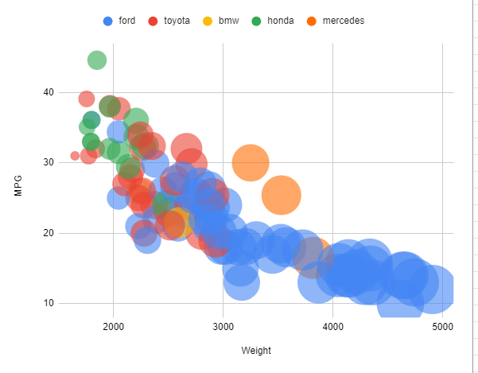

# 02-DataVis-5ways
### Kaamil Lokhandwala

I had fun learning in this project! Vega-lite, python, and google sheets are new for me! 

This is the original graph for reference.

# ThreeJS

Threejs was definitely the most difficult library to make a scattergraph with. All data management and had to be done with plain javascript, and graph visuals and placement had to be done manually. Although the code was verbose, once setup, I had a great amount of control over the graph. I used spheres in the graph, and an orbital camera so that the user can rotate the graph in 3D space. I added onload animations for the data and axes using the gsap library. 

The workflow included spwaning 3D meshes for every object in the scene. Each mesh needs a material and geometry, so the code length built up fast. I noted that I had to multiply the weight by a very small number when sizing spheres.

Here is the [live link](https://kslokhandwala2022.github.io/a2-DataVis-5Ways/threejs/) to see the animations.

# D3

D3 required a good amount of setup, but the data reading was very easy. The most difficult part was getting the viewbox and svg height and width correct in order to see the whole graph. I'm sure there is a simple way to deal with this, but I'm stll getting familiar with d3.

Most of the workflow with d3 was just svg.append(<>) with some data or hard coded value to match the graph. I noted that I had to divide the weight by a large number when sizing the circles.

# Python + matplotlib

Python, matplotlib and pandas csv reading was delightfully easy to work with. With only a few lines of code the data was neatly arranged. Afterwards, almost all the work was done by a scatter() function to feed the data to it's color, size, and position. The graph spawned setup with axes and differently sized data points! I had to add a few lines of code to ensure I got the correct colors, and a few more to edit the axes to fit the given graph.

I noted that I had to divide the weight by a large number when sizing the circles.

# Vega-lite

Vega-lite took a little more time to work with, but the resulting code is very short (8 lines in the script tag!). Vega-lite just runs one big json file to create the entire graph! To start, I looked at this [example](https://vega.github.io/editor/#/examples/vega-lite/point_color_with_shape). After looking at this example, I just had to look through the docs on how to read a csv instead of a json, editing data point size based off of Weight, and creating a scale with a custom domain. The colors were not exact, but they are different based off of the car manufacturer.

Most of the trouble came from finding the names of different attributes, and knowing when to set a field to an object with subfields. The circles here sized themselves based off of the given weight.

# Google Sheets

Google sheets was fairly simple, but it's customization was difficult to find. The GUI, surprisingly, was much less clear than the code I had written for all the other libraries. Features were hidden in menus compared to being written out plainly, although I would bet most people would rather edit a google sheets graph compared to a threejs graph!

Most of the process involved searching the UI to see if customization existed for certain attributes. I began with a scatterplot, and switched it to a bubble plot, which gave me more access to features like different colors and sizes. The circles here sized themselves based off of the given weight. The bubble sizes are bit too big for my liking, but I did not see any way to change this.

## Technical Achievements
- **Csv functions**: In three js, I had to parse through the csv with plain old javascript
- **Used four languages/libraries**
- **PlaceOnAxis function**: In three js, I created a function that takes in the value, axis start, axis end, and axis length to compute where along the axis the value should be placed in global space.

### Design Achievements
- **Axis and Data Animation**: In my threejs graph, I included some great aesthetic animations on the axes and the data, based on it's weight value. 
