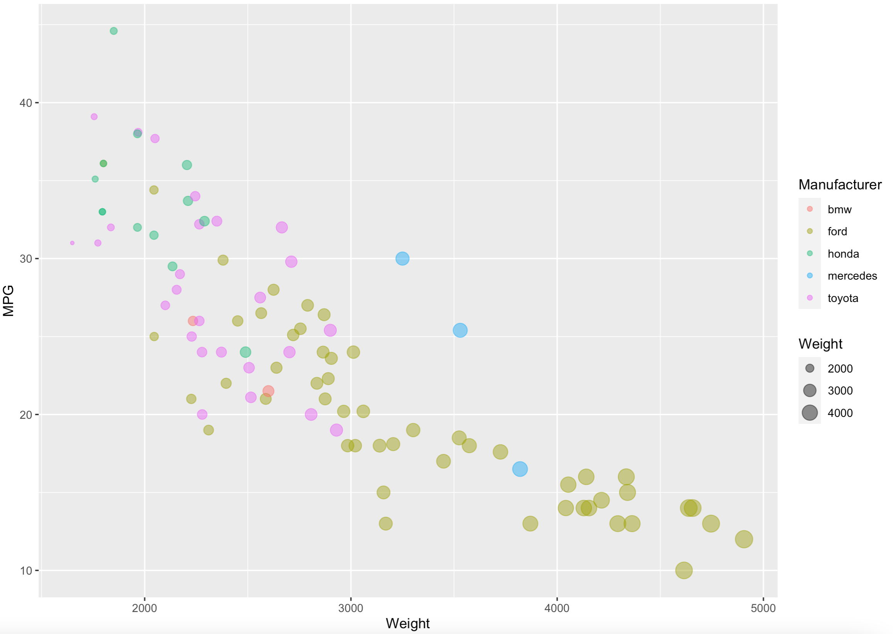

Assignment 2 - Data Visualization, 5 Ways  
===

# Numbers App on Mac

I came upon this visualization tool by accident. When I open the cars-sample.csv file, it automatically opens with the Numbers App on my desktop. Here, you can select to add a chart and then select the data that you would like to use. It is similar to Excel, but I chose to use this tool over excel because you do not have to import the csv file, it is right there in a nice table format to use. There are many capabilities that I was surprised about using this tool: you can choose where the tick marks are, add in grid lines, choose where you would like the axes to start, and have the color opacity. I was also surprised when I was able to select the weight as the factor that determined the circle size. However, with this feature the bubbles are way too big, and there is no way to  scale them down, as they are determined by the weight column.

# Matplotlib + Python

Using Matplotlib contained a lot of built in functions designed exactly for what I was trying to do. In the function scatter(), there are inputs for color and the size of the bubbles which makes it pretty easy to create a graph that has the bubbles a different size, and color. On the other hand, I found it difficult to add in tick marks. There are two functions I used called yticks() and xticks() which are supposed to set the x and y tick marks and locations on the graph, but when I use this function, only the numerical values for each tick is shown, and not the actual tick mark itself. It was easy, though, to have the axes not start at zero and still have the ticks at the desired locations. Some of the other tools made it difficult to have the right tick numbers when altering the axes.

# MATLAB

This was a very interesting visualization tool, because it was relatively easy/simple to do everything, but not at the correct time. The function scatter() allows inputs to not only contain the x and y axis, but also to have the plot size relative to its weight value, and the plots filled in. The function gscatter is very nice in that it has the inputs to have the x any y axis and values, and the third argument is how the colors are sorted. This function is super convenient because you do not have to assign any colors to the column, MATLAB takes the different Manufacturers and automatically creates a color pattern. However, with the gscatter function, there no longer are arguments to have the size of the plots relative to the weight column in the csv. Also, the opacity of the plots are not set the same way as before, the line alpha function does not set the opacity. Another thing that I really liked about MATLAB is that it automatically created the correct axes to fit the data, meaning that the graph did not automatically start at zero.
	NOTE: In order to run this code for the colors, comment out line 3 with a “%” and uncomment out line 4.

# R + ggplot2

I think that I was able to use the shortest amount of lines of code for this plot. It is very efficient at reading a csv file and understanding all of the parameters needed for plotting. The function ggplot() has parameters that take in the data frame, and by doing so, the other input parameters are understood to come from that table so for the X and Y coordinates, you only need to state the column names. Other parameters for this function include the color and size and for this you also only need to state the column name it is coming from and ggplot knows how to convert different weights to its plot size and different manufacturers to a different color. Also, the opacity is set to 50% inside of this function, and the rest automatically occurs: axis labels, tick marks and locations, gridlines (both major and minor), and a legend for the size and color. 
	NOTE: when running the rPlot.R file, the path to the csv file needs to be changed since the path created now is a path only on my computer. This is on line 3 of the file.

# D3

To create everything in D3, I started off with a basic scatter plot found on this page: https://www.d3-graph-gallery.com/graph/scatter_basic.html . Here, the plot contains a simple scatter plot with the axes starting at zero and automatic tick marks. In order for me to change this, I had to alter the domain and range of the axes which was easily done by hardcoding. Another thing I changed was the size of the graph in order to enlarge it. For changing the number of ticks shown on the graph, all I needed to do was add in a method ticks() which takes in the number of ticks desired for the given axis. The plot sizes were easy to manipulate, all I had to do was use the same function called for the X axis. I ended up dividing the radius of the circle by 25 so that the plots would still be to scale, but fit nicely on the screen. The opacity was just another added line of code and added as an attribute when adding the dots. The different colors is what I had to do the most work for, and it involved me creating my own function to get the correct color. I just made a simple if statement function and have it return a specified color depending on the manufacturer for each plot. 

## Technical Achievements
- **Proved P=NP**: Using a combination of...
- **Solved AI Forever**: ...
- While the Numbers app did not allow me to have multiple colors plotted, I was able to plot the values of the Y axis on the graph. This came out messy and not very readable, but I think it is a nice feature to point out that this app allows. Also, the circles are too big which also makes the graph difficult to read. However, there is an option to choose how to draw the circles, either by radius or diameter, so I was able to make the circles (relatively) smaller by choosing the radius. I was also able to categorize the chart by manufacturer which allowed me to see the categories, and what should have been grouped by color.
	Something really interesting about MATLAB is that when you create a figure, the box that pops up is dynamic, and if you click on a plot with your mouse, the specific X and Y values are visible. These boxes stay up after you click on them so that you can compare values of different plots. I think that this function is very valuable, especially since you do not need any hardcoding for this feature.
	In d3, I was able to use code that plots each circle one by one. Here, you see each individual plot being placed as the grid updates. The time taken in between each update is what is set and can be changed if desired. I like this function because it allows one to see every data point and they do not get involved by all of the data points at once. 

### Design Achievements
- **Re-vamped Apple's Design Philosophy**: As demonstrated in my colorscheme...
- For the Numbers App, design achievements were difficult since there were check marks and you could not hardcode anything. However it was interesting that there were a variety of options. For example, I chose a font size for the axes that is visible big enough to see. Something that was very frustrating about this app is that I was not able to get different colors. I thought this was possible and looked it up, but each time I created multiple series, there was no option to have multiple colors, even though the color schemes were multiple colors. So, this might be possible, but I was not able to figure out how. Also, there is little documentation for this app, which I found difficult in creating the chart. In addition, there is an option to just have the circles graphed which allows for the graph to be more readable, however then there are no options to fill the circles and make them a different size or color which is why I did not go down that path.
	When using Matplotlib, I included grid lines for the major gridlines, which helps make the graph more readable. Matplotlib did a lot of things automatically, and originally the colors were just gradient shades of gray. Since the colors are grouped by categorical data, I did not think that the coloring was correct so I included a variable called colors that changed each manufacturer into a color, which is plotted and makes more sense with the given data. 
	When using Matplotlib, the altering of the bubbles was much easier than the Numbers app. Here I was able to scale down the size of the bubbles by dividing the weight by 10 so that all of the plots fit nicely on the graph. Similarly in MATLAB, I was able to divide the weight by 15 so that the plots fit nicely on the graph. Also, when running the gscatter function, the legend also appears, which is very helpful in noting the different types of manufacturer. Similarly, in d3, I was able to divide the weight by 25 so that the plots would fit nicely on the screen.
	In R/ggplot, the legend automatically appear, and the circles fit to the grid and are not too big. One of the alterations I played around with was the location of the axes, the Y was at the upper left hand corner of the graph and the x was located at the bottom right hand corner, but the graph looked better with the axis titles in the center of their axis.

